# Personal Finance Tracker

The Personal Finance Tracker manages income and expense transactions.

## Phase 1 features

- Transaction and category enums
- Dictionary-based transaction data
- Dictionary-based account data
- Input validation
- Balance calculation
- Income and expense totals
- Filtering by category
- Filtering by transaction type
- Automated tests with pytest
- Test-driven development

## Run the tests

```bash
uv sync
uv run pytest -v
```

Expected result:

```text
33 passed
```

## Phase 1 UML diagram

The following UML diagram shows the dictionary-based structure of Phase 1.

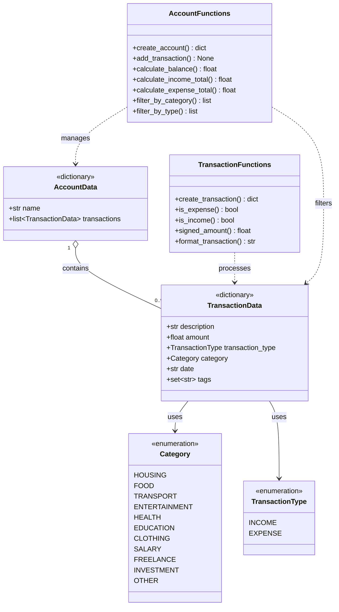

### UML diagram explanation

The diagram represents the dictionary-based domain model used in Phase 1.

#### Multiplicity

- `1` means exactly one element.
- `0..*` means zero, one, or any number of elements.
- Therefore, one account can contain zero or many transactions.

A newly created account initially contains no transactions. After transactions
are added, the same account can contain multiple transaction dictionaries.

#### UML symbols

| Symbol | Meaning |
|---|---|
| `+` | Public field or function |
| `1` | Exactly one element |
| `0..*` | Zero to any number of elements |
| `o--` | Aggregation: an account contains transactions |
| `-->` | Association: one element uses another element |
| `..>` | Dependency: a function creates, reads, or processes data |
| `<<enumeration>>` | A fixed collection of allowed values |
| `<<dictionary>>` | Data is represented by a Python dictionary |
| `: uses` | A transaction uses an enum value |
| `: contains` | An account contains transaction dictionaries |
| `: manages` | Functions manage account data |
| `: filters` | Functions select matching transactions |
| `: processes` | Functions create or process transaction data |

#### Relationships

- `TransactionData --> Category`: Each transaction uses one category, such as `FOOD` or `HOUSING`.
- `TransactionData --> TransactionType`: Each transaction is either `INCOME` or `EXPENSE`.
- `AccountData "1" o-- "0..*" TransactionData`: One account contains zero or many transactions.
- `TransactionFunctions ..> TransactionData`: The functions create, validate, format, and evaluate transaction dictionaries.
- `AccountFunctions ..> AccountData`: The functions create and manage account dictionaries.
- `AccountFunctions ..> TransactionData`: The functions calculate totals and filter transaction dictionaries.

## Test-Driven Development

Phase 1 was developed using the TDD cycle:

1. **RED:** The tests were written before the implementation and initially failed.
2. **GREEN:** The required functions were implemented until all tests passed.
3. **REFACTOR:** The code was reviewed and improved while keeping all tests green.

### RED – failing tests before implementation

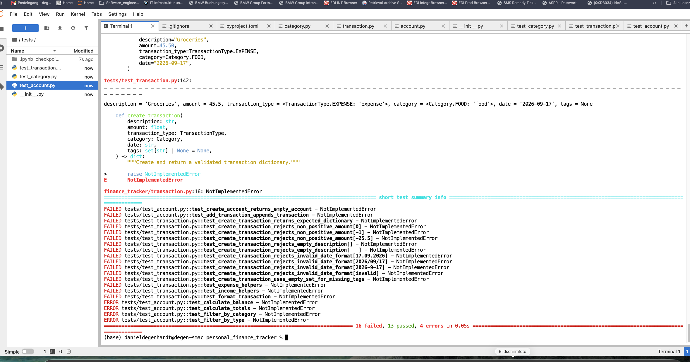

### GREEN – all tests passing after implementation

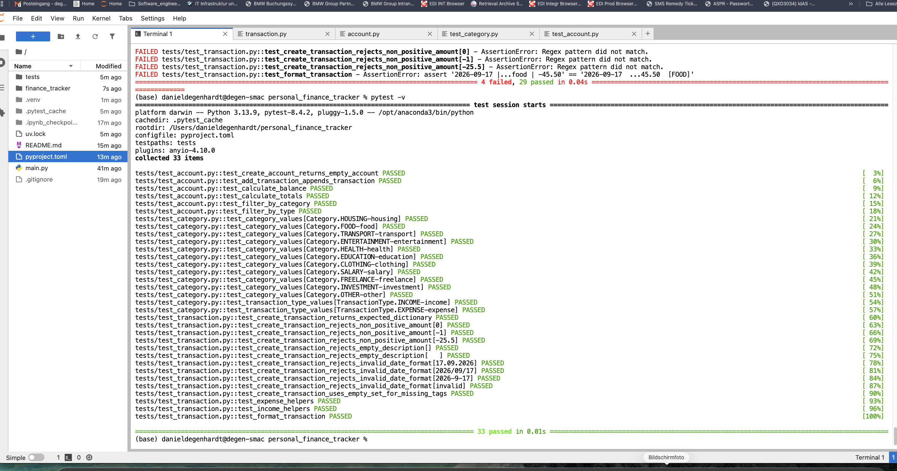

## Phase 2 features

Phase 2 adds filtering, search, analysis, and dictionary-based budget
management.

### Filtering and search

- Inclusive date-range filtering
- Filtering by month
- Filtering by transaction tags
- Case-insensitive regular-expression search

### Financial analysis

- Monthly income, expense, and net summaries
- Expense totals grouped by category
- Ranking of the largest expenses
- Daily expense totals grouped by date

### Budget management

- Dictionary-based budgets
- Dictionary-based budget tracker
- Remaining budget calculations
- Budget usage percentages
- Detection of exceeded budgets
- Replacement of existing budgets for the same category and month

## Testing

Phase 2 was developed with Test-Driven Development:

1. Tests were written before the implementation.
2. The new tests initially failed with `NotImplementedError`.
3. The required functions were implemented.
4. All existing and new tests passed.

```text
64 passed
```

## Phase 2 UML diagram

Phase 2 extends the core model with filtering, search, financial analysis,
budgets, and budget tracking.

The Phase 1 structures remain unchanged. The following diagram focuses on the
new components and their relationships with the existing account and
transaction dictionaries.

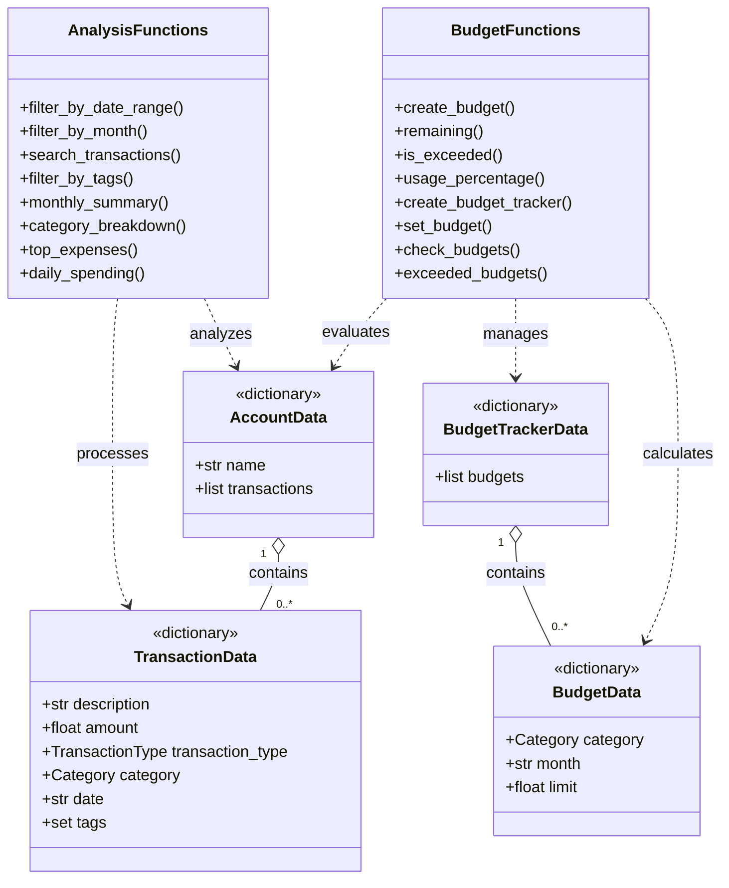

---

# Phase 3 – JSON and CSV persistence

Phase 3 adds permanent file storage and data exchange to the Personal Finance
Tracker.

The existing dictionary-based data model remains unchanged. Transactions and
accounts can now be converted into JSON-compatible data, saved to files, loaded
again, imported from CSV files, and exported to CSV files.

## Phase 3 features

### Phase 3A – JSON storage

- Convert transaction dictionaries into JSON-compatible dictionaries
- Restore Python transaction dictionaries from JSON data
- Convert account dictionaries into JSON-compatible dictionaries
- Restore account dictionaries from JSON data
- Save an account to a JSON file
- Load an account from a JSON file
- Restore enums and sets after loading
- Report missing or invalid files

### Phase 3B – CSV storage

- Import transactions from CSV files
- Export transactions to CSV files
- Detect positive amounts as income
- Detect negative amounts as expenses
- Convert negative amounts into positive transaction amounts
- Recognize categories case-insensitively
- Continue importing after an invalid row
- Collect invalid rows and their error messages
- Add a summary row during export
- Use custom storage and CSV exceptions

## New Phase 3 files

```text
finance_tracker/
├── json_storage.py
├── csv_storage.py
└── exceptions.py

tests/
├── test_json_storage.py
└── test_csv_storage.py
```

### File responsibilities

| File | Responsibility |
| --- | --- |
| `finance_tracker/json_storage.py` | Converts, saves, and loads JSON data |
| `finance_tracker/csv_storage.py` | Imports and exports transaction CSV files |
| `finance_tracker/exceptions.py` | Contains custom exceptions for storage errors |
| `tests/test_json_storage.py` | Tests JSON conversion and file storage |
| `tests/test_csv_storage.py` | Tests CSV import, export, and error handling |

## JSON storage

Python dictionaries can contain values that JSON cannot store directly.

For example:

- `Category` and `TransactionType` are enum values.
- `tags` is represented by a Python set.
- JSON supports strings, numbers, lists, dictionaries, booleans, and `null`.

Before saving, Phase 3 converts:

- enum values into strings,
- sets into lists,
- transaction dictionaries into JSON-compatible dictionaries,
- account dictionaries into JSON-compatible dictionaries.

When the file is loaded, these conversions are reversed.

### JSON round trip

A round trip means that data is:

1. converted into JSON-compatible data,
2. written to a file,
3. read from the file,
4. restored to its original Python types.

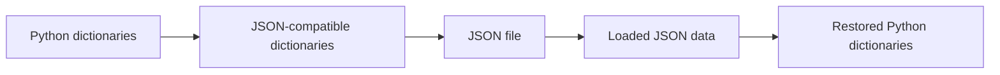

## CSV import

The CSV importer reads one row after another.

Each valid row is converted into a transaction dictionary. If one row is
invalid, the complete import does not stop. Instead, the error is collected and
the importer continues with the next row.

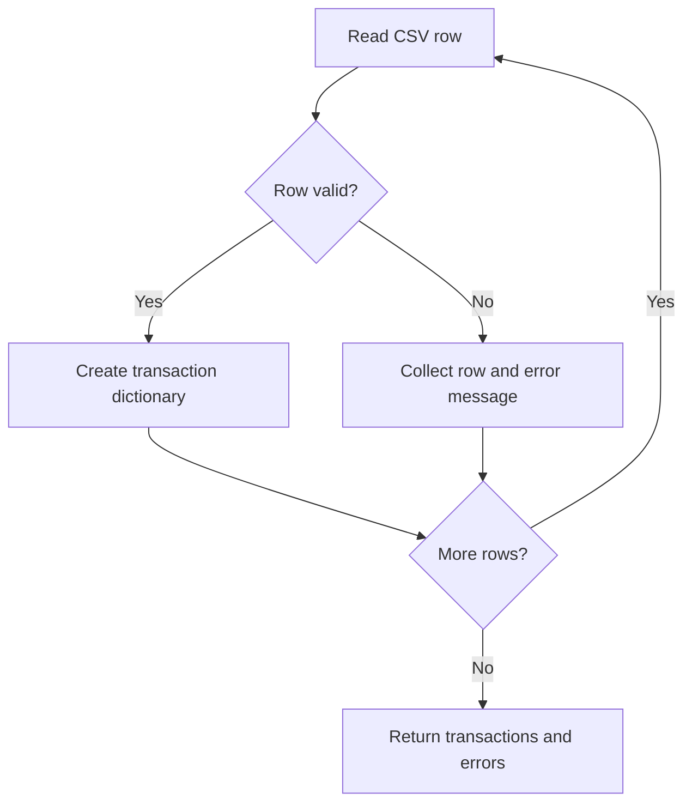

### Amount interpretation

| CSV amount | Transaction type | Stored amount |
| ---: | --- | ---: |
| `2500.00` | `INCOME` | `2500.00` |
| `-45.50` | `EXPENSE` | `45.50` |
| `0` | Invalid row | Not imported |

The stored amount is always positive because the transaction type already
describes whether the transaction is income or expense.

## CSV export

The CSV exporter writes transaction dictionaries into a CSV file.

The exported file contains:

- one header row,
- one row for every transaction,
- one final summary row.

The summary row provides an overview of the exported transactions.

## Custom exceptions

Phase 3 introduces custom exceptions so that storage errors can be distinguished
from other Python errors.

Custom exceptions make it possible to:

- identify invalid JSON files,
- identify missing files,
- identify malformed CSV files,
- present understandable error messages,
- catch specific errors in a future Qt user interface.

A future GUI can catch these exceptions and display a `QMessageBox` instead of
terminating the complete program.

## Test-Driven Development

Phase 3 was implemented using Test-Driven Development.

### RED

The tests were written before the implementation. The new tests initially
failed because the required functions were not implemented.

#### Phase 3A JSON RED

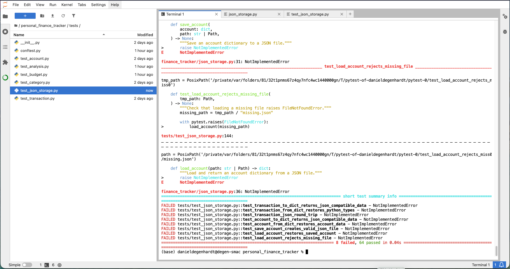

#### Phase 3B CSV RED

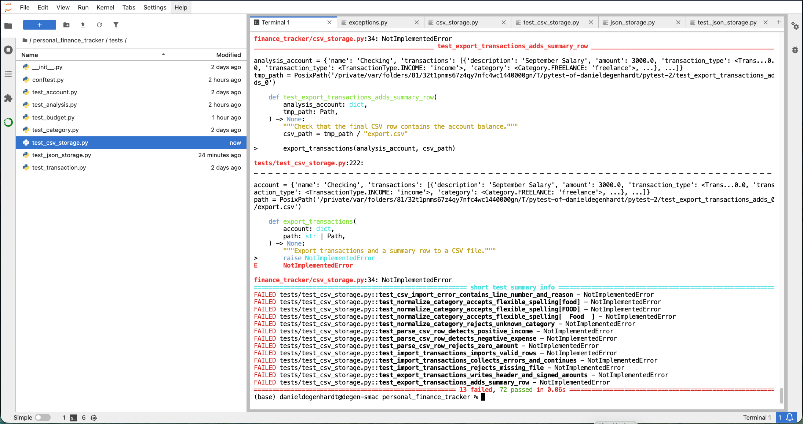

### GREEN

After the required functions were implemented, all existing and new tests
passed.

#### Phase 3A JSON GREEN

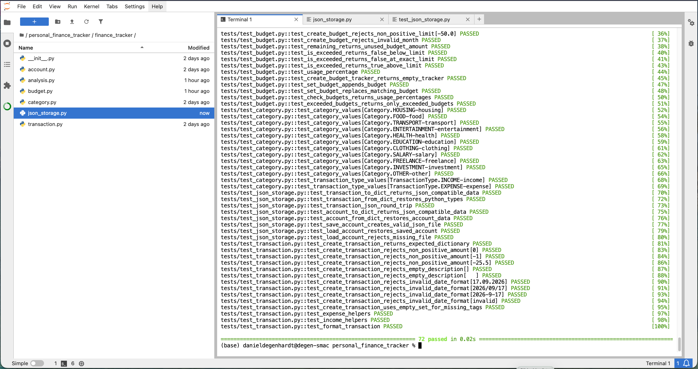

#### Phase 3B CSV GREEN

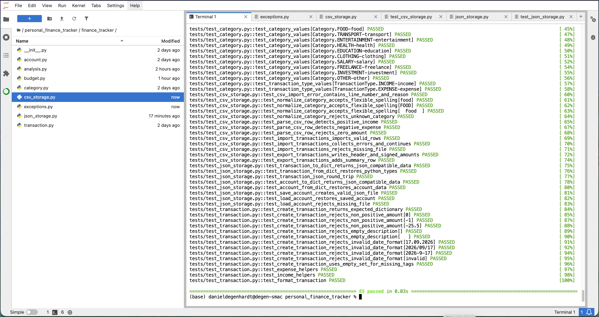

### Final Phase 3 test result

```text
85 passed
```

The result confirms that the new JSON and CSV features work and that the
features from Phases 1 and 2 still work correctly.

# Phase 3 UML diagram

Phase 3 extends the application with JSON storage, CSV import, CSV export, and
custom exceptions.

The Phase 1 and Phase 2 structures remain available. Phase 3 does not replace
the dictionary-based model. It provides additional functions that translate
between the existing dictionaries and external files.

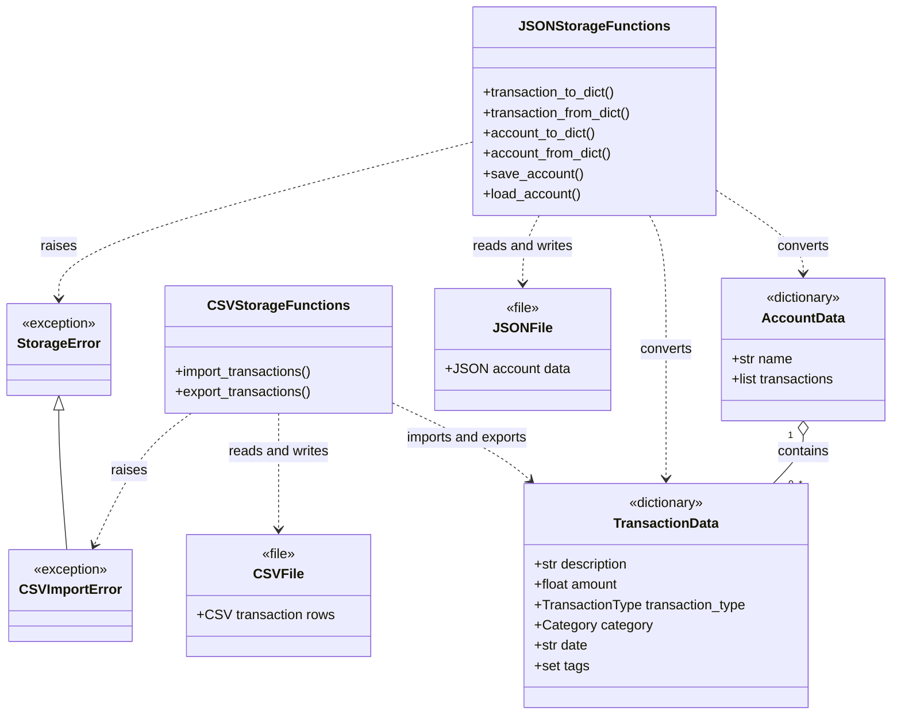

## Phase 3 UML explanation

The Phase 3 UML diagram shows how the existing dictionary-based domain model
interacts with JSON and CSV files.

### Existing data structures

`AccountData` represents an account dictionary. It contains the account name and
a list of transaction dictionaries.

`TransactionData` represents one transaction dictionary. It contains the
description, amount, transaction type, category, date, and tags.

One account can contain zero, one, or many transactions.

### JSON storage functions

`JSONStorageFunctions` represents the functions from `json_storage.py`.

These functions:

- convert transaction dictionaries into JSON-compatible data,
- restore transaction dictionaries from JSON data,
- convert complete account dictionaries,
- restore complete account dictionaries,
- save accounts to JSON files,
- load accounts from JSON files.

The relationship to `JSONFile` shows that the functions read and write JSON
files.

### CSV storage functions

`CSVStorageFunctions` represents the functions from `csv_storage.py`.

These functions:

- read transaction rows from CSV files,
- convert valid rows into transaction dictionaries,
- collect invalid rows,
- export transaction dictionaries,
- add a summary row to exported files.

The relationship to `CSVFile` shows that the functions read and write CSV
files.

### Exceptions

`StorageError` represents a general error involving file storage.

`CSVImportError` represents an error involving CSV input. It is a specialized
storage exception.

Custom exceptions allow the application to handle file problems in a controlled
and understandable way.

## UML symbols

| Symbol | Meaning |
| --- | --- |
| `+` | Public field or function |
| `1` | Exactly one element |
| `0..*` | Zero to any number of elements |
| `o--` | Aggregation: one structure contains other structures |
| `..>` | Dependency: a component uses another component |
| `<\|--` | Inheritance: one exception specializes another exception |
| `<<dictionary>>` | Data is represented by a Python dictionary |
| `<<file>>` | Data is stored in an external file |
| `<<exception>>` | The class represents a custom exception |
| `: contains` | One account contains transaction dictionaries |
| `: converts` | Functions transform data between representations |
| `: reads and writes` | Functions access an external file |
| `: imports and exports` | Functions exchange transaction data with CSV |
| `: raises` | A function can raise the specified exception |

## Phase 3 relationships

- `AccountData "1" o-- "0..*" TransactionData`  
  One account contains zero to any number of transaction dictionaries.

- `JSONStorageFunctions ..> AccountData`  
  The JSON functions convert complete account dictionaries.

- `JSONStorageFunctions ..> TransactionData`  
  The JSON functions convert individual transaction dictionaries.

- `JSONStorageFunctions ..> JSONFile`  
  The JSON functions read and write JSON files.

- `CSVStorageFunctions ..> TransactionData`  
  The CSV functions import and export transaction dictionaries.

- `CSVStorageFunctions ..> CSVFile`  
  The CSV functions read and write CSV files.

- `StorageError <|-- CSVImportError`  
  `CSVImportError` is a specialized form of `StorageError`.

## Phase 3 result

Phase 3 provides a complete persistence and data-exchange layer for the Personal
Finance Tracker.

The application can now:

- keep data between program starts,
- exchange transaction data with spreadsheet programs,
- survive individual invalid CSV rows,
- report storage problems with understandable exceptions,
- restore enums and sets after loading JSON,
- verify all functionality with automated tests.

Phase 3 is complete with:

```text
85 passed
```

## Phase 4: PySide6 graphical user interface

Phase 4 adds a desktop graphical user interface to the Personal Finance
Tracker.

The interface is implemented with PySide6. It uses the existing dictionary-based
domain model and the functions developed during Phases 1 to 3. The graphical
user interface does not replace the existing business logic. It provides a
visual layer through which users can enter, display, save, and load financial
data.

Phase 4 is divided into several smaller TDD steps:

- Phase 4A: main application window and transaction table
- Phase 4B: transaction entry form
- Phase 4C: JSON save and load controls
- Phase 4D: additional graphical features

### Phase 4A: Main application window

Phase 4A introduces the main PySide6 application window.

The `MainWindow` class represents the central window of the Personal Finance
Tracker. It contains a `QTabWidget`, which makes it possible to organize the
application into separate functional areas.

The first tab is named `Transactions`. It contains a `QTableWidget` that
displays the transactions stored in the current account.

The transaction table contains the following columns:

| Column | Purpose |
| --- | --- |
| Date | Date of the transaction |
| Description | Short description of the transaction |
| Type | Income or expense |
| Category | Financial category |
| Amount | Monetary value of the transaction |
| Tags | Optional keywords associated with the transaction |

The table is initially empty because a newly created account does not contain
any transactions.

#### Phase 4A TDD evidence

The GUI structure was developed with Test-Driven Development.

First, tests were created for the window title, tab widget, transactions tab,
table widget, and table headers. These tests failed before the GUI components
were implemented.

**RED state:**

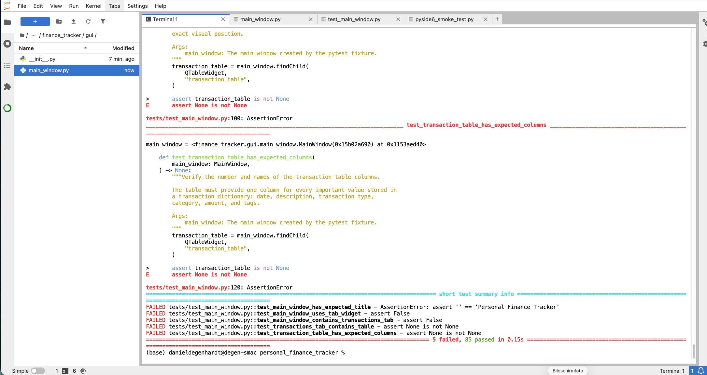

After implementing the main application window and transaction table, all tests
passed.

**GREEN state:**

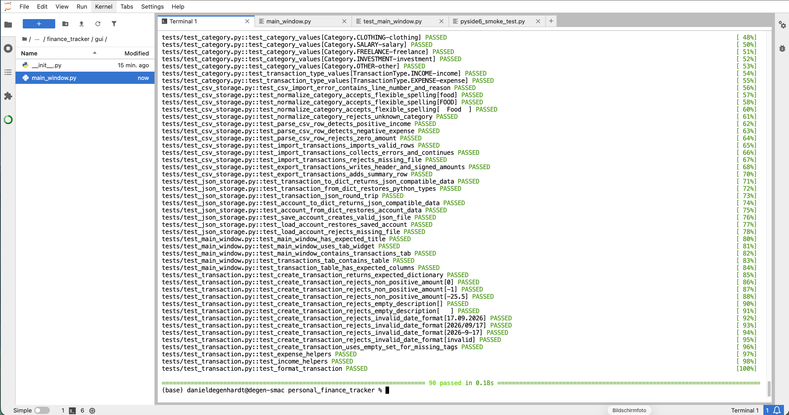

### Phase 4B: Transaction form

Phase 4B adds an interactive transaction form to the Transactions tab.

The form contains the following widgets:

| Widget | Purpose |
| --- | --- |
| Description input | Accepts a textual transaction description |
| Amount input | Accepts the transaction amount |
| Transaction type input | Selects income or expense |
| Category input | Selects a financial category |
| Date input | Selects the transaction date |
| Tags input | Accepts optional comma-separated tags |
| Add transaction button | Validates and adds the transaction |
| Status label | Displays success or validation messages |

When the user selects **Add transaction**, the graphical interface reads the
values from the form. It then calls the existing `create_transaction()` function
from the domain layer.

The transaction is therefore validated by the same business logic that was
already tested in Phase 1. The GUI does not duplicate the validation rules.

If the data is valid:

1. A transaction dictionary is created.
2. The transaction is added to the current account.
3. A new row is added to the transaction table.
4. The description, amount, and tags text fields are cleared.
5. A success message is displayed.

If the amount is not a valid number, no transaction is added and the status
label displays a readable validation message. The application remains open and
can continue to be used.

#### Phase 4B TDD evidence

The Phase 4B tests verify that all input widgets exist, valid transactions are
added to the table, successful input clears the appropriate fields, and invalid
amounts are rejected.

**RED state:**

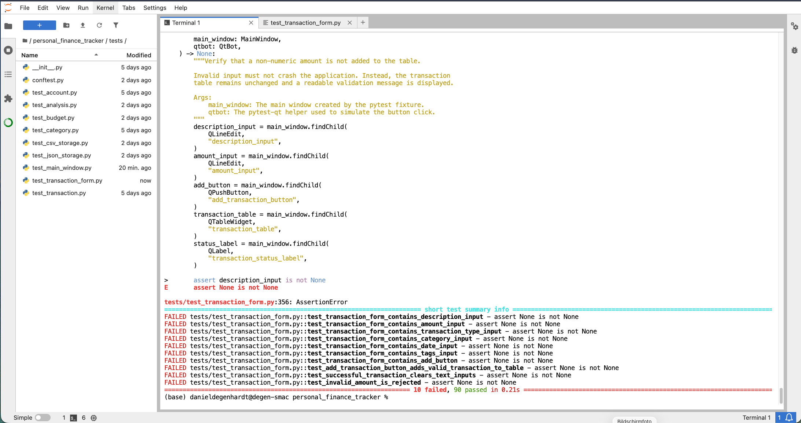

**GREEN state:**

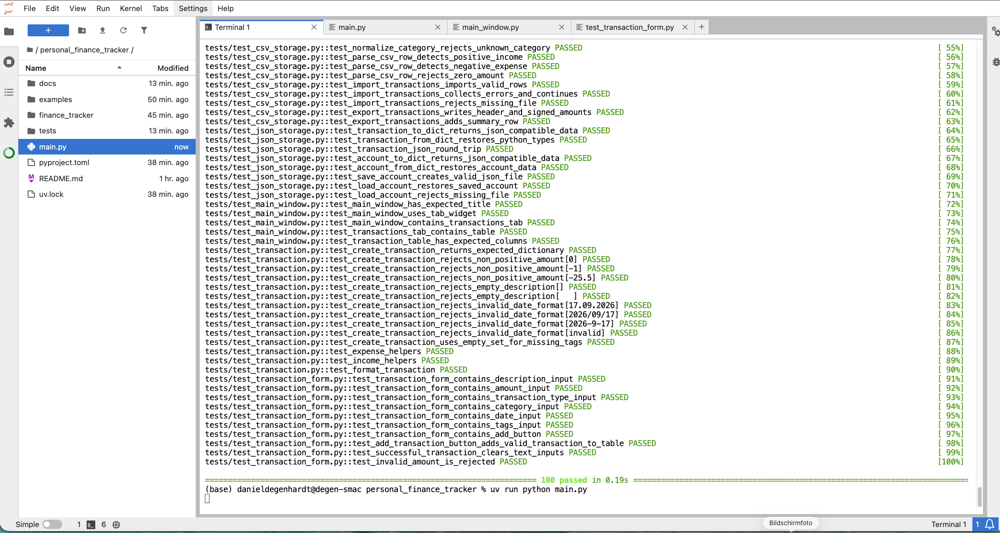

### Phase 4C: JSON file controls

Phase 4C connects the graphical user interface with the JSON storage functions
implemented in Phase 3.

The Transactions tab provides two additional controls:

- **Save JSON** saves the current account to a JSON file.
- **Load JSON** loads an account from a selected JSON file.

Native Qt file dialogs are used so that the user can select the destination or
source file through the operating system.

#### Saving an account

When the user selects **Save JSON**, the application:

1. Opens a save-file dialog.
2. Reads the selected path.
3. Adds the `.json` extension when necessary.
4. Calls `save_account()` from `json_storage.py`.
5. Displays a success message after saving.

If the user cancels the dialog, the application performs no save operation and
the current account remains unchanged.

#### Loading an account

When the user selects **Load JSON**, the application:

1. Opens an open-file dialog.
2. Reads the selected JSON file.
3. Calls `load_account()` from `json_storage.py`.
4. Replaces the current in-memory account with the loaded account.
5. Rebuilds the transaction table from the loaded transaction dictionaries.
6. Displays a success message after loading.

If the dialog is cancelled, the current account and transaction table remain
unchanged.

Storage, conversion, and validation errors are caught by the GUI and displayed
in the status label. This prevents file-related errors from terminating the
application unexpectedly.

#### Phase 4C TDD evidence

The Phase 4C tests verify:

- the existence of the save button,
- the existence of the load button,
- saving to the selected path,
- safe cancellation of the save dialog,
- loading and replacing the current account,
- rebuilding the transaction table after loading,
- safe cancellation of the load dialog.

**RED state:**

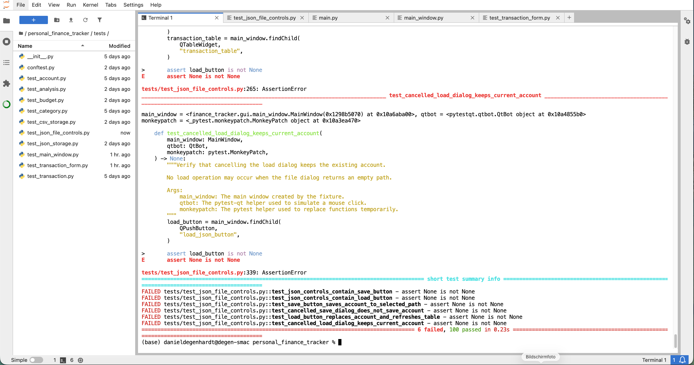

**GREEN state:**

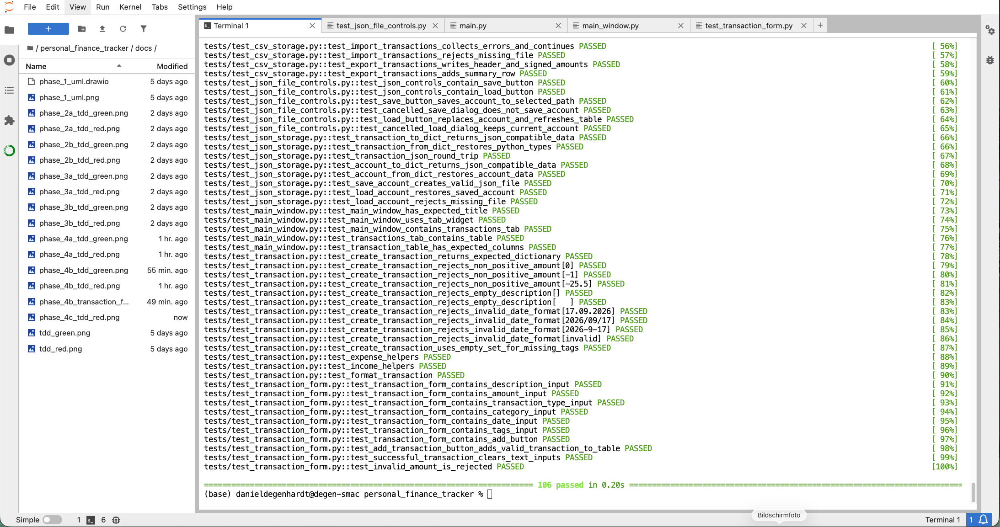

### Phase 4 architecture

The Phase 4 GUI is a presentation layer placed on top of the existing
dictionary-based business logic.

The `MainWindow` manages the visible widgets and the current account. It uses
the existing transaction functions to create validated transactions and the
existing JSON storage functions to save and restore account data.

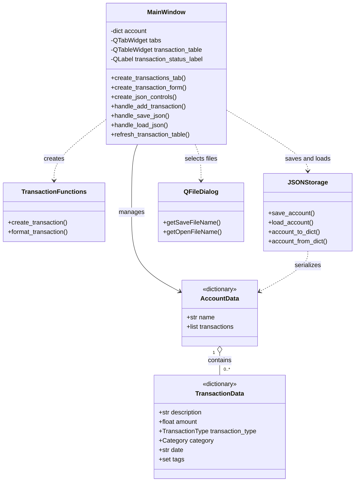

### Phase 4 UML explanation

#### Components

- `MainWindow` represents the central PySide6 application window.
- `AccountData` represents the current account dictionary.
- `TransactionData` represents one transaction dictionary.
- `TransactionFunctions` represents the existing transaction business logic.
- `JSONStorage` represents the JSON conversion and storage functions.
- `QFileDialog` represents the native Qt file-selection dialogs.

#### Relationships

- `AccountData "1" o-- "0..*" TransactionData`
  means that one account contains zero or multiple transaction dictionaries.
- `MainWindow --> AccountData`
  means that the main window manages the current account.
- `MainWindow ..> TransactionFunctions`
  means that the GUI uses the existing transaction functions to create and
  validate transactions.
- `MainWindow ..> JSONStorage`
  means that the GUI uses the JSON storage layer to save and load accounts.
- `MainWindow ..> QFileDialog`
  means that the GUI uses Qt file dialogs to select JSON files.
- `JSONStorage ..> AccountData`
  means that the storage layer converts and serializes account data.

#### Separation of responsibilities

The application separates its responsibilities into different layers:

| Layer | Responsibility |
| --- | --- |
| GUI layer | Displays widgets and processes user interaction |
| Domain layer | Creates and validates transaction and account dictionaries |
| Storage layer | Converts, saves, and loads JSON data |
| Test layer | Verifies domain, storage, and GUI behaviour |

This separation avoids duplicating business rules inside the graphical user
interface. It also makes the individual parts easier to test, maintain, and
extend.

### Phase 4 testing status

Phase 4A, Phase 4B, and Phase 4C were developed incrementally with
Test-Driven Development:

1. Tests were written before each implementation.
2. The new tests initially failed.
3. The required GUI functionality was implemented.
4. All existing and new tests were executed together.
5. The complete test suite passed without regressions.

Current result:

```text
106 passed
```

Phase 4D will extend the graphical interface and will be documented in this
section after its implementation.