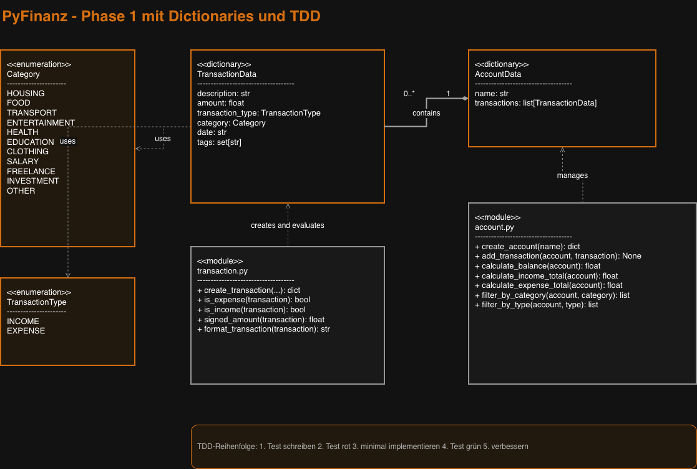

# Personal Finance Tracker

The Personal Finance Tracker manages income and expense transactions.

## Phase 1 features

- Transaction and category enums
- Dictionary-based transaction data
- Dictionary-based account data
- Input validation
- Balance calculation
- Income and expense totals
- Filtering by category
- Filtering by transaction type
- Automated tests with pytest

## Run the tests

```bash
uv sync
uv run pytest -v

## Phase 1 UML diagram

The following diagram shows the dictionary-based domain model and the
relationships between categories, transactions, and accounts.



The editable draw.io source file is available in
[`docs/phase_1_uml.drawio`](docs/phase_1_uml.drawio).

## Phase 1 UML diagram

The following UML diagram shows the dictionary-based structure of Phase 1.

