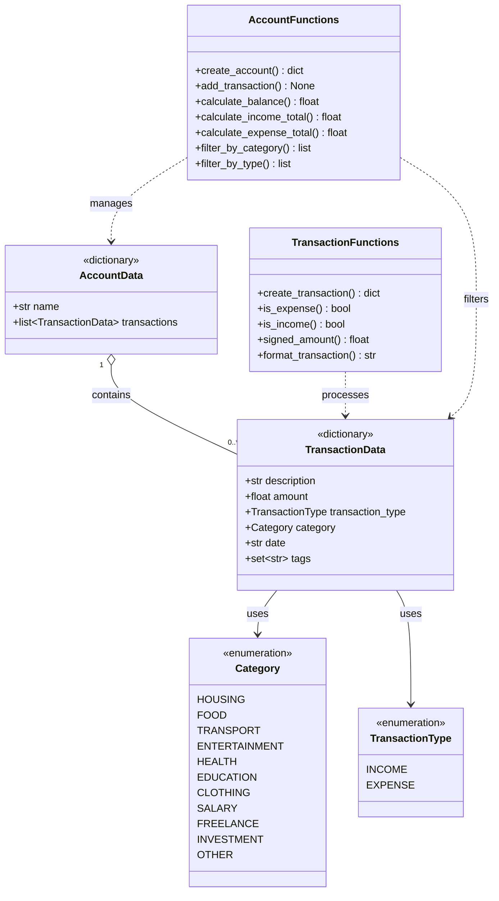
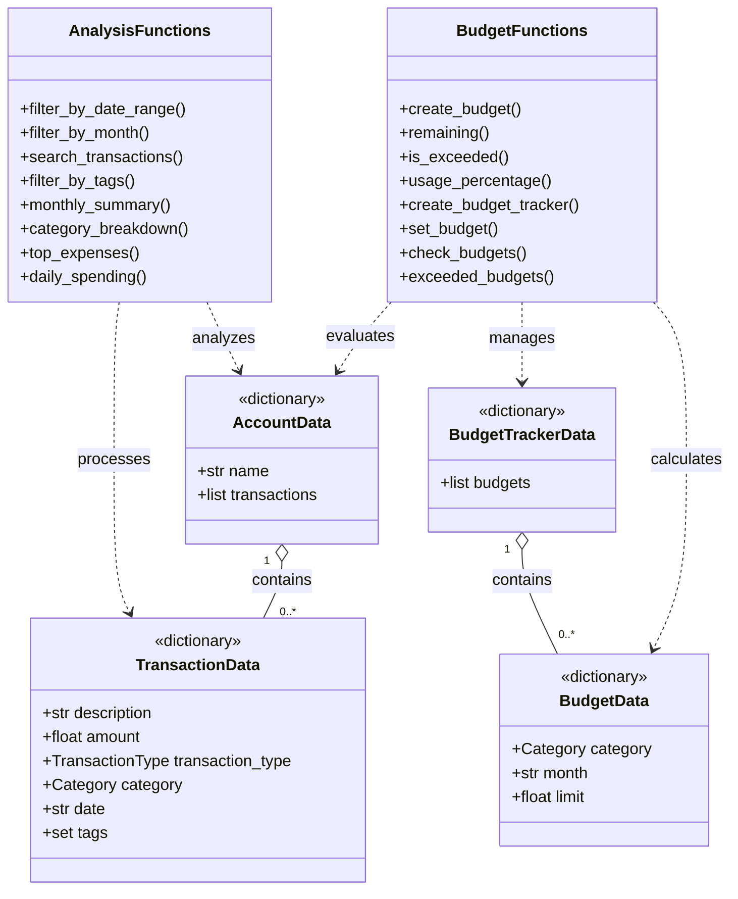

# Personal Finance Tracker

The Personal Finance Tracker manages income and expense transactions.

## Phase 1 features

- Transaction and category enums
- Dictionary-based transaction data
- Dictionary-based account data
- Input validation
- Balance calculation
- Income and expense totals
- Filtering by category
- Filtering by transaction type
- Automated tests with pytest
- Test-driven development

## Run the tests

```bash
uv sync
uv run pytest -v
```

Expected result:

```text
33 passed
```

## Phase 1 UML diagram

The following UML diagram shows the dictionary-based structure of Phase 1.



### UML diagram explanation

The diagram represents the dictionary-based domain model used in Phase 1.

#### Multiplicity

- `1` means exactly one element.
- `0..*` means zero, one, or any number of elements.
- Therefore, one account can contain zero or many transactions.

A newly created account initially contains no transactions. After transactions
are added, the same account can contain multiple transaction dictionaries.

#### UML symbols

| Symbol | Meaning |
|---|---|
| `+` | Public field or function |
| `1` | Exactly one element |
| `0..*` | Zero to any number of elements |
| `o--` | Aggregation: an account contains transactions |
| `-->` | Association: one element uses another element |
| `..>` | Dependency: a function creates, reads, or processes data |
| `<<enumeration>>` | A fixed collection of allowed values |
| `<<dictionary>>` | Data is represented by a Python dictionary |
| `: uses` | A transaction uses an enum value |
| `: contains` | An account contains transaction dictionaries |
| `: manages` | Functions manage account data |
| `: filters` | Functions select matching transactions |
| `: processes` | Functions create or process transaction data |

#### Relationships

- `TransactionData --> Category`: Each transaction uses one category, such as `FOOD` or `HOUSING`.
- `TransactionData --> TransactionType`: Each transaction is either `INCOME` or `EXPENSE`.
- `AccountData "1" o-- "0..*" TransactionData`: One account contains zero or many transactions.
- `TransactionFunctions ..> TransactionData`: The functions create, validate, format, and evaluate transaction dictionaries.
- `AccountFunctions ..> AccountData`: The functions create and manage account dictionaries.
- `AccountFunctions ..> TransactionData`: The functions calculate totals and filter transaction dictionaries.

## Test-Driven Development

Phase 1 was developed using the TDD cycle:

1. **RED:** The tests were written before the implementation and initially failed.
2. **GREEN:** The required functions were implemented until all tests passed.
3. **REFACTOR:** The code was reviewed and improved while keeping all tests green.

### RED – failing tests before implementation


### GREEN – all tests passing after implementation


## Phase 2 features

Phase 2 adds filtering, search, analysis, and dictionary-based budget
management.

### Filtering and search

- Inclusive date-range filtering
- Filtering by month
- Filtering by transaction tags
- Case-insensitive regular-expression search

### Financial analysis

- Monthly income, expense, and net summaries
- Expense totals grouped by category
- Ranking of the largest expenses
- Daily expense totals grouped by date

### Budget management

- Dictionary-based budgets
- Dictionary-based budget tracker
- Remaining budget calculations
- Budget usage percentages
- Detection of exceeded budgets
- Replacement of existing budgets for the same category and month

## Testing

Phase 2 was developed with Test-Driven Development:

1. Tests were written before the implementation.
2. The new tests initially failed with `NotImplementedError`.
3. The required functions were implemented.
4. All existing and new tests passed.

```text
64 passed
```

## Phase 2 UML diagram

Phase 2 extends the core model with filtering, search, financial analysis,
budgets, and budget tracking.

The Phase 1 structures remain unchanged. The following diagram focuses on the
new components and their relationships with the existing account and
transaction dictionaries.

