# Personal Finance Tracker

The Personal Finance Tracker manages income and expense transactions.
Its PySide6 desktop interface provides transaction entry, dashboard summaries,
monthly budgets, JSON persistence, and CSV import/export.

Current local test suite: **208 passing tests**, verified on 12 October 2026.

Phase 6 introduced modular GUI components, compact layouts, a shared
orange-accented theme, status messages, and Matplotlib charts.

Phase 7 added transaction editing, confirmed deletion, description search,
combined month/category filters, and integrated workflow tests.

## Quick start

From the project directory:

```bash
uv sync
uv run python main.py
```

Run the complete test suite:

```bash
uv run pytest -v
```

## Contents

- [Phase 1: Core model](#phase-1-features)
- [Phase 2: Analysis and budgets](#phase-2-features)
- [Phase 3: JSON and CSV persistence](#phase-3---json-and-csv-persistence)
- [Phase 4: PySide6 interface](#phase-4-pyside6-graphical-user-interface)
- [Phase 5: Dashboard and budget integration](#phase-5-dashboard-and-budget-integration)
- [Phase 6: GUI structure, layout, styling, and charts](#phase-6a1--extract-the-dashboard-widget)
- [Phase 7: Transaction editing, deletion, search, and filters](#phase-7a---edit-existing-transactions)

## Phase 1 features

- Transaction and category enums
- Dictionary-based transaction data
- Dictionary-based account data
- Input validation
- Balance calculation
- Income and expense totals
- Filtering by category
- Filtering by transaction type
- Automated tests with pytest
- Test-driven development

## Phase 1 test baseline

```bash
uv sync
uv run pytest -v
```

Historical result after Phase 1:

```text
33 passed
```

## Phase 1 UML diagram

The following UML diagram shows the dictionary-based structure of Phase 1.

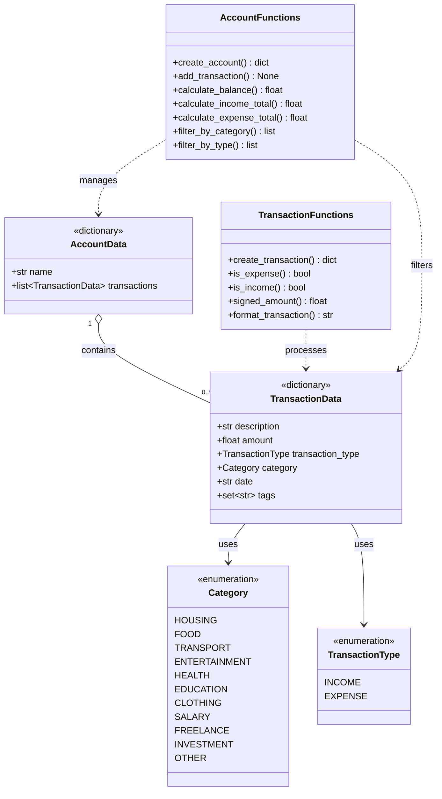
```mermaid
classDiagram
    direction TB

    class Category {
        <<enumeration>>
        HOUSING
        FOOD
        TRANSPORT
        ENTERTAINMENT
        HEALTH
        EDUCATION
        CLOTHING
        SALARY
        FREELANCE
        INVESTMENT
        OTHER
    }

    class TransactionType {
        <<enumeration>>
        INCOME
        EXPENSE
    }

    class TransactionData {
        <<dictionary>>
        +str description
        +float amount
        +TransactionType transaction_type
        +Category category
        +str date
        +set~str~ tags
    }

    class AccountData {
        <<dictionary>>
        +str name
        +list~TransactionData~ transactions
    }

    class TransactionFunctions {
        +create_transaction() dict
        +is_expense() bool
        +is_income() bool
        +signed_amount() float
        +format_transaction() str
    }

    class AccountFunctions {
        +create_account() dict
        +add_transaction() None
        +calculate_balance() float
        +calculate_income_total() float
        +calculate_expense_total() float
        +filter_by_category() list
        +filter_by_type() list
    }

    TransactionData --> Category : uses
    TransactionData --> TransactionType : uses
    AccountData "1" o-- "0..*" TransactionData : contains
    TransactionFunctions ..> TransactionData : processes
    AccountFunctions ..> AccountData : manages
    AccountFunctions ..> TransactionData : filters
```

### UML diagram explanation

The diagram represents the dictionary-based domain model used in Phase 1.

#### Multiplicity

- `1` means exactly one element.
- `0..*` means zero, one, or any number of elements.
- Therefore, one account can contain zero or many transactions.

A newly created account initially contains no transactions. After transactions
are added, the same account can contain multiple transaction dictionaries.

#### UML symbols

| Symbol | Meaning |
|---|---|
| `+` | Public field or function |
| `1` | Exactly one element |
| `0..*` | Zero to any number of elements |
| `o--` | Aggregation: an account contains transactions |
| `-->` | Association: one element uses another element |
| `..>` | Dependency: a function creates, reads, or processes data |
| `<<enumeration>>` | A fixed collection of allowed values |
| `<<dictionary>>` | Data is represented by a Python dictionary |
| `: uses` | A transaction uses an enum value |
| `: contains` | An account contains transaction dictionaries |
| `: manages` | Functions manage account data |
| `: filters` | Functions select matching transactions |
| `: processes` | Functions create or process transaction data |

#### Relationships

- `TransactionData --> Category`: Each transaction uses one category, such as `FOOD` or `HOUSING`.
- `TransactionData --> TransactionType`: Each transaction is either `INCOME` or `EXPENSE`.
- `AccountData "1" o-- "0..*" TransactionData`: One account contains zero or many transactions.
- `TransactionFunctions ..> TransactionData`: The functions create, validate, format, and evaluate transaction dictionaries.
- `AccountFunctions ..> AccountData`: The functions create and manage account dictionaries.
- `AccountFunctions ..> TransactionData`: The functions calculate totals and filter transaction dictionaries.

## Test-Driven Development

Phase 1 was developed using the TDD cycle:

1. **RED:** The tests were written before the implementation and initially failed.
2. **GREEN:** The required functions were implemented until all tests passed.
3. **REFACTOR:** The code was reviewed and improved while keeping all tests green.

### RED – failing tests before implementation

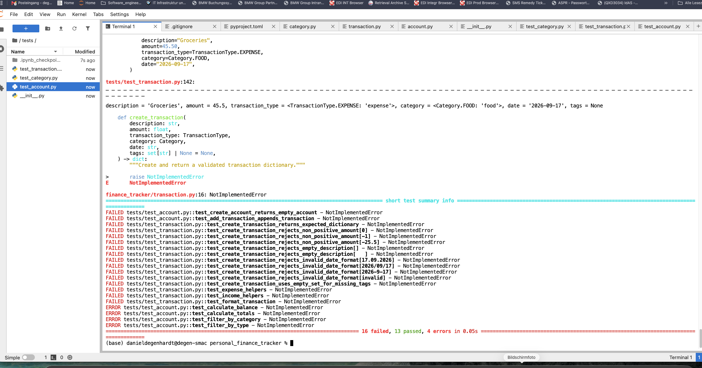

### GREEN – all tests passing after implementation

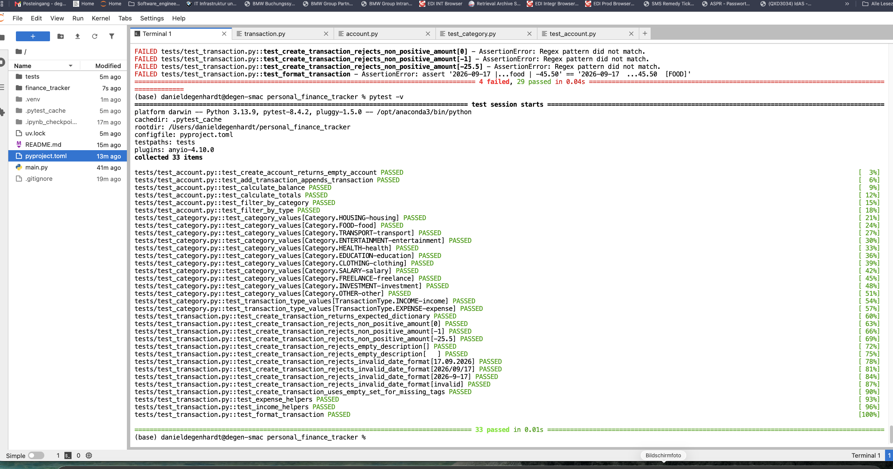

## Phase 2 features

Phase 2 adds filtering, search, analysis, and dictionary-based budget
management.

### Filtering and search

- Inclusive date-range filtering
- Filtering by month
- Filtering by transaction tags
- Case-insensitive regular-expression search

### Financial analysis

- Monthly income, expense, and net summaries
- Expense totals grouped by category
- Ranking of the largest expenses
- Daily expense totals grouped by date

### Budget management

- Dictionary-based budgets
- Dictionary-based budget tracker
- Remaining budget calculations
- Budget usage percentages
- Detection of exceeded budgets
- Replacement of existing budgets for the same category and month

## Testing

Phase 2 was developed with Test-Driven Development:

1. Tests were written before the implementation.
2. The new tests initially failed with `NotImplementedError`.
3. The required functions were implemented.
4. All existing and new tests passed.

```text
64 passed
```

## Phase 2 UML diagram

Phase 2 extends the core model with filtering, search, financial analysis,
budgets, and budget tracking.

The Phase 1 structures remain unchanged. The following diagram focuses on the
new components and their relationships with the existing account and
transaction dictionaries.

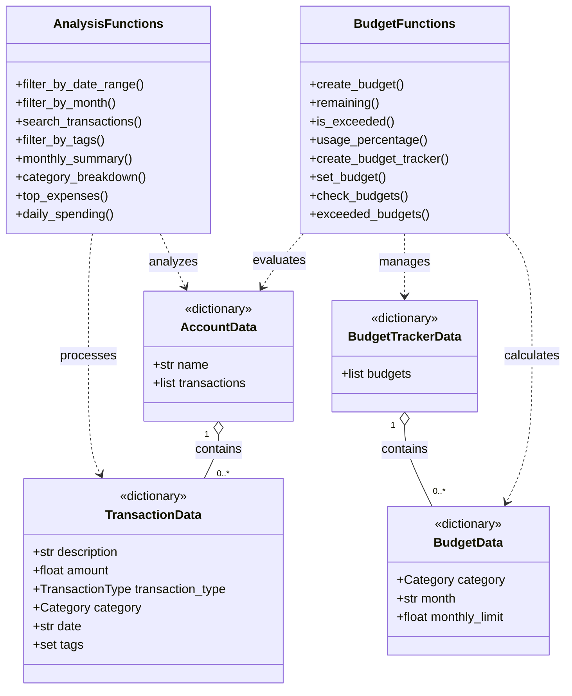
```mermaid
classDiagram
    direction TB

    class AccountData {
        <<dictionary>>
        +str name
        +list transactions
    }

    class TransactionData {
        <<dictionary>>
        +str description
        +float amount
        +TransactionType transaction_type
        +Category category
        +str date
        +set tags
    }

    class AnalysisFunctions {
        +filter_by_date_range()
        +filter_by_month()
        +search_transactions()
        +filter_by_tags()
        +monthly_summary()
        +category_breakdown()
        +top_expenses()
        +daily_spending()
    }

    class BudgetData {
        <<dictionary>>
        +Category category
        +str month
        +float monthly_limit
    }

    class BudgetTrackerData {
        <<dictionary>>
        +list budgets
    }

    class BudgetFunctions {
        +create_budget()
        +remaining()
        +is_exceeded()
        +usage_percentage()
        +create_budget_tracker()
        +set_budget()
        +check_budgets()
        +exceeded_budgets()
    }

    AccountData "1" o-- "0..*" TransactionData : contains
    AnalysisFunctions ..> AccountData : analyzes
    AnalysisFunctions ..> TransactionData : processes
    BudgetTrackerData "1" o-- "0..*" BudgetData : contains
    BudgetFunctions ..> BudgetData : calculates
    BudgetFunctions ..> BudgetTrackerData : manages
    BudgetFunctions ..> AccountData : evaluates
```

---

## Phase 3 - JSON and CSV persistence

Phase 3 adds permanent file storage and data exchange to the Personal Finance
Tracker.

The existing dictionary-based data model remains unchanged. Transactions and
accounts can now be converted into JSON-compatible data, saved to files, loaded
again, imported from CSV files, and exported to CSV files.

### Phase 3 features

#### Phase 3A – JSON storage

- Convert transaction dictionaries into JSON-compatible dictionaries
- Restore Python transaction dictionaries from JSON data
- Convert account dictionaries into JSON-compatible dictionaries
- Restore account dictionaries from JSON data
- Save an account to a JSON file
- Load an account from a JSON file
- Restore enums and sets after loading
- Report missing or invalid files

#### Phase 3B – CSV storage

- Import transactions from CSV files
- Export transactions to CSV files
- Detect positive amounts as income
- Detect negative amounts as expenses
- Convert negative amounts into positive transaction amounts
- Recognize categories case-insensitively
- Continue importing after an invalid row
- Collect invalid rows and their error messages
- Add a summary row during export
- Use custom transaction and CSV row exceptions

### New Phase 3 files

```text
finance_tracker/
├── json_storage.py
├── csv_storage.py
└── exceptions.py

tests/
├── test_json_storage.py
└── test_csv_storage.py
```

#### File responsibilities

| File | Responsibility |
| --- | --- |
| `finance_tracker/json_storage.py` | Converts, saves, and loads JSON data |
| `finance_tracker/csv_storage.py` | Imports and exports transaction CSV files |
| `finance_tracker/exceptions.py` | Defines transaction, CSV row, and budget lookup exceptions |
| `tests/test_json_storage.py` | Tests JSON conversion and file storage |
| `tests/test_csv_storage.py` | Tests CSV import, export, and error handling |

### JSON storage

Python dictionaries can contain values that JSON cannot store directly.

For example:

- `Category` and `TransactionType` are enum values.
- `tags` is represented by a Python set.
- JSON supports strings, numbers, lists, dictionaries, booleans, and `null`.

Before saving, Phase 3 converts:

- enum values into strings,
- sets into lists,
- transaction dictionaries into JSON-compatible dictionaries,
- account dictionaries into JSON-compatible dictionaries.

When the file is loaded, these conversions are reversed.

#### JSON round trip

A round trip means that data is:

1. converted into JSON-compatible data,
2. written to a file,
3. read from the file,
4. restored to its original Python types.

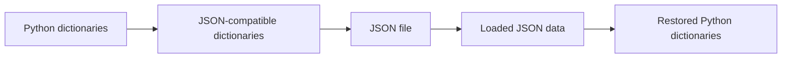
```mermaid
flowchart LR
    A["Python dictionaries"] --> B["JSON-compatible dictionaries"]
    B --> C["JSON file"]
    C --> D["Loaded JSON data"]
    D --> E["Restored Python dictionaries"]
```

### CSV import

The CSV importer reads one row after another.

Each valid row is converted into a transaction dictionary. If one row is
invalid, the complete import does not stop. Instead, the error is collected and
the importer continues with the next row.

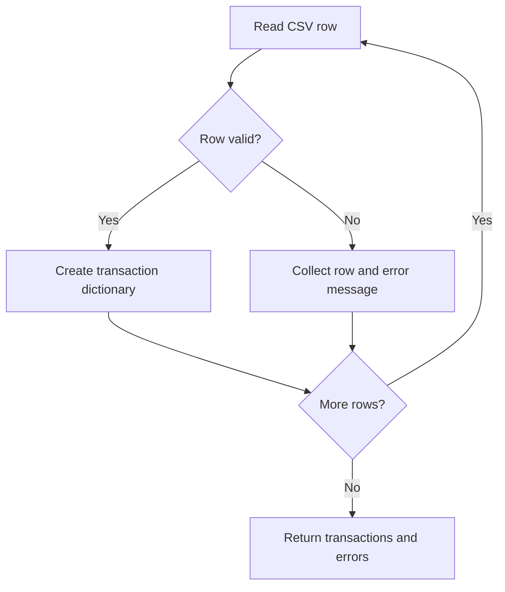
```mermaid
flowchart TB
    A["Read CSV row"] --> B{"Row valid?"}
    B -->|Yes| C["Create transaction dictionary"]
    B -->|No| D["Collect row and error message"]
    C --> E{"More rows?"}
    D --> E
    E -->|Yes| A
    E -->|No| F["Return transactions and errors"]
```

#### Amount interpretation

| CSV amount | Transaction type | Stored amount |
| ---: | --- | ---: |
| `2500.00` | `INCOME` | `2500.00` |
| `-45.50` | `EXPENSE` | `45.50` |
| `0` | Invalid row | Not imported |

The stored amount is always positive because the transaction type already
describes whether the transaction is income or expense.

### CSV export

The CSV exporter writes transaction dictionaries into a CSV file.

The exported file contains:

- one header row,
- one row for every transaction,
- one final summary row.

The summary row provides an overview of the exported transactions.

### Custom exceptions

The existing exception module defines `InvalidTransactionError`, `CsvImportError`,
and `BudgetNotFoundError`.

- `InvalidTransactionError` extends `ValueError` and reports invalid transaction
  data, including invalid CSV fields and categories.
- `CsvImportError` records the line number and reason for an invalid CSV row.
  The importer collects these errors and continues processing later rows.
- `BudgetNotFoundError` extends `LookupError` and is available for budget lookup
  errors; the current budget file controls do not use it.

JSON operations currently use standard Python exceptions such as `OSError`,
`ValueError`, and `json.JSONDecodeError`. The GUI reports handled file errors in
status labels.

### Test-Driven Development

Phase 3 was implemented using Test-Driven Development.

#### RED

The tests were written before the implementation. The new tests initially
failed because the required functions were not implemented.

##### Phase 3A JSON RED

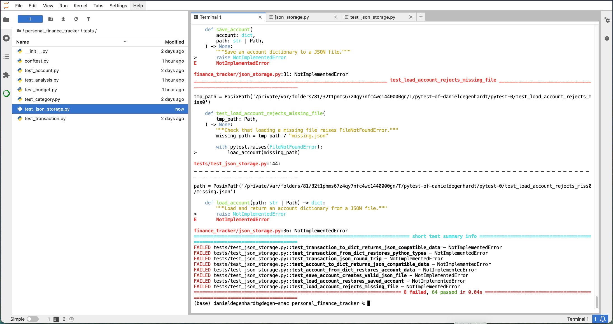

##### Phase 3B CSV RED

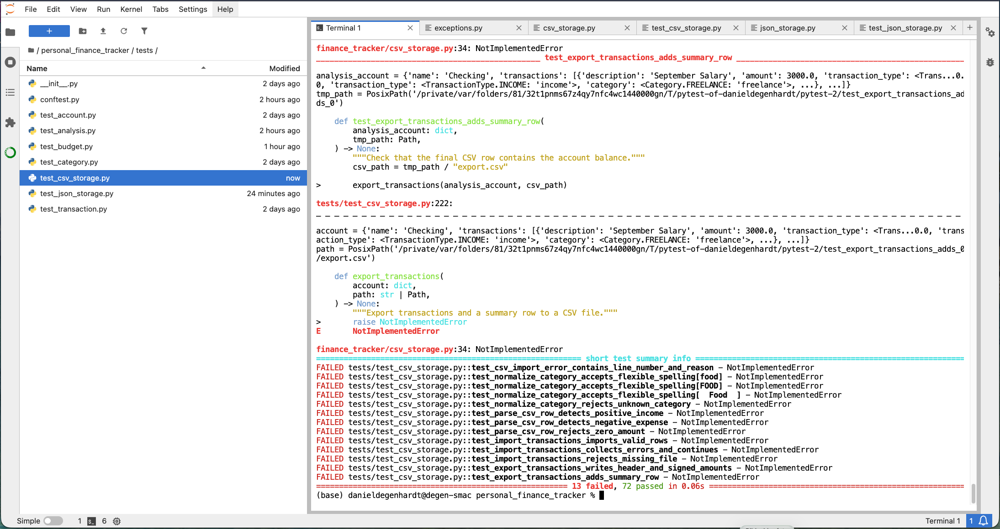

#### GREEN

After the required functions were implemented, all existing and new tests
passed.

##### Phase 3A JSON GREEN

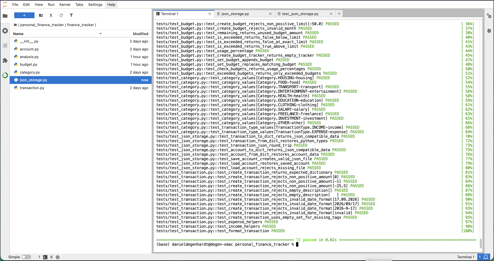

##### Phase 3B CSV GREEN

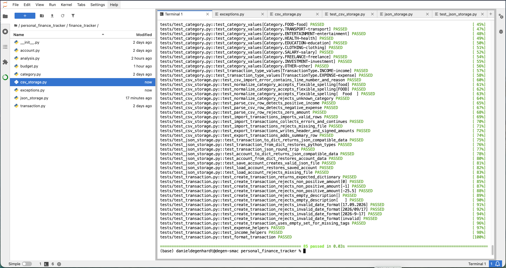

#### Final Phase 3 test result

```text
85 passed
```

The result confirms that the new JSON and CSV features work and that the
features from Phases 1 and 2 still work correctly.

### Phase 3 UML diagram

Phase 3 extends the application with JSON storage, CSV import, CSV export, and
custom exceptions.

The Phase 1 and Phase 2 structures remain available. Phase 3 does not replace
the dictionary-based model. It provides additional functions that translate
between the existing dictionaries and external files.

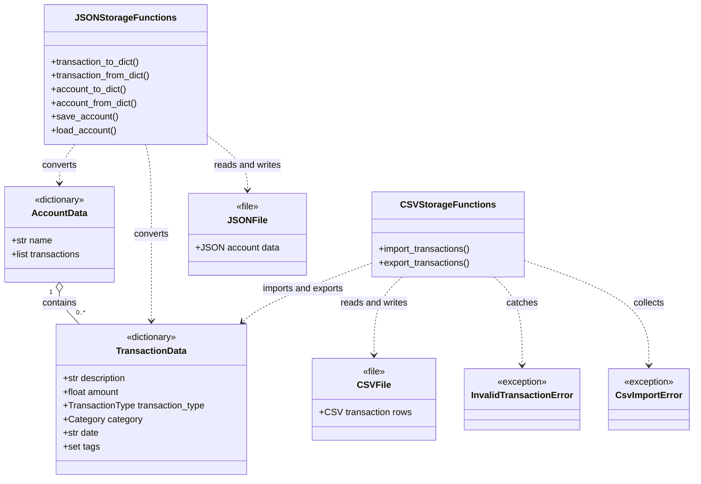
```mermaid
classDiagram
    direction TB

    class AccountData {
        <<dictionary>>
        +str name
        +list transactions
    }

    class TransactionData {
        <<dictionary>>
        +str description
        +float amount
        +TransactionType transaction_type
        +Category category
        +str date
        +set tags
    }

    class JSONStorageFunctions {
        +transaction_to_dict()
        +transaction_from_dict()
        +account_to_dict()
        +account_from_dict()
        +save_account()
        +load_account()
    }

    class CSVStorageFunctions {
        +import_transactions()
        +export_transactions()
    }

    class InvalidTransactionError {
        <<exception>>
        <<ValueError subclass>>
    }

    class CsvImportError {
        <<exception>>
    }

    class JSONFile {
        <<file>>
        +JSON account data
    }

    class CSVFile {
        <<file>>
        +CSV transaction rows
    }

    AccountData "1" o-- "0..*" TransactionData : contains

    JSONStorageFunctions ..> AccountData : converts
    JSONStorageFunctions ..> TransactionData : converts
    JSONStorageFunctions ..> JSONFile : reads and writes

    CSVStorageFunctions ..> TransactionData : imports and exports
    CSVStorageFunctions ..> CSVFile : reads and writes
    CSVStorageFunctions ..> InvalidTransactionError : catches
    CSVStorageFunctions ..> CsvImportError : collects

```

### Phase 3 UML explanation

The Phase 3 UML diagram shows how the existing dictionary-based domain model
interacts with JSON and CSV files.

#### Existing data structures

`AccountData` represents an account dictionary. It contains the account name and
a list of transaction dictionaries.

`TransactionData` represents one transaction dictionary. It contains the
description, amount, transaction type, category, date, and tags.

One account can contain zero, one, or many transactions.

#### JSON storage functions

`JSONStorageFunctions` represents the functions from `json_storage.py`.

These functions:

- convert transaction dictionaries into JSON-compatible data,
- restore transaction dictionaries from JSON data,
- convert complete account dictionaries,
- restore complete account dictionaries,
- save accounts to JSON files,
- load accounts from JSON files.

The relationship to `JSONFile` shows that the functions read and write JSON
files.

#### CSV storage functions

`CSVStorageFunctions` represents the functions from `csv_storage.py`.

These functions:

- read transaction rows from CSV files,
- convert valid rows into transaction dictionaries,
- collect invalid rows,
- export transaction dictionaries,
- add a summary row to exported files.

The relationship to `CSVFile` shows that the functions read and write CSV
files.

#### Exceptions

`InvalidTransactionError` is a `ValueError` subclass used for invalid CSV
transaction data. `CsvImportError` records a CSV row error for collection by the
importer. These two exceptions do not inherit from each other.

JSON storage uses standard Python exceptions. A `StorageError` class is not
part of the current implementation.

### UML symbols

| Symbol | Meaning |
| --- | --- |
| `+` | Public field or function |
| `1` | Exactly one element |
| `0..*` | Zero to any number of elements |
| `o--` | Aggregation: one structure contains other structures |
| `..>` | Dependency: a component uses another component |
| `<<dictionary>>` | Data is represented by a Python dictionary |
| `<<file>>` | Data is stored in an external file |
| `<<exception>>` | The class represents a custom exception |
| `: contains` | One account contains transaction dictionaries |
| `: converts` | Functions transform data between representations |
| `: reads and writes` | Functions access an external file |
| `: imports and exports` | Functions exchange transaction data with CSV |
| `: catches` | A function handles the specified exception |
| `: collects` | A function records errors for invalid rows |

### Phase 3 relationships

- `AccountData "1" o-- "0..*" TransactionData`
  One account contains zero to any number of transaction dictionaries.

- `JSONStorageFunctions ..> AccountData`
  The JSON functions convert complete account dictionaries.

- `JSONStorageFunctions ..> TransactionData`
  The JSON functions convert individual transaction dictionaries.

- `JSONStorageFunctions ..> JSONFile`
  The JSON functions read and write JSON files.

- `CSVStorageFunctions ..> TransactionData`
  The CSV functions import and export transaction dictionaries.

- `CSVStorageFunctions ..> CSVFile`
  The CSV functions read and write CSV files.

- `CSVStorageFunctions ..> InvalidTransactionError`
  The importer handles invalid rows.

- `CSVStorageFunctions ..> CsvImportError`
  The importer collects each row error with its line number and reason.

### Phase 3 result

Phase 3 provides a complete persistence and data-exchange layer for the Personal
Finance Tracker.

The application can now:

- keep data between program starts,
- exchange transaction data with spreadsheet programs,
- survive individual invalid CSV rows,
- report storage problems with understandable exceptions,
- restore enums and sets after loading JSON,
- verify all functionality with automated tests.

Phase 3 is complete with:

```text
85 passed
```


## Phase 4: PySide6 graphical user interface

Phase 4 adds a desktop graphical user interface to the Personal Finance
Tracker.

The interface is implemented with PySide6. It uses the existing dictionary-based
domain model and the functions developed during Phases 1 to 3. The graphical
user interface does not replace the existing business logic. It provides a
visual layer through which users can enter, display, save, and load financial
data.

Phase 4 is divided into several smaller TDD steps:

- Phase 4A: main application window and transaction table
- Phase 4B: transaction entry form
- Phase 4C: JSON save and load controls
- Phase 4D: CSV import and export controls

### Phase 4A: Main application window

Phase 4A introduces the main PySide6 application window.

The `MainWindow` class represents the central window of the Personal Finance
Tracker. It contains a `QTabWidget`, which makes it possible to organize the
application into separate functional areas.

The first tab is named `Transactions`. It contains a `QTableWidget` that
displays the transactions stored in the current account.

The transaction table contains the following columns:

| Column | Purpose |
| --- | --- |
| Date | Date of the transaction |
| Description | Short description of the transaction |
| Type | Income or expense |
| Category | Financial category |
| Amount | Monetary value of the transaction |
| Tags | Optional keywords associated with the transaction |

The table is initially empty because a newly created account does not contain
any transactions.

#### Phase 4A TDD evidence

The GUI structure was developed with Test-Driven Development.

First, tests were created for the window title, tab widget, transactions tab,
table widget, and table headers. These tests failed before the GUI components
were implemented.

**RED state:**

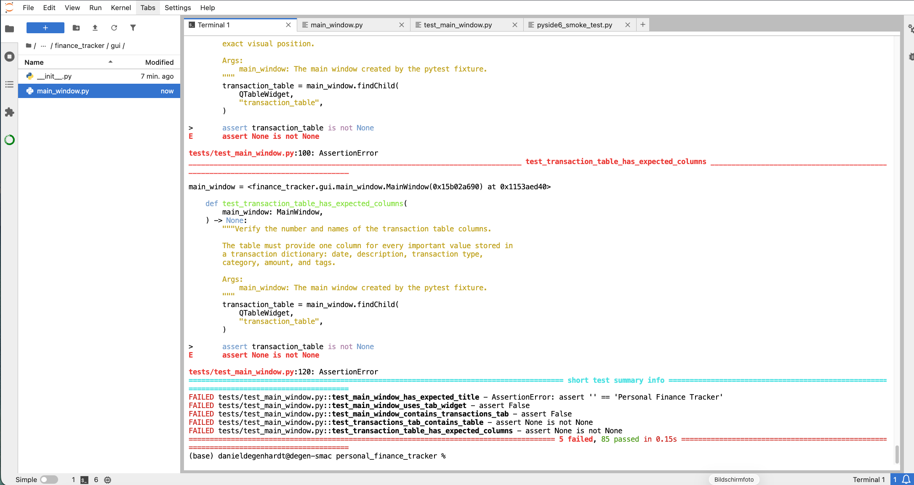

After implementing the main application window and transaction table, all tests
passed.

**GREEN state:**

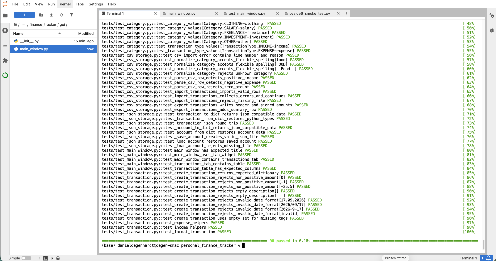

### Phase 4B: Transaction form

Phase 4B adds an interactive transaction form to the Transactions tab.

The form contains the following widgets:

| Widget | Purpose |
| --- | --- |
| Description input | Accepts a textual transaction description |
| Amount input | Accepts the transaction amount |
| Transaction type input | Selects income or expense |
| Category input | Selects a financial category |
| Date input | Selects the transaction date |
| Tags input | Accepts optional comma-separated tags |
| Add transaction button | Validates and adds the transaction |
| Status label | Displays success or validation messages |

When the user selects **Add transaction**, the graphical interface reads the
values from the form. It then calls the existing `create_transaction()` function
from the domain layer.

The transaction is therefore validated by the same business logic that was
already tested in Phase 1. The GUI does not duplicate the validation rules.

If the data is valid:

1. A transaction dictionary is created.
2. The transaction is added to the current account.
3. A new row is added to the transaction table.
4. The description, amount, and tags text fields are cleared.
5. A success message is displayed.

If the amount is not a valid number, no transaction is added and the status
label displays a readable validation message. The application remains open and
can continue to be used.

#### Phase 4B TDD evidence

The Phase 4B tests verify that all input widgets exist, valid transactions are
added to the table, successful input clears the appropriate fields, and invalid
amounts are rejected.

**RED state:**

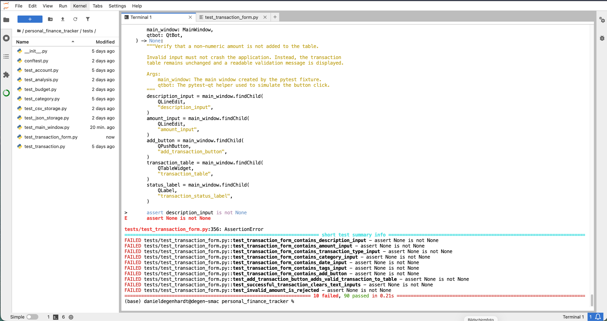

**GREEN state:**

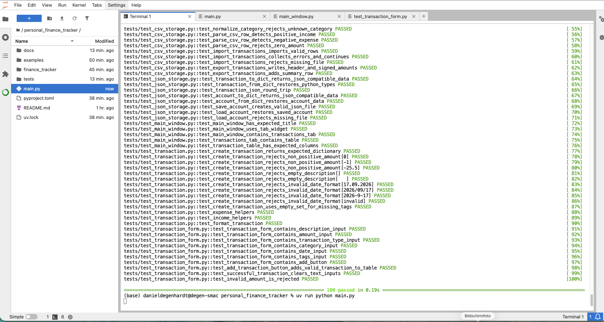

#### Transaction form preview

The completed transaction form allows users to enter a description, amount,
transaction type, category, date, and optional tags. A successful transaction
is immediately shown in the table.

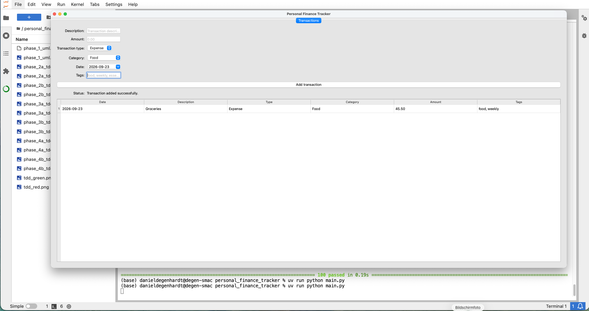

### Phase 4C: JSON file controls

Phase 4C connects the graphical user interface with the JSON storage functions
implemented in Phase 3.

The Transactions tab provides two additional controls:

- **Save JSON** saves the current account to a JSON file.
- **Load JSON** loads an account from a selected JSON file.

Native Qt file dialogs are used so that the user can select the destination or
source file through the operating system.

#### Saving an account

When the user selects **Save JSON**, the application:

1. Opens a save-file dialog.
2. Reads the selected path.
3. Adds the `.json` extension when necessary.
4. Calls `save_account()` from `json_storage.py`.
5. Displays a success message after saving.

If the user cancels the dialog, the application performs no save operation and
the current account remains unchanged.

#### Loading an account

When the user selects **Load JSON**, the application:

1. Opens an open-file dialog.
2. Reads the selected JSON file.
3. Calls `load_account()` from `json_storage.py`.
4. Replaces the current in-memory account with the loaded account.
5. Rebuilds the transaction table from the loaded transaction dictionaries.
6. Displays a success message after loading.

If the dialog is cancelled, the current account and transaction table remain
unchanged.

Storage, conversion, and validation errors are caught by the GUI and displayed
in the status label. This prevents file-related errors from terminating the
application unexpectedly.

#### Phase 4C TDD evidence

The Phase 4C tests verify:

- the existence of the save button,
- the existence of the load button,
- saving to the selected path,
- safe cancellation of the save dialog,
- loading and replacing the current account,
- rebuilding the transaction table after loading,
- safe cancellation of the load dialog.

**RED state:**

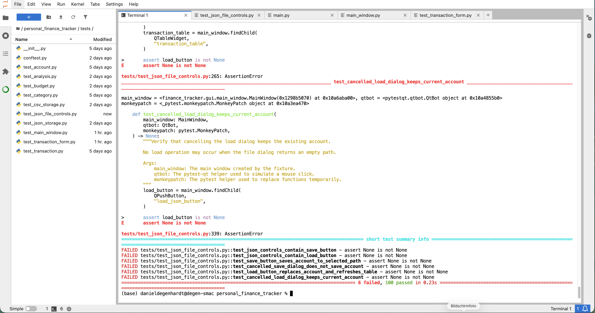

**GREEN state:**

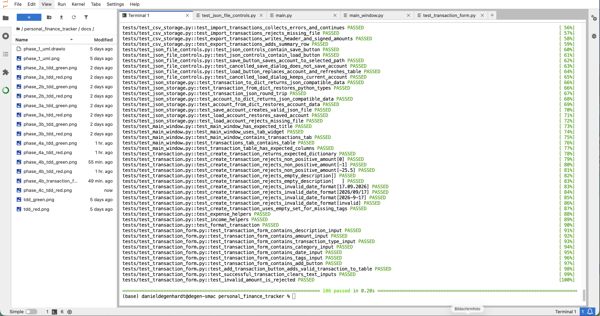

### Phase 4D: CSV import and export controls

Phase 4D connects the graphical user interface with the CSV storage functions
implemented in Phase 3. The Transactions tab now provides two additional
buttons:

| Control | Purpose |
| --- | --- |
| `Import CSV` | Reads transactions from a selected CSV file and adds every valid row to the current account |
| `Export CSV` | Writes the current transaction table to a selected CSV file and adds a summary row |

The GUI reuses `import_transactions()` and `export_transactions()` from
`finance_tracker/csv_storage.py`. CSV parsing and validation therefore remain
inside the storage layer instead of being duplicated in the window class.

#### Importing transactions

When the user selects `Import CSV`, the application:

1. Opens a native file-selection dialog.
2. Restricts the selection to CSV files.
3. Returns without changing the account if the dialog is cancelled.
4. Calls `import_transactions()` with the current account and selected path.
5. Adds every valid CSV row as a transaction dictionary.
6. Collects invalid rows without stopping the remaining import.
7. Rebuilds the transaction table from the updated account.
8. Displays the imported and skipped row counts in the status label.

The importer returns a result dictionary with three entries:

| Entry | Meaning |
| --- | --- |
| `imported` | Number of successfully imported transactions |
| `skipped` | Number of rows that could not be imported |
| `errors` | Error objects containing line numbers and reasons for invalid rows |

This design is fault tolerant: one malformed row does not prevent valid rows
later in the file from being processed.

#### Exporting transactions

When the user selects `Export CSV`, the application:

1. Opens a native save-file dialog.
2. Reads the destination selected by the user.
3. Returns without writing a file if the dialog is cancelled.
4. Adds the `.csv` extension when it is missing.
5. Calls `export_transactions()` with the current account and selected path.
6. Writes a header, one row per transaction, and a final summary row.
7. Displays a success message in the status label.

Income values are exported as positive amounts and expense values as negative
amounts. The summary row includes the account balance so that the exported file
can also be inspected in spreadsheet software.

#### Error handling

File-system, conversion, and validation errors are caught by the GUI. Instead
of terminating the application, the window displays a readable message in the
status label. The current in-memory account remains available for further work.

#### Phase 4D TDD evidence

The Phase 4D tests were written before the CSV controls were implemented. The
RED run proves that the new buttons and handlers did not yet exist.

RED state:

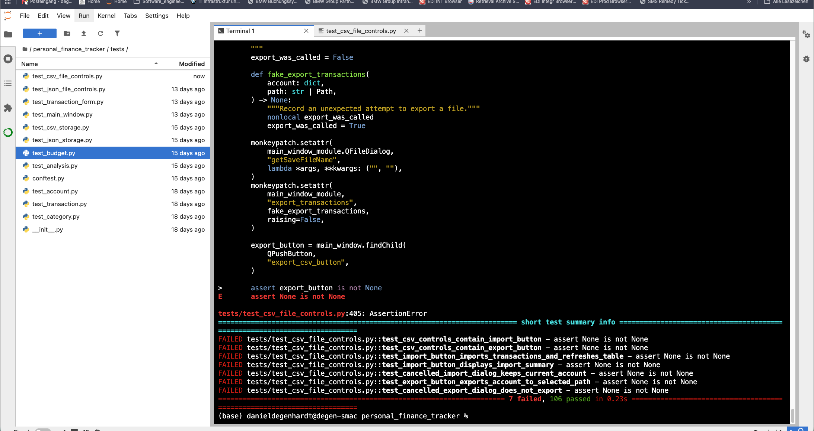

After the CSV controls and their handlers were implemented, the new tests and
all tests from the earlier phases passed together.

GREEN state:

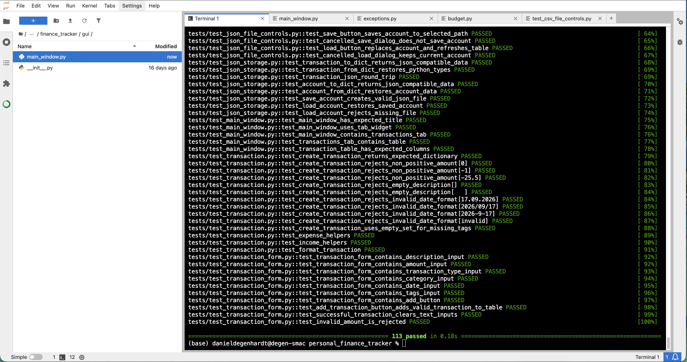

The Phase 4D tests verify:

- the existence of the `Import CSV` button,
- the existence of the `Export CSV` button,
- importing valid CSV rows through the GUI,
- refreshing the transaction table after an import,
- displaying imported and skipped row counts,
- exporting to the selected path,
- safe cancellation of import and export dialogs.

### Phase 4 architecture

The Phase 4 GUI is a presentation layer placed on top of the existing
dictionary-based domain and storage logic. `MainWindow` manages the visible
widgets and current account. It delegates validation to the transaction layer
and file operations to the JSON and CSV storage layers.

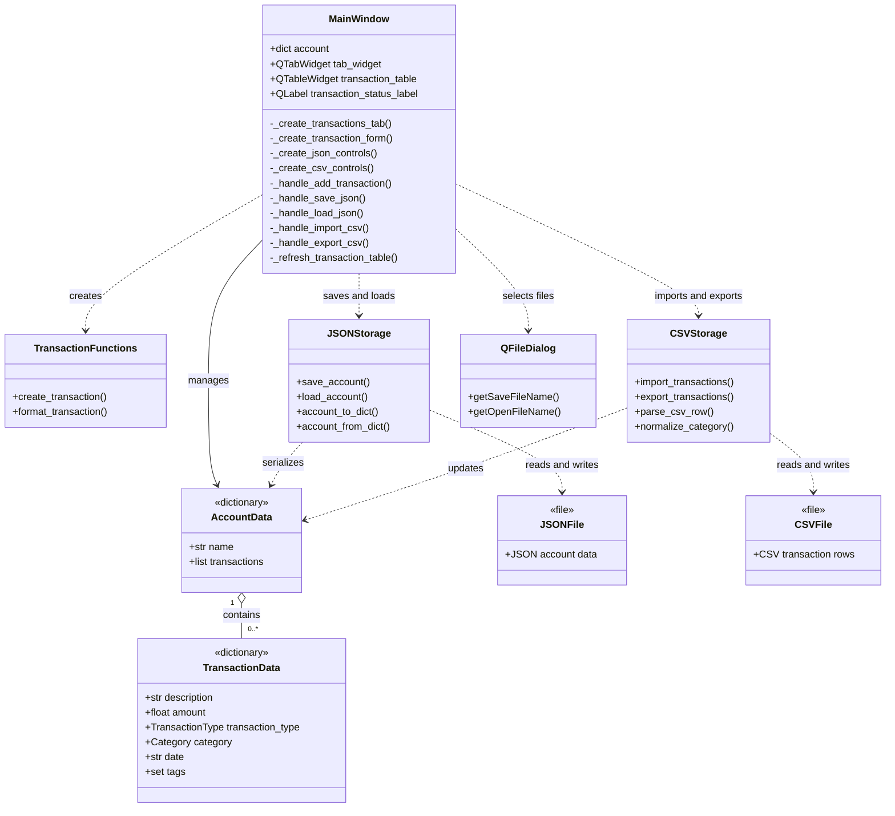
```mermaid
classDiagram
    direction TB

    class MainWindow {
        +dict account
        +QTabWidget tab_widget
        +QTableWidget transaction_table
        +QLabel transaction_status_label
        -_create_transactions_tab()
        -_create_transaction_form()
        -_create_json_controls()
        -_create_csv_controls()
        -_handle_add_transaction()
        -_handle_save_json()
        -_handle_load_json()
        -_handle_import_csv()
        -_handle_export_csv()
        -_refresh_transaction_table()
    }

    class AccountData {
        <<dictionary>>
        +str name
        +list transactions
    }

    class TransactionData {
        <<dictionary>>
        +str description
        +float amount
        +TransactionType transaction_type
        +Category category
        +str date
        +set tags
    }

    class TransactionFunctions {
        +create_transaction()
        +format_transaction()
    }

    class JSONStorage {
        +save_account()
        +load_account()
        +account_to_dict()
        +account_from_dict()
    }

    class CSVStorage {
        +import_transactions()
        +export_transactions()
        +parse_csv_row()
        +normalize_category()
    }

    class QFileDialog {
        +getSaveFileName()
        +getOpenFileName()
    }

    class JSONFile {
        <<file>>
        +JSON account data
    }

    class CSVFile {
        <<file>>
        +CSV transaction rows
    }

    AccountData "1" o-- "0..*" TransactionData : contains
    MainWindow --> AccountData : manages
    MainWindow ..> TransactionFunctions : creates
    MainWindow ..> JSONStorage : saves and loads
    MainWindow ..> CSVStorage : imports and exports
    MainWindow ..> QFileDialog : selects files
    JSONStorage ..> AccountData : serializes
    JSONStorage ..> JSONFile : reads and writes
    CSVStorage ..> AccountData : updates
    CSVStorage ..> CSVFile : reads and writes
```

### Phase 4 UML explanation

#### Components

- `MainWindow` represents the central PySide6 application window.
- `AccountData` represents the current account dictionary.
- `TransactionData` represents one transaction dictionary.
- `TransactionFunctions` represents the existing transaction business logic.
- `JSONStorage` represents JSON conversion, saving, and loading.
- `CSVStorage` represents CSV import, export, parsing, and category normalization.
- `QFileDialog` represents the native Qt file-selection dialogs.
- `JSONFile` and `CSVFile` represent external files selected by the user.

#### Relationships

- `AccountData "1" o-- "0..*" TransactionData` means that one account
  contains zero or multiple transaction dictionaries.
- `MainWindow --> AccountData` means that the main window manages the current
  in-memory account.
- `MainWindow ..> TransactionFunctions` means that the GUI delegates transaction
  creation and validation to the existing domain layer.
- `MainWindow ..> JSONStorage` means that the GUI delegates JSON save and load
  operations to the JSON storage layer.
- `MainWindow ..> CSVStorage` means that the GUI delegates CSV import and export
  operations to the CSV storage layer.
- `MainWindow ..> QFileDialog` means that Qt dialogs select source and destination
  files.
- `JSONStorage ..> JSONFile` and `CSVStorage ..> CSVFile` mean that the storage
  functions read and write their corresponding file formats.

#### Separation of responsibilities

| Layer | Responsibility |
| --- | --- |
| GUI layer | Displays widgets, reads user input, selects files, refreshes the table, and reports results |
| Domain layer | Creates and validates transaction and account dictionaries |
| Storage layer | Converts, imports, exports, saves, and loads JSON and CSV data |
| Test layer | Verifies domain, storage, and GUI behaviour |

This separation avoids duplicating business rules inside the graphical user
interface. It also makes the individual parts easier to test, maintain, and
extend.

### Running the graphical application

From the project directory, start the application with:

```bash
uv run python main.py
```

The window can then be used to add transactions, save or load JSON accounts,
and import or export CSV files.

### Phase 4 testing status

Phase 4A, Phase 4B, Phase 4C, and Phase 4D were developed incrementally with
Test-Driven Development:

1. Tests were written before each implementation.
2. The new tests initially failed.
3. The required GUI functionality was implemented.
4. All existing and new tests were executed together.
5. The complete test suite passed without regressions.

Final result after Phase 4D:

```text
113 passed
```

Phase 4 is now complete. The graphical application supports transaction entry,
table display, JSON persistence, and CSV data exchange while continuing to use
the dictionary-based architecture from the earlier phases.


---

## Phase 5: Dashboard and budget integration

Phase 5 adds financial summaries and connects the existing budget functions to
the PySide6 interface. The application now has three tabs: `Transactions`,
`Dashboard`, and `Budgets`.

### Phase 5A: Dashboard totals

The Dashboard tab displays total income, total expenses, and the account
balance. Values are calculated from the current account and formatted with two
decimal places.

The GUI delegates the calculations to `calculate_income_total()`,
`calculate_expense_total()`, and `calculate_balance()` from `account.py`.

### Phase 5B: Monthly summary

The monthly summary table displays `Month`, `Income`, `Expenses`, and `Balance`.
It uses `monthly_summary()` from `analysis.py` to group transactions by month.
The `net` value returned by this function is displayed in the Balance column.

A newly created account has no monthly rows. Adding transactions, loading an
account, or importing CSV transactions updates the summary.

### Phase 5C: Expenses by category

The category table displays `Category` and `Expenses`. It uses
`category_breakdown()` from `analysis.py` and lists expense totals in descending
order. Income transactions are excluded.

This summary includes all months in the current account. Phase 5 does not add
a dashboard month filter.

#### Phase 5C TDD evidence

- [RED: category expense tests](docs/phase_5c_tdd_red.png)
- [GREEN: category expense tests](docs/phase_5c_tdd_green.png)

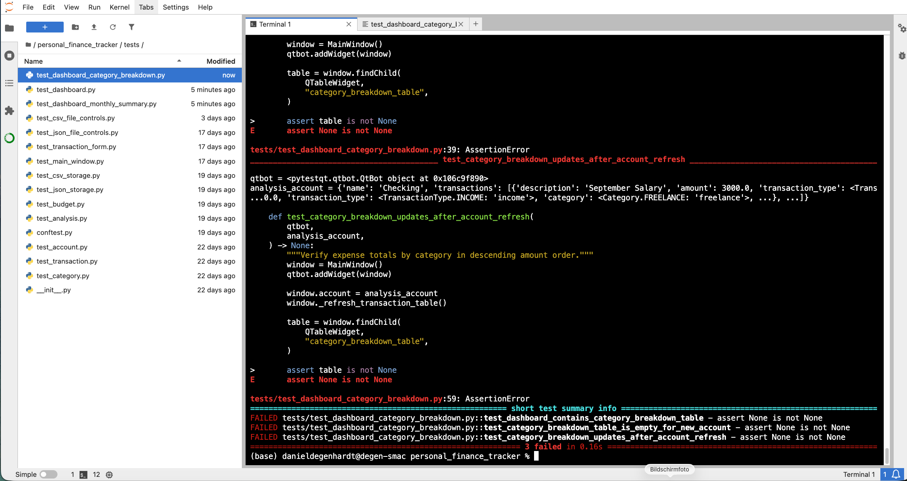

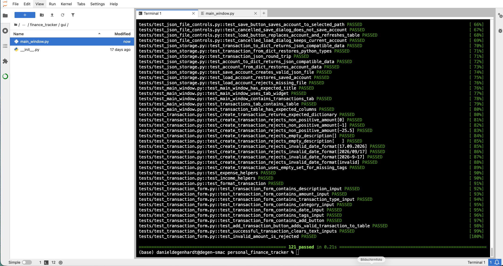

#### Phase 5C interface screenshot

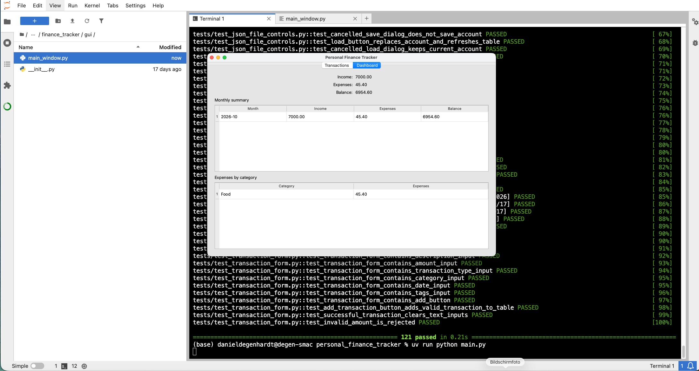

### Phase 5D1: Budget overview

The Budgets tab contains a read-only overview of the budgets in the current
tracker.

| Column | Meaning |
| --- | --- |
| Month | Budget month in `YYYY-MM` format |
| Category | Category to which the limit applies |
| Limit | Monthly budget limit |
| Spent | Expenses matching the budget category and month |
| Remaining | Limit minus matching expenses |
| Usage | Matching expenses as a percentage of the limit |
| Status | `Within budget` or `Exceeded` |

The table uses `calculate_spent_amount()`, `remaining()`, `usage_percentage()`,
and `is_exceeded()` from `budget.py`. Income does not count as budget spending.

For example, a Food budget of `300.00` and matching expenses of `195.00` produces
`105.00` remaining and `65.00%` usage. A budget is exceeded only when expenses
are greater than its limit. Exactly `100.00%` is still `Within budget`.

#### Phase 5D1 TDD evidence

- [RED: budget overview tests](docs/phase_5d1_tdd_red.png)
- [GREEN: budget overview tests](docs/phase_5d1_tdd_green.png)

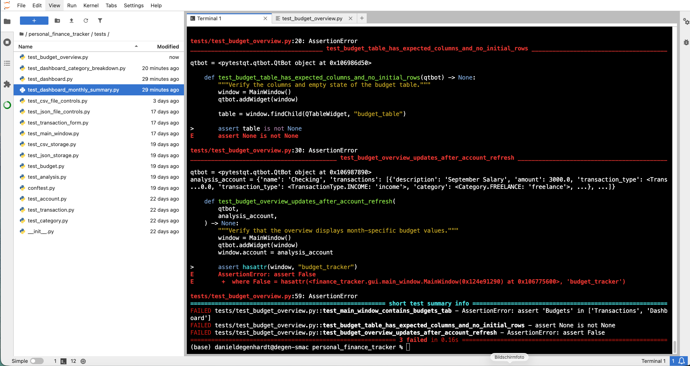

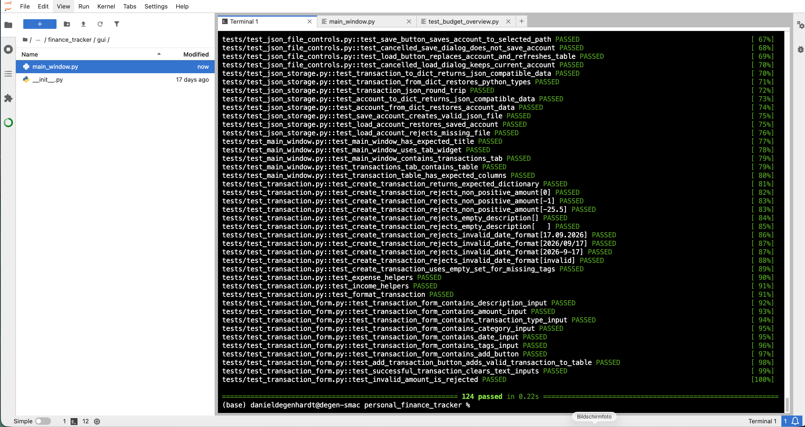

#### Phase 5D1 interface screenshot

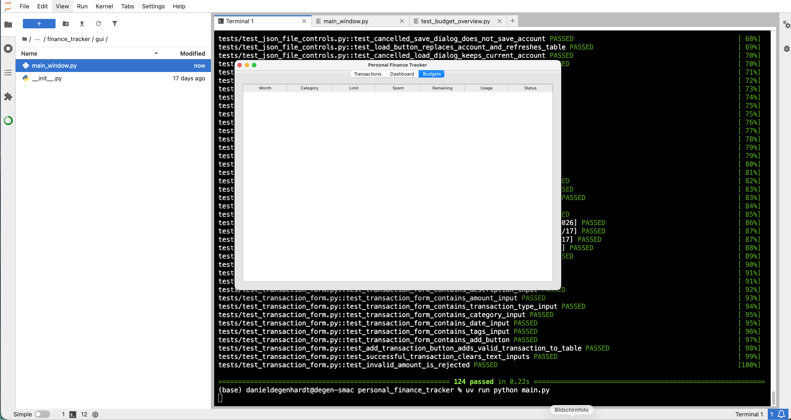

### Phase 5D2: Budget form

The form provides a category selection, a monthly limit input, a month
selection, a `Set budget` button, and a status label.

To create or change a budget:

1. Select a category.
2. Enter a positive limit using a decimal point, for example `300.00`.
3. Select the year and month.
4. Select `Set budget`.

The GUI calls `set_budget()` from the existing domain layer. The same category
and month replace an existing budget; a different category or month adds a new
budget. The overview refreshes immediately after successful submission.

Empty input, non-numeric text, zero, negative values, and non-finite numbers
are rejected. Invalid input leaves the existing budget unchanged. Successful
submission keeps the form values available for further edits.

`Budget saved for this session.` confirms an in-memory change. Use
`Save budgets` to write these changes to a file.

### Phase 5D3: Budget JSON files

The Budgets tab provides two file controls:

- `Save budgets` writes the current budget tracker to a JSON file and appends
  `.json` when the filename has no JSON extension.
- `Load budgets` validates a selected JSON file, replaces the budget tracker,
  and refreshes the overview using the current account.

Budget JSON conversion and file access are implemented in `json_storage.py`:

| Function | Responsibility |
| --- | --- |
| `budget_tracker_to_dict()` | Converts category enums into JSON-compatible names and validates the data |
| `budget_tracker_from_dict()` | Restores category enums and validates each budget through the domain layer |
| `save_budgets()` | Writes a validated tracker as UTF-8 JSON |
| `load_budgets()` | Reads JSON and returns a validated tracker |

Example budget file:

```json
{
    "budgets": [
        {
            "category": "FOOD",
            "monthly_limit": 300.0,
            "month": "2026-09"
        }
    ]
}
```

The category is stored as an enum name such as `FOOD`, following the existing
transaction JSON convention. Loading restores `Category.FOOD`.

The loader checks the file structure, required fields, category names, numeric
finite limits, and month strings. Existing domain validation checks positive
limits and valid months. A new tracker is returned only after all entries have
been processed successfully.

Cancelling a file dialog leaves the current state unchanged. Loading errors
are displayed in the budget status label and preserve the existing tracker.
A valid empty budget list clears the overview. Loading replaces budgets rather
than merging them; it does not replace the current account.

### Saving and restoring a complete session

Account transactions and budget limits use separate JSON files.

| Data | Save control | Load control | Example filename |
| --- | --- | --- | --- |
| Account and transactions | `Save JSON` in Transactions | `Load JSON` in Transactions | `account.json` |
| Budget limits | `Save budgets` in Budgets | `Load budgets` in Budgets | `budgets.json` |

Save both files before closing the application. After a restart, load the
account and budget files to restore the data and recalculate the summaries.
There is no automatic save or automatic restore in Phase 5.

### Refresh behaviour

Adding a transaction, loading an account, and importing CSV transactions update
the dashboard totals, monthly summary, category summary, and budget overview.
Setting or loading budgets updates the budget overview immediately.

Tables are rebuilt from the current data so repeated refreshes do not add
duplicate rows. Summary tables are read-only; their values are calculated from
the account and budget dictionaries.

### Phase 5 architecture

The following diagram focuses on the Phase 5 GUI dependencies. The domain model
continues to use dictionaries. Boxes named after modules represent groups of
functions, not additional Python classes.

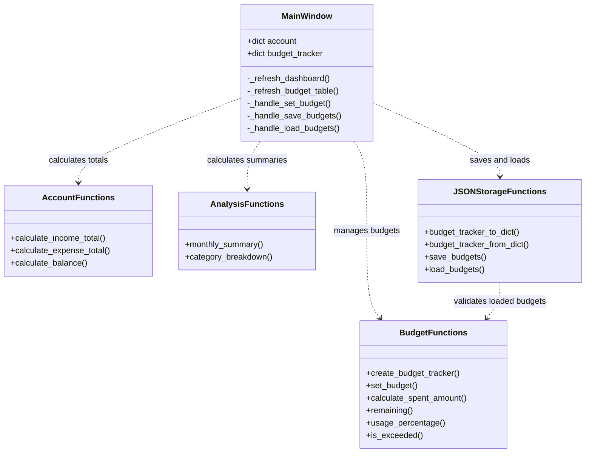
```mermaid
classDiagram
    direction TB

    class MainWindow {
        +dict account
        +dict budget_tracker
        -_refresh_dashboard()
        -_refresh_budget_table()
        -_handle_set_budget()
        -_handle_save_budgets()
        -_handle_load_budgets()
    }

    class AccountFunctions {
        +calculate_income_total()
        +calculate_expense_total()
        +calculate_balance()
    }

    class AnalysisFunctions {
        +monthly_summary()
        +category_breakdown()
    }

    class BudgetFunctions {
        +create_budget_tracker()
        +set_budget()
        +calculate_spent_amount()
        +remaining()
        +usage_percentage()
        +is_exceeded()
    }

    class JSONStorageFunctions {
        +budget_tracker_to_dict()
        +budget_tracker_from_dict()
        +save_budgets()
        +load_budgets()
    }

    MainWindow ..> AccountFunctions : calculates totals
    MainWindow ..> AnalysisFunctions : calculates summaries
    MainWindow ..> BudgetFunctions : manages budgets
    MainWindow ..> JSONStorageFunctions : saves and loads
    JSONStorageFunctions ..> BudgetFunctions : validates loaded budgets
```

The GUI creates widgets, reads input, opens dialogs, and reports results. Domain
functions calculate summaries and validate budgets. Storage functions convert
and persist data. `..>` denotes a dependency; `-` denotes an internal method in
this diagram.

### Phase 5 test files

| Test file | Coverage |
| --- | --- |
| `tests/test_dashboard.py` | Dashboard totals |
| `tests/test_dashboard_monthly_summary.py` | Monthly summary columns and values |
| `tests/test_dashboard_category_breakdown.py` | Expense category totals and ordering; not yet committed |
| `tests/test_budget_overview.py` | Budgets tab, overview columns, and monthly values; not yet committed |
| `tests/test_budget_form.py` | Creation, replacement, separate months, and invalid input |
| `tests/test_budget_storage.py` | JSON format, round trips, empty trackers, and invalid files |
| `tests/test_budget_file_controls.py` | GUI save/load, extension handling, cancellation, and failed loading |

Each step used separate RED and GREEN stages. The complete Phase 5 learning
workspace passed `144` tests. The current GitHub repository passes:

```text
138 passed
```

Verified on 11 October 2026 under Linux with Qt running offscreen. The six-test
difference comes from `tests/test_dashboard_category_breakdown.py` and
`tests/test_budget_overview.py`, which are not yet committed. Both contain three
cases. The category summary and budget overview implementations are present.

Run the complete test suite from the project directory:

```bash
uv run pytest -v
```

Run only the Phase 5D3 tests:

```bash
uv run pytest tests/test_budget_storage.py tests/test_budget_file_controls.py -v
```

Start the desktop application:

```bash
uv run python main.py
```

### Phase 5 TDD screenshots

The links below point to screenshots currently committed to the repository.
All RED and GREEN screenshots listed below are committed to the repository.

| Step | RED evidence | GREEN evidence |
| --- | --- | --- |
| 5A: Dashboard totals | [RED](docs/phase_5a_tdd_red.png) | [GREEN](docs/phase_5a_tdd_green.png) |
| 5B: Monthly summary | [RED](docs/phase_5b_tdd_red.png) | [GREEN](docs/phase_5b_tdd_green.png) |
| 5C: Category expenses | [RED](docs/phase_5c_tdd_red.png) | [GREEN](docs/phase_5c_tdd_green.png) |
| 5D1: Budget overview | [RED](docs/phase_5d1_tdd_red.png) | [GREEN](docs/phase_5d1_tdd_green.png) |
| 5D2: Budget form | [RED](docs/phase_5d2_tdd_red.png) | [GREEN](docs/phase_5d2_tdd_green.png) |
| 5D3: Budget files | [RED](docs/phase_5d3_tdd_red.png) | [GREEN](docs/phase_5d3_tdd_green.png) |

### Phase 5 interface screenshots

#### Dashboard totals

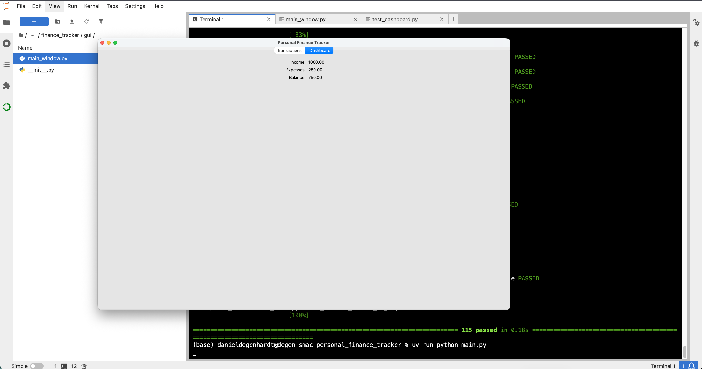

#### Monthly summary

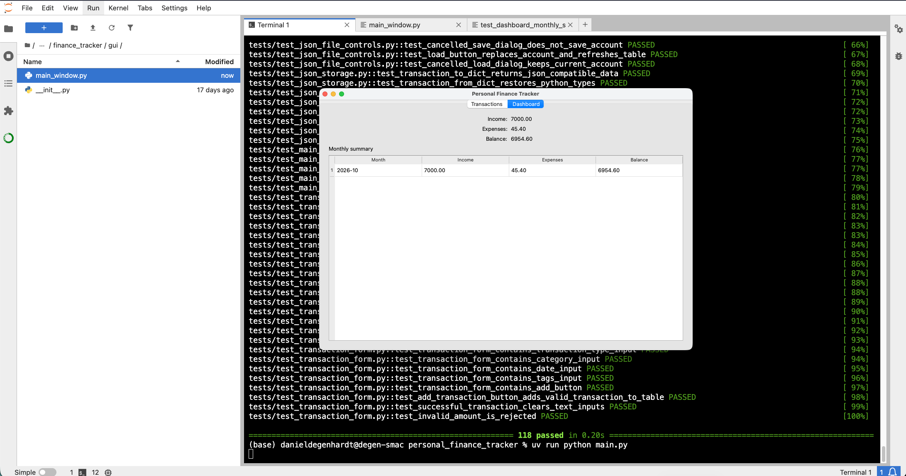

[Category summary](docs/phase_5c_dashboard_category_breakdown.png) — displayed in Phase 5C above.

- [Budget overview](docs/phase_5d1_budget_overview.png)
- [Budget form](docs/phase_5d2_budget_form.png)

#### Budget file controls

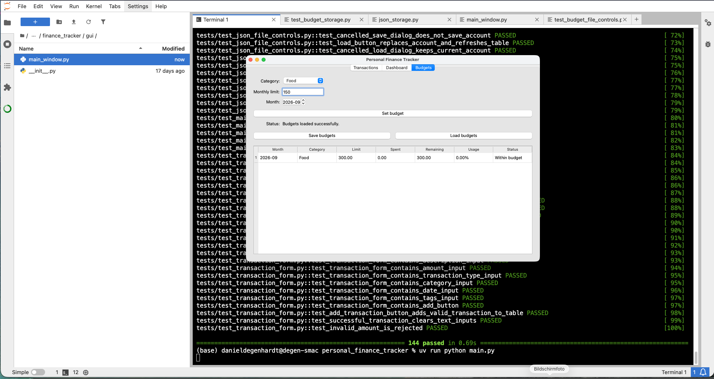

### Next phase

Phase 6 will improve the GUI structure and visual layout. The current interface
provides the functional baseline for reorganizing widgets and refining spacing,
typography, colours, and table presentation while keeping the existing tests
and domain behaviour intact.
## Phase 6A1 – Extract the Dashboard Widget

### Goal

Move the dashboard interface into a separate `DashboardWidget` component
to make the main window easier to understand and maintain.

### Changes

- Added `finance_tracker/gui/dashboard_widget.py`.
- Extracted the dashboard interface into `DashboardWidget`.
- Updated `finance_tracker/gui/main_window.py` to use the new component.
- Preserved the existing dashboard functionality.

### Design

The main window integrates the application's components.
The dashboard widget manages the dashboard interface.

This separation supports the Single Responsibility Principle (SRP)
and improves the cohesion of the GUI components.

### TDD – RED → GREEN

1. **RED:** Added tests for the standalone dashboard widget before implementation.
2. **GREEN:** Implemented the widget and integrated it into the main window.
3. **Verification:** The complete test suite passed.

**Result: 149 passed.**

### Test Evidence

**RED – Before implementation**

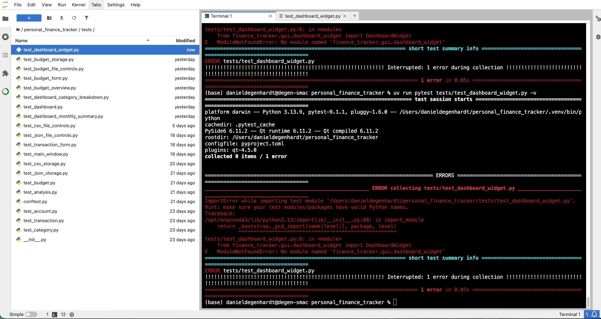

**GREEN – All 149 tests passed**

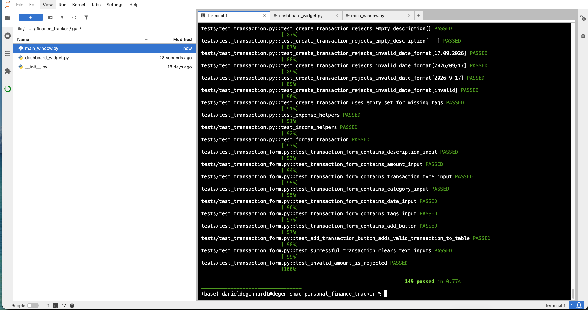

### Dashboard after Refactoring

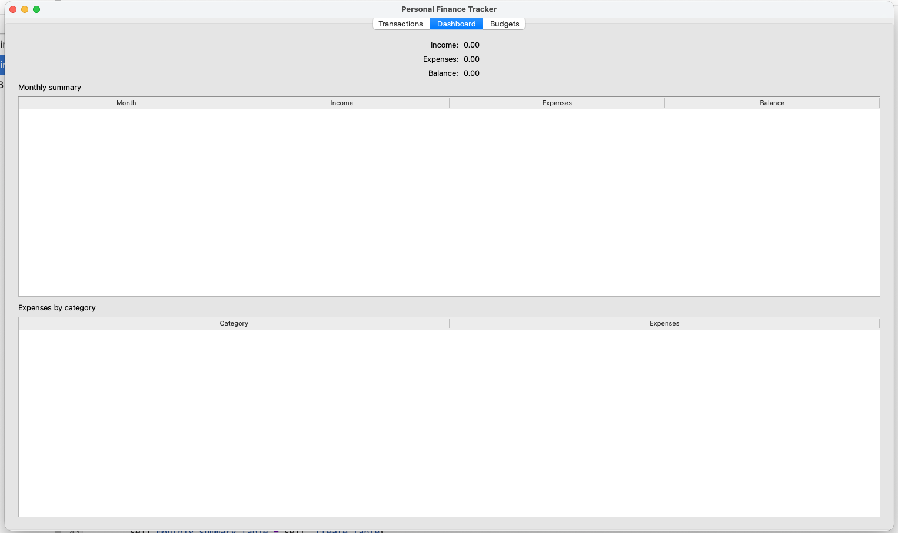

## Phase 6A2 - Extract the Budget Widget

### Goal

Move the budget interface into a standalone `BudgetWidget` to make
the main window easier to understand and maintain.

### Changes

- Added `finance_tracker/gui/budget_widget.py`.
- Moved the budget form, file buttons, and overview table into `BudgetWidget`.
- Updated `MainWindow` to embed the widget in the Budgets tab.
- Preserved existing widget access through aliases referencing the same objects.

### Responsibilities

| Component | Responsibility |
| --- | --- |
| `BudgetWidget` | Creates the budget interface and displays budget usage |
| `MainWindow` | Owns session data, handles requests, and coordinates storage |
| Budget functions | Validate budgets and calculate spent, remaining, usage, and exceeded status |
| JSON storage functions | Save and load budget data |

### Qt Signals

The widget emits three requests:

- `set_budget_requested`
- `save_budgets_requested`
- `load_budgets_requested`

`MainWindow` connects these signals to its existing handlers.

The widget does not own an account or budget tracker.
Its `refresh(budget_tracker, account)` method receives the current data
and rebuilds the overview.

The `usage_percentage` function is now imported by `budget_widget.py`.
Its calculation remains part of the application.

### TDD - RED → GREEN

1. **RED:** Added tests before the widget module existed.
   Pytest reported `ModuleNotFoundError` during test collection.
2. **GREEN:** Implemented `BudgetWidget` and integrated it into `MainWindow`.
3. **Verification:** All existing and new tests passed.

The four new tests cover:

- The seven budget table columns.
- Removal of outdated rows during refresh.
- Button request signals.
- Integration into the main window and shared widget references.

**Result: 153 passed.**

### Test Evidence

**RED - Before implementation**

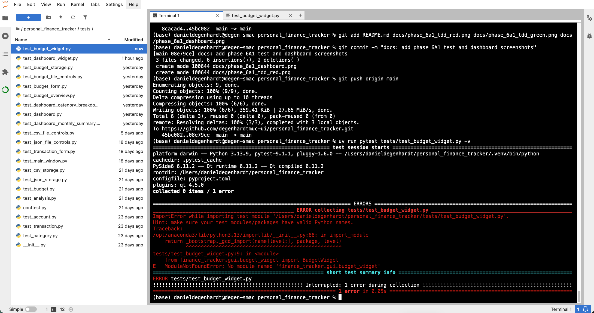

**GREEN - All 153 tests passed**

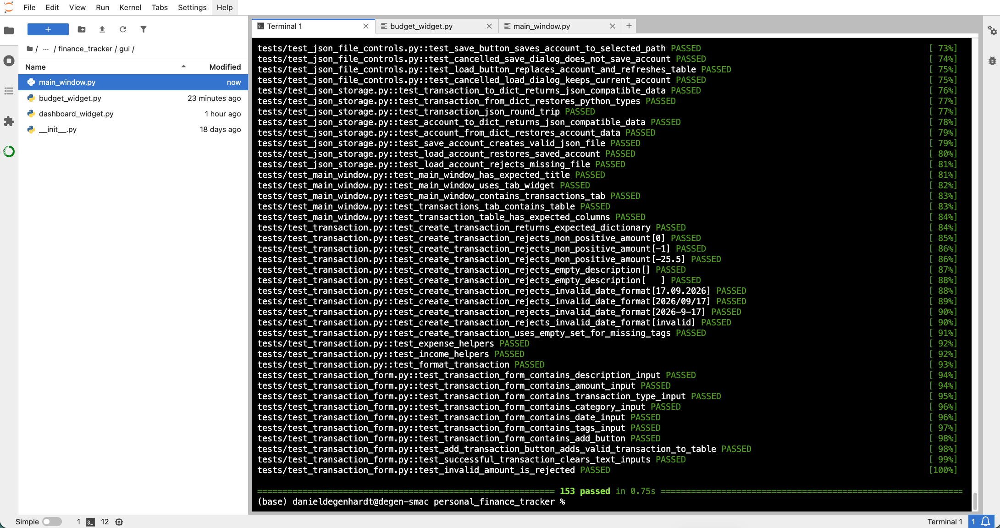

### Budget Interface after Refactoring

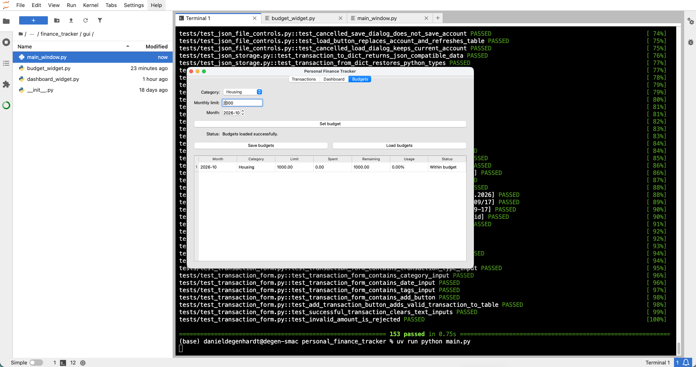


## Phase 6A3 - Extract the Transactions Widget

### Goal

Move the transaction interface into a standalone `TransactionsWidget`
to separate widget construction and table presentation from application
coordination.

### Changes

- Added `finance_tracker/gui/transactions_widget.py`.
- Moved the transaction form into the new widget.
- Moved the JSON and CSV buttons into the new widget.
- Moved transaction table construction and row rendering into the new widget.
- Updated `MainWindow` to embed the widget in the Transactions tab.
- Preserved existing widget access through aliases referencing the same objects.

### Responsibilities

| Component | Responsibility |
| --- | --- |
| `TransactionsWidget` | Creates inputs and buttons, displays transactions, and clears text fields |
| `MainWindow` | Reads input, coordinates validation, manages the account, and performs file operations |
| Transaction functions | Validate input and create transaction dictionaries |
| Account functions | Store transactions in the account |
| JSON and CSV storage functions | Save, load, import, and export data |

### Widget Methods

| Method | Purpose |
| --- | --- |
| `append_transaction(transaction)` | Displays one validated transaction |
| `refresh(account)` | Replaces all displayed rows with the supplied account transactions |
| `clear_form()` | Clears description, amount, and tags |

### Qt Signals

The widget emits five requests:

- `add_transaction_requested`
- `save_json_requested`
- `load_json_requested`
- `import_csv_requested`
- `export_csv_requested`

`MainWindow` connects these signals to its existing handlers.

### Transaction Flow

When a transaction is submitted:

1. The widget emits `add_transaction_requested`.
2. `MainWindow` reads the form values.
3. The domain layer validates and creates the transaction dictionary.
4. The transaction is added to the current account.
5. `TransactionsWidget` displays the new row.
6. Dashboard totals and budget usage are refreshed.
7. Description, amount, and tags are cleared.

Invalid input is reported in the status label.

Loading JSON or importing CSV rebuilds the transaction table
and refreshes the dashboard and budget overview.

### TDD - RED → GREEN

1. **RED:** Added tests before the widget module existed.
   Pytest reported `ModuleNotFoundError` during test collection.
2. **GREEN:** Implemented `TransactionsWidget` and integrated it into `MainWindow`.
3. **Verification:** All existing and new tests passed.

The four new tests cover:

- The six transaction table columns.
- Removal of outdated rows during refresh.
- All five button request signals.
- Integration into the main window and shared widget references.

**Result: 157 passed.**

### Test Evidence

**RED - Before implementation**

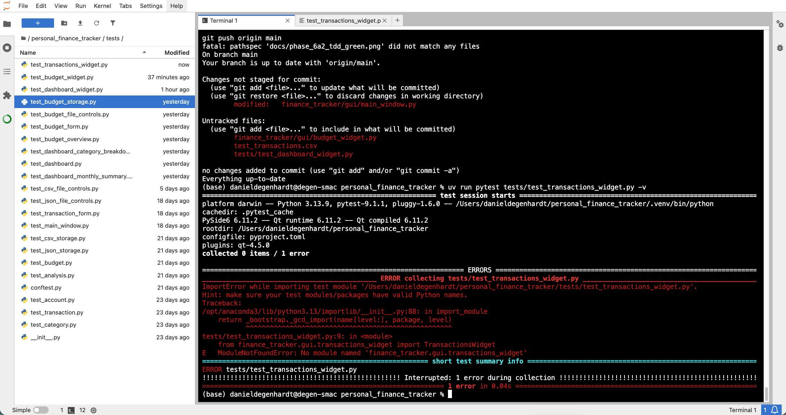

**GREEN - All 157 tests passed**

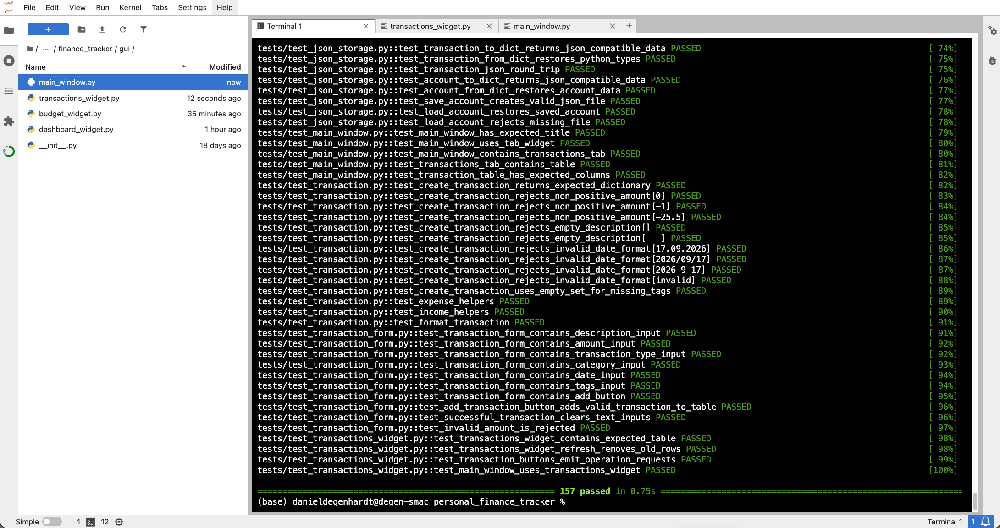

### Transaction Interface after Refactoring

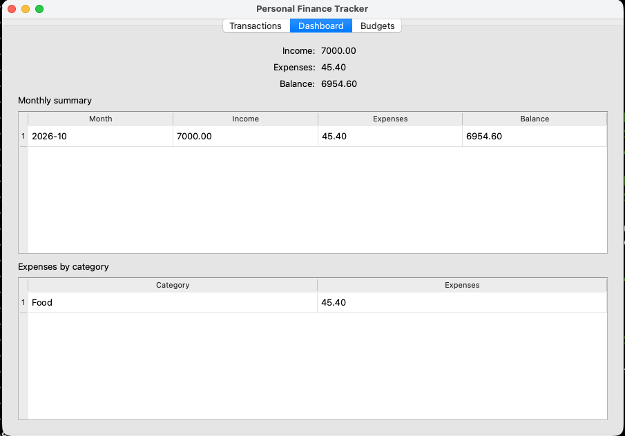

### Phase 6A Component Relationships

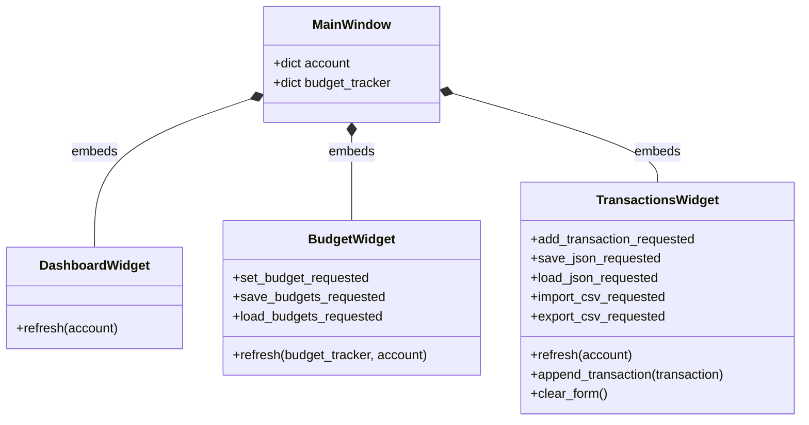
```mermaid
classDiagram
    direction TB

    class MainWindow {
        +dict account
        +dict budget_tracker
    }

    class DashboardWidget {
        +refresh(account)
    }

    class BudgetWidget {
        +refresh(budget_tracker, account)
        +set_budget_requested
        +save_budgets_requested
        +load_budgets_requested
    }

    class TransactionsWidget {
        +refresh(account)
        +append_transaction(transaction)
        +clear_form()
        +add_transaction_requested
        +save_json_requested
        +load_json_requested
        +import_csv_requested
        +export_csv_requested
    }

    MainWindow *-- DashboardWidget : embeds
    MainWindow *-- BudgetWidget : embeds
    MainWindow *-- TransactionsWidget : embeds
```

### Design Explanation

Each widget groups the presentation of one application tab.

Qt request signals connect user actions to coordination in `MainWindow`.
The main window owns the current account and budget tracker.

Existing widget aliases reference the same Qt objects.
They do not create additional inputs or tables.

This refactoring improves cohesion and supports the Single Responsibility
Principle by separating tab presentation from application coordination.

The dictionary-based domain model remains the source of truth.
Tables display the current data.

### Run the Component Tests

```bash
uv run pytest tests/test_budget_widget.py tests/test_transactions_widget.py -v
```

### Run All Tests

```bash
uv run pytest -v
```

### Start the Application

```bash
uv run python main.py
```
## Phase 6B1 - Compact Transaction Layout

### Goal

Improve the layout of the Transactions tab by arranging inputs more compactly,
grouping related buttons, and giving the transaction table more available space.

Phase 6A separated the interface into individual widgets.
Phase 6B now improves the arrangement of those widgets.

The selected layout is **Compact at the top**:
transaction inputs appear above the table in two groups of three columns.

### Changes

- Replaced the transaction form's `QFormLayout` with a `QGridLayout`.
- Arranged six input fields in three columns.
- Placed each label directly above its input field.
- Added consistent outer margins and layout spacing.
- Moved the submission button and status message into a separate row.
- Grouped JSON and CSV controls in one horizontal toolbar.
- Assigned additional vertical space to the transaction table.
- Enabled word wrapping for longer status messages.

### Files

| File | Responsibility |
| --- | --- |
| `finance_tracker/gui/transactions_widget.py` | Builds the compact form, grouped controls, and transaction table |
| `tests/test_transactions_layout.py` | Tests input positions, spacing, and vertical space allocation |

`MainWindow` continues to handle transaction validation, account management,
and file operations through the existing request signals.

### Form Arrangement

The grid uses four rows: two label rows and two input rows.

| Grid row | Column 0 | Column 1 | Column 2 |
| --- | --- | --- | --- |
| 0: Labels | Description | Amount | Transaction type |
| 1: Inputs | Description input | Amount input | Type selection |
| 2: Labels | Category | Date | Tags |
| 3: Inputs | Category selection | Date input | Tags input |

Compared with six fields arranged vertically, this structure reduces
the height required by the input area and leaves more room for the table.

### Grid Layout

`QGridLayout` places widgets at explicit row and column positions.

```python
grid.addWidget(label, label_row, column)
grid.addWidget(input_widget, label_row + 1, column)
```

The label is placed in its assigned row.
The input field is placed one row below it, in the same column.

A list of field definitions provides the label text, input widget,
label row, and column. A loop creates the six label/input pairs.

The grid receives the object name `transaction_form_grid`.
This allows automated tests to find the layout without relying on
its visual appearance.

### Column Space Allocation

Each column receives the same stretch factor:

```python
for column in range(3):
    grid.setColumnStretch(column, 1)
```

This distributes additional horizontal space evenly between the columns,
subject to the widgets' minimum sizes and size hints.

Input fields use the following size policy:

```python
input_widget.setSizePolicy(
    QSizePolicy.Policy.Expanding,
    QSizePolicy.Policy.Fixed,
)
```

The fields can expand horizontally while retaining their preferred height.

### Margins and Spacing

The layout uses explicitly defined spacing values.

| Area | Setting | Value |
| --- | --- | ---: |
| Main layout | Left, top, right, and bottom margins | 20 |
| Main layout | Spacing between sections | 16 |
| Input grid | Additional outer margins | 0 |
| Input grid | Horizontal spacing | 16 |
| Input grid | Vertical spacing | 8 |
| Submission row | Spacing between button and status | 12 |
| File toolbar | Spacing between JSON and CSV groups | 24 |
| File groups | Spacing within each group | 8 |

These values are Qt layout units and follow the application's display scaling.

The inner layouts use zero outer margins to avoid accumulating
additional padding inside the main layout.

### Submission and Status Row

The Add transaction button and status label share a horizontal layout.

```python
controls.addWidget(self.add_transaction_button)
controls.addWidget(self.transaction_status_label, 1)
```

The status label receives the available horizontal space beside the button.

```python
self.transaction_status_label.setWordWrap(True)
```

Longer success or validation messages can wrap onto multiple lines.
The row can therefore grow vertically when required.

### Grouped File Controls

JSON and CSV operations are grouped separately within one toolbar.

- **JSON:** Save JSON and Load JSON.
- **CSV:** Import CSV and Export CSV.

```python
controls.addLayout(self._create_json_controls())
controls.addLayout(self._create_csv_controls())
controls.addStretch(1)
```

The stretch at the end absorbs unused horizontal space,
keeping the button groups aligned to the left.

The existing request signals remain connected to the handlers
in `MainWindow`.

### Table Space Allocation

The transaction table receives a vertical stretch factor of `1`:

```python
layout.addWidget(self.transaction_table, 1)
```

The other sections have a stretch factor of `0`.

When additional vertical space is available, the layout preferentially
allocates it to the table. This allows more transaction rows to be visible
when the window is enlarged.

The stretch factor is a relative weight, not a fixed size or a percentage
of the complete window.

### TDD - RED → GREEN

1. **RED:** Added layout tests before changing the existing interface.
   The tests failed because the compact grid, explicit spacing,
   and table stretch factor were not yet implemented.
2. **GREEN:** Implemented the compact layout in `TransactionsWidget`.
3. **Verification:** All existing and new tests passed.

### New Layout Tests

| Test | Coverage |
| --- | --- |
| `test_transaction_inputs_use_compact_grid` | Checks all six input positions in the named grid |
| `test_transaction_layout_has_consistent_spacing` | Checks outer margins and main/grid spacing |
| `test_transaction_table_receives_extra_vertical_space` | Checks the table's stretch factor and the other sections' factors |

The layout tests verify the agreed structural settings.
A visual check additionally confirms how the interface behaves
when the window is displayed and resized.

**Complete test result: 160 passed.**

### Test Evidence

**RED - Before implementation**

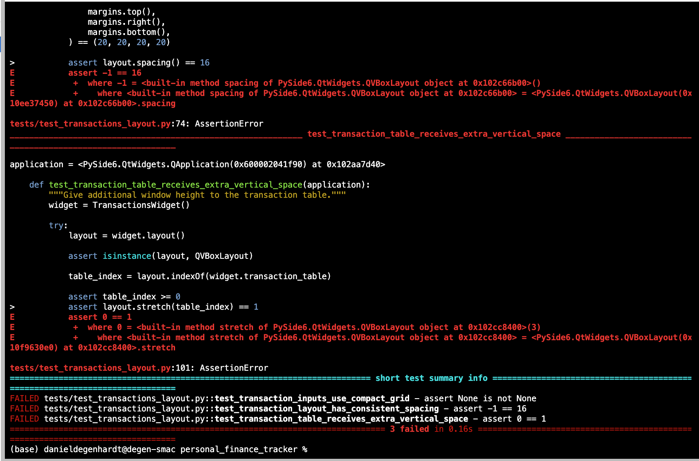

**GREEN - All 160 tests passed**

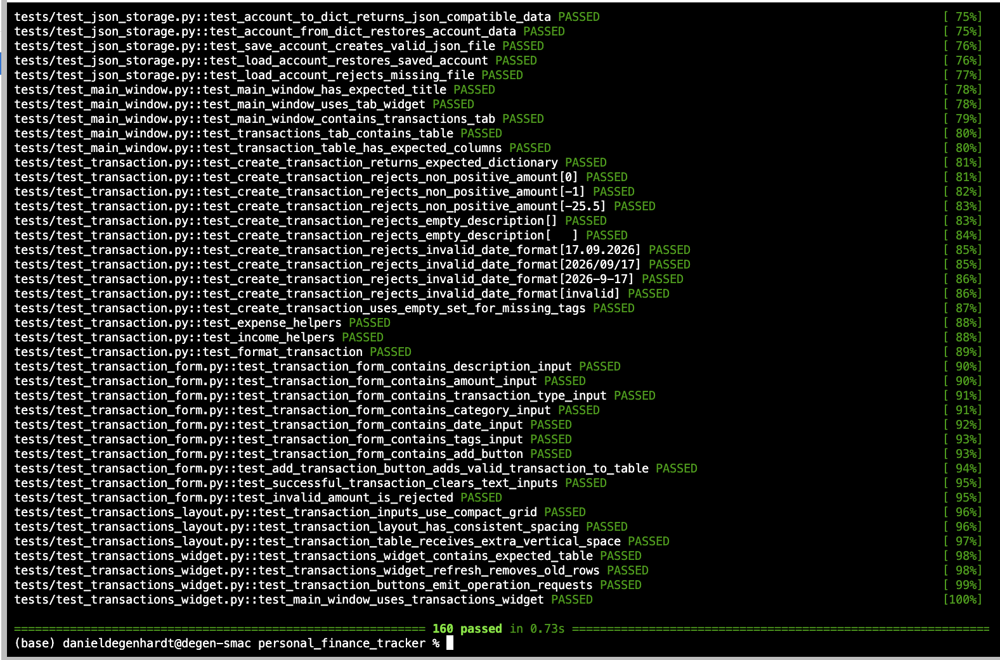

### Transaction Interface after Layout Improvements

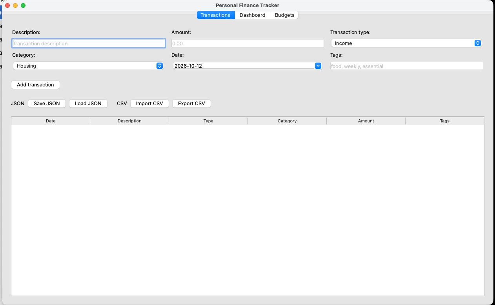

### Verification Commands

Run the new layout tests:

```bash
uv run pytest tests/test_transactions_layout.py -v
```

Run the complete test suite:

```bash
uv run pytest -v
```

Start the application:

```bash
uv run python main.py
```

### Manual Interface Checks

- Add a valid transaction.
- Enter an invalid amount and inspect the status message.
- Enlarge the window and confirm that the transaction table grows.
- Check that the input fields and grouped file buttons remain readable.

### Result

Phase 6B1 provides a more compact transaction entry area,
consistent spacing, and more available room for the transaction table.

The next layout steps will improve the Budgets and Dashboard tabs.
Colours, typography, and consistent status styling belong to Phase 6C.
Financial charts belong to Phase 6D.
## Phase 6B2 - Compact Budget Layout

### Goal

Improve the Budgets tab by arranging its inputs in one compact row,
using consistent spacing, and giving the budget overview more available space.

The layout follows the same principles introduced for Transactions in Phase 6B1.

### Changes

- Replaced the budget form's `QFormLayout` with a `QGridLayout`.
- Arranged Category, Monthly limit, and Month in three columns.
- Placed each label directly above its input.
- Added consistent outer margins and spacing.
- Positioned Set budget beside a wrapping status message.
- Grouped Save budgets and Load budgets in a JSON toolbar.
- Assigned additional vertical space to the budget table.

### Files

| File | Responsibility |
| --- | --- |
| `finance_tracker/gui/budget_widget.py` | Creates the compact budget interface and displays budget usage |
| `tests/test_budget_layout.py` | Tests input positions, spacing, and table stretch |

`MainWindow` continues to manage budget data, validate submissions,
and coordinate saving and loading.

### Form Arrangement

| Grid row | Column 0 | Column 1 | Column 2 |
| --- | --- | --- | --- |
| 0: Labels | Category | Monthly limit | Month |
| 1: Inputs | Category selection | Limit input | Month selection |

The three input fields now appear beside each other.
This reduces the vertical space required by the form.

### Grid Layout

```python
grid.addWidget(label, 0, column)
grid.addWidget(input_widget, 1, column)
grid.setColumnStretch(column, 1)
```

Labels occupy row `0`.
Their corresponding inputs occupy row `1`.

Each column receives the same stretch factor.
Additional horizontal space is distributed between the columns,
subject to widget minimum sizes and size hints.

The object name `budget_form_grid` allows tests to locate the layout.

### Input Size Policy

```python
input_widget.setSizePolicy(
    QSizePolicy.Policy.Expanding,
    QSizePolicy.Policy.Fixed,
)
```

Inputs can expand horizontally while retaining their preferred height.

### Margins and Spacing

| Area | Setting | Value |
| --- | --- | ---: |
| Main layout | Left, top, right, and bottom margins | 20 |
| Main layout | Spacing between sections | 16 |
| Input grid | Additional outer margins | 0 |
| Input grid | Horizontal spacing | 16 |
| Input grid | Vertical spacing | 8 |
| Submission row | Button and status spacing | 12 |
| JSON toolbar | Spacing between items | 8 |

These are Qt layout units and follow display scaling.

Inner layouts have zero outer margins to avoid accumulating
additional padding inside the main layout.

### Submission and Status Row

```python
controls.addWidget(self.set_budget_button)
controls.addWidget(self.budget_status_label, 1)
```

The status label receives the available horizontal space
beside the Set budget button.

```python
self.budget_status_label.setWordWrap(True)
```

Longer validation or storage messages can wrap onto multiple lines.

### JSON File Controls

The file controls contain:

- A JSON label.
- Save budgets.
- Load budgets.

```python
controls.addWidget(QLabel("JSON"))
controls.addWidget(self.save_budgets_button)
controls.addWidget(self.load_budgets_button)
controls.addStretch(1)
```

The stretch at the end absorbs unused horizontal space
and keeps the controls aligned to the left.

### Table Space Allocation

```python
layout.addWidget(self.budget_table, 1)
```

The table receives a vertical stretch factor of `1`.
The other main sections have a stretch factor of `0`.

Additional window height is therefore preferentially allocated to the table.
This increases the space available for displaying budget rows.

It does not enlarge the text or create additional budget data.

### Budget Behaviour

The existing request signals remain available:

- `set_budget_requested`
- `save_budgets_requested`
- `load_budgets_requested`

`MainWindow` receives these requests and performs the corresponding operations.

The overview continues to use:

- `calculate_spent_amount`
- `remaining`
- `usage_percentage`
- `is_exceeded`

The layout refactoring preserves the existing budget calculations.

### Example: Set a Monthly Budget

Select:

| Field | Example |
| --- | --- |
| Category | Food |
| Monthly limit | 100 |
| Month | 2026-10 |

Click **Set budget**.

This defines an expense limit of 100 for Food in October 2026.
Setting a budget does not create a transaction.

If no matching expenses exist, the overview displays:

| Limit | Spent | Remaining | Usage | Status |
| ---: | ---: | ---: | ---: | --- |
| 100.00 | 0.00 | 100.00 | 0.00% | Within budget |

Existing expenses for the same category and month are included automatically.

For example, matching expenses of 25 produce:

- Spent: 25.00.
- Remaining: 75.00.
- Usage: 25.00%.

### TDD - RED → GREEN

1. **RED:** Added layout tests before implementing the compact form.
   The existing widget did not satisfy the new layout requirements.
2. **GREEN:** Implemented the grid, spacing, and table stretch.
3. **Verification:** All existing and new tests passed.

### New Layout Tests

| Test | Coverage |
| --- | --- |
| `test_budget_inputs_use_compact_grid` | Checks the three input positions |
| `test_budget_layout_has_consistent_spacing` | Checks main margins and grid spacing |
| `test_budget_table_receives_extra_vertical_space` | Checks the table's stretch factor |

The tests verify the agreed structural settings.
Manual inspection checks the displayed interface and resizing behaviour.

**Complete test result: 163 passed.**

### Test Evidence

**RED - Before implementation**

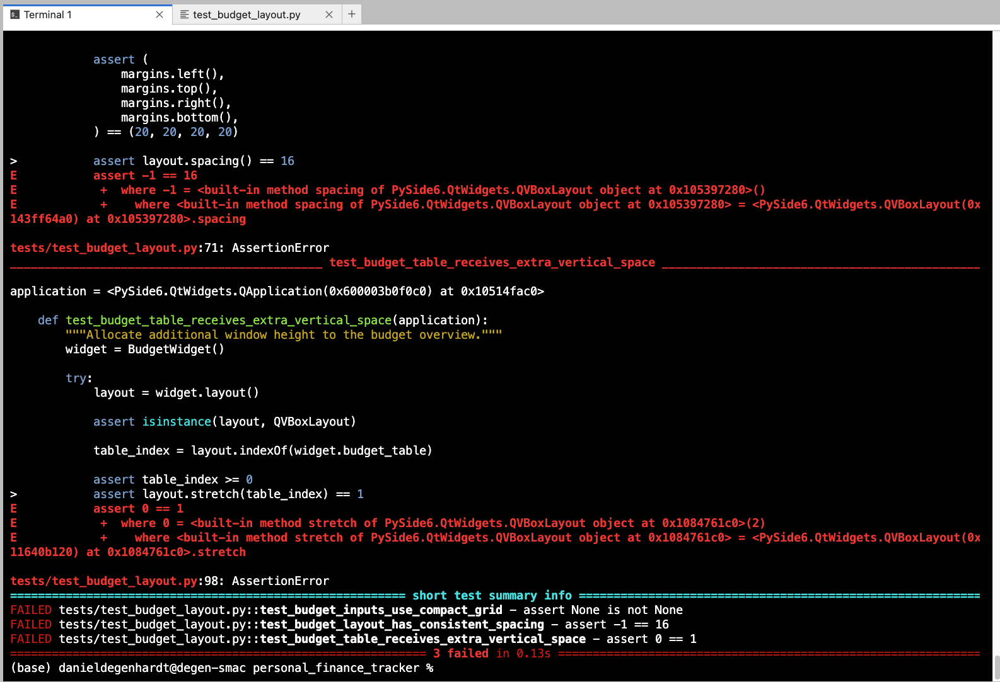

**GREEN - All 163 tests passed**

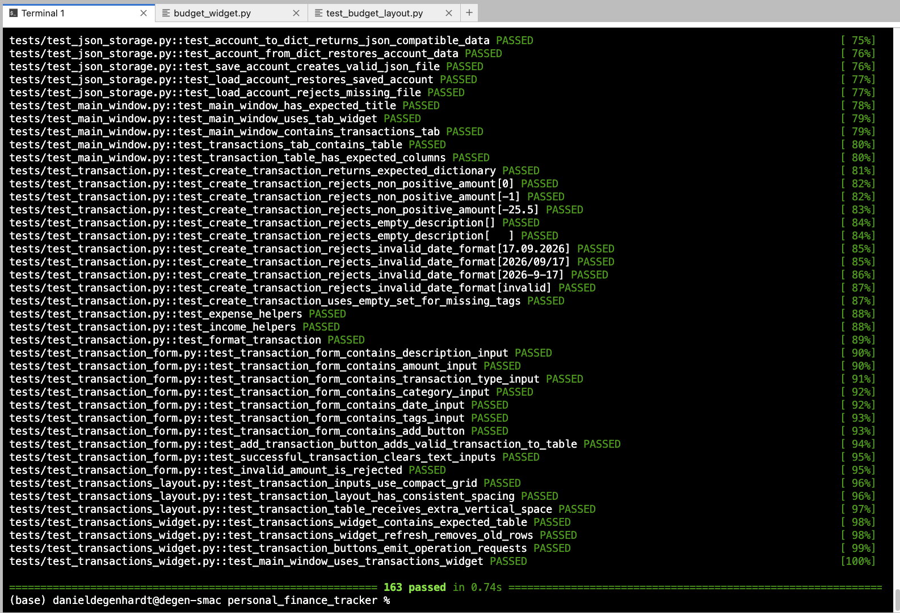

### Budget Interface after Layout Improvements

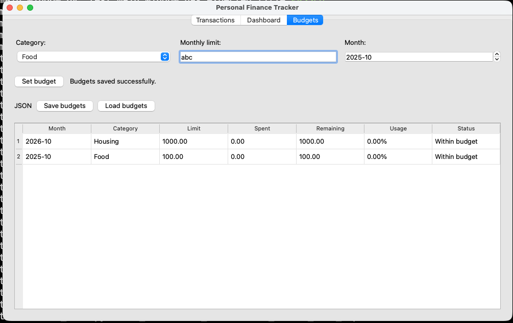

### Manual Verification

#### Set a budget

Select Food, enter `100` in Monthly limit, select the month,
and click Set budget.

Check the resulting table row and session confirmation message.

#### Reject invalid input

Enter `abc` in Monthly limit and click Set budget.

Expected message:

```text
Monthly limit must be a valid number.
```

The previously stored budget should remain unchanged.

#### Save and load

1. Save the budget tracker as `budgets_test.json`.
2. Change the limit to `200` and click Set budget.
3. Load the previously saved file.
4. Confirm that the saved limit of `100` is restored.

Loading replaces the current budget tracker with the saved tracker.

#### Resize the window

Increase the height of the Personal Finance Tracker window.

The table should gain vertical space while the input fields
retain approximately their preferred height.

### Verification Commands

Run the new layout tests:

```bash
uv run pytest tests/test_budget_layout.py -v
```

Run the complete test suite:

```bash
uv run pytest -v
```

Start the application:

```bash
uv run python main.py
```

### Result

The Budgets tab now follows the compact layout principles
used in the Transactions tab.

Inputs and buttons occupy less vertical space,
spacing is consistent, and the overview can use additional window height.

The next step, Phase 6B3, will improve the Dashboard layout.
## Phase 6B3 - Compact Dashboard Layout

### Goal

Improve the Dashboard tab by placing the three account totals beside each other,
using consistent spacing, and allocating additional height to both summary tables.

This completes the layout improvements introduced in Phase 6B:

- **6B1:** Compact transaction layout.
- **6B2:** Compact budget layout.
- **6B3:** Compact dashboard layout.

### Changes

- Replaced the totals area's `QFormLayout` with a `QGridLayout`.
- Arranged Income, Expenses, and Balance in three columns.
- Placed each heading above its corresponding value.
- Applied the same outer margins and spacing as the other tabs.
- Assigned equal vertical stretch factors to both summary tables.
- Preserved the existing account calculations and table contents.

### Files

| File | Responsibility |
| --- | --- |
| `finance_tracker/gui/dashboard_widget.py` | Builds the dashboard layout and displays financial summaries |
| `tests/test_dashboard_layout.py` | Tests total positions, spacing, and table stretch factors |

`MainWindow` continues to own the account and passes the current data
to `DashboardWidget.refresh(account)`.

### Totals Arrangement

| Grid row | Column 0 | Column 1 | Column 2 |
| --- | --- | --- | --- |
| 0: Headings | Income | Expenses | Balance |
| 1: Values | Income total | Expense total | Account balance |

The totals are displayed beside each other instead of in separate vertical rows.

### Grid Construction

```python
for column, (label_text, value_label) in enumerate(totals):
    grid.addWidget(QLabel(label_text), 0, column)
    grid.addWidget(value_label, 1, column)
    grid.setColumnStretch(column, 1)
```

`totals` contains three heading/value pairs.

`enumerate` supplies the column numbers `0`, `1`, and `2`.
Each heading is placed in row `0`, and its value is placed in row `1`.

All columns receive the same stretch factor.
Additional horizontal space is distributed between them,
subject to minimum sizes and widget size hints.

The grid's object name is `dashboard_totals_grid`.
This provides a stable identifier for automated tests.

### Margins and Spacing

| Area | Setting | Value |
| --- | --- | ---: |
| Main layout | Left, top, right, and bottom margins | 20 |
| Main layout | Spacing between sections | 16 |
| Totals grid | Additional outer margins | 0 |
| Totals grid | Horizontal spacing | 16 |
| Totals grid | Vertical spacing | 8 |

These settings follow the same layout conventions as
the Transactions and Budgets tabs.

The values are Qt layout units and follow display scaling.

### Summary Tables

The dashboard retains two tables:

- **Monthly summary:** Month, Income, Expenses, and Balance.
- **Expenses by category:** Category and Expenses.

Their headings remain directly above the corresponding tables.

### Vertical Space Allocation

```python
layout.addWidget(self.monthly_summary_table, 1)
layout.addWidget(self.category_breakdown_table, 1)
```

Both tables receive a vertical stretch factor of `1`.
The other sections have a stretch factor of `0`.

Additional vertical space is shared between the two tables.
Their actual heights can also depend on minimum sizes and size hints.

Resizing increases the available table area.
It does not enlarge the text or create additional data rows.

### Financial Calculations

The dashboard continues to use the existing domain functions:

| Function | Purpose |
| --- | --- |
| `calculate_income_total(account)` | Calculates total income |
| `calculate_expense_total(account)` | Calculates total expenses |
| `calculate_balance(account)` | Calculates income minus expenses |
| `monthly_summary(account)` | Groups financial totals by month |
| `category_breakdown(account)` | Groups expenses by category |

The layout change does not introduce a separate account model
or duplicate the financial calculation logic.

### Refresh Behaviour

`refresh(account)` updates:

1. The three total labels.
2. The monthly summary table.
3. The expense category table.

The `_set_rows` helper replaces the displayed table rows
without modifying the account dictionary.

### TDD - RED → GREEN

1. **RED:** Added layout tests before implementing the new arrangement.
   The existing dashboard did not satisfy the grid, spacing,
   and table stretch requirements.
2. **GREEN:** Implemented the compact totals grid and space allocation.
3. **Verification:** All existing and new tests passed.

For this step, the test, implementation, and RED/GREEN evidence
were prepared for one combined commit rather than separate RED and GREEN commits.

### New Layout Tests

| Test | Coverage |
| --- | --- |
| `test_dashboard_totals_use_three_columns` | Checks the three total labels in row 1, columns 0 to 2 |
| `test_dashboard_layout_has_consistent_spacing` | Checks main margins and totals-grid spacing |
| `test_dashboard_tables_share_extra_vertical_space` | Checks equal table stretch factors |

The tests verify the agreed layout settings.
Visual inspection additionally checks the displayed interface
and resizing behaviour.

**Complete test result: 166 passed.**

### Test Evidence

**RED - Before implementation**

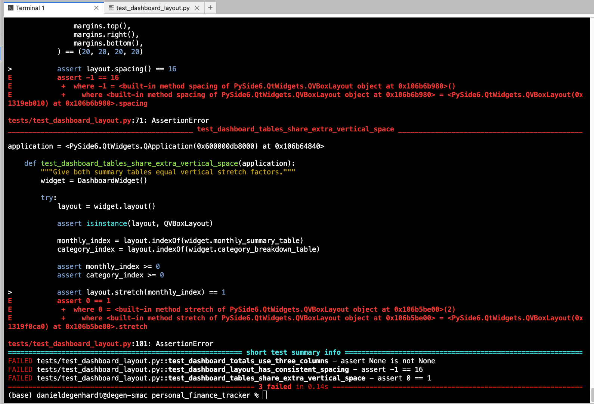

**GREEN - All 166 tests passed**

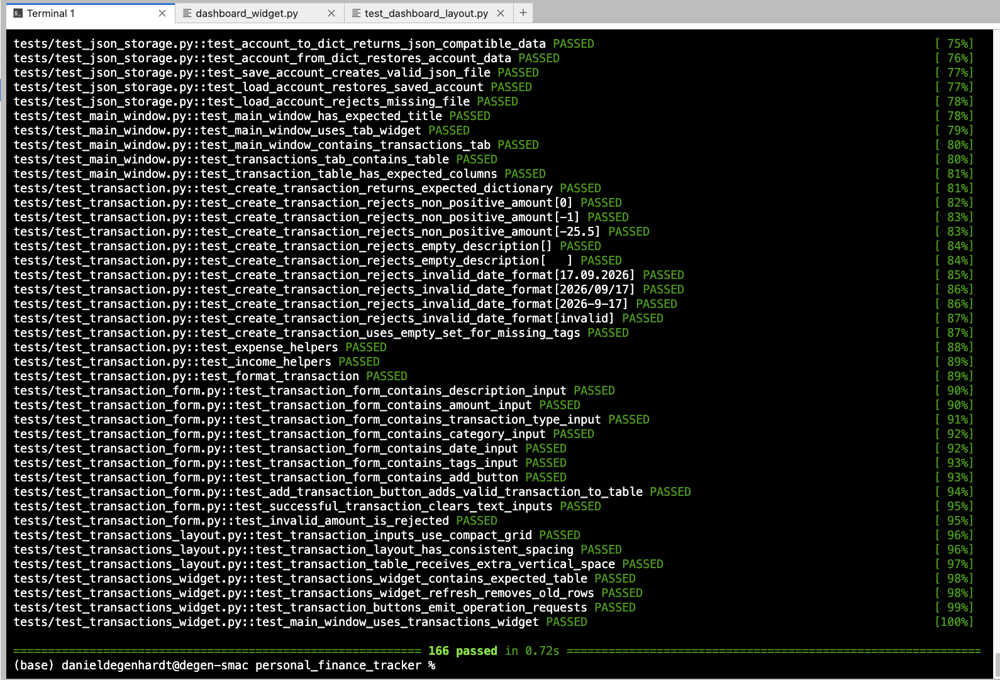

### Dashboard after Layout Improvements

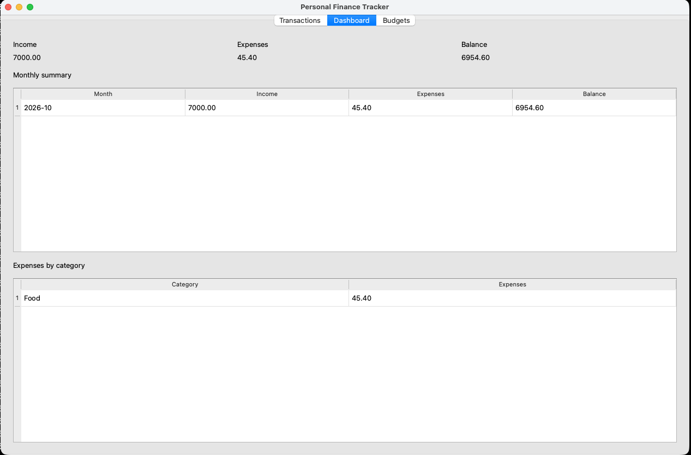

### Manual Verification

#### Check the arrangement

Open the Dashboard tab.

Confirm that:

- Income, Expenses, and Balance appear beside each other.
- Monthly summary appears below the totals.
- Expenses by category appears below the monthly table.

#### Check resizing

Increase the height of the Personal Finance Tracker window.

Both tables should gain vertical space.
The headings and total labels should retain approximately
their preferred height.

#### Check financial values

For an empty account, add an income of `1000`
and a Food expense of `25` in the same month.

Expected totals:

| Income | Expenses | Balance |
| ---: | ---: | ---: |
| 1000.00 | 25.00 | 975.00 |

The monthly table should show the corresponding monthly totals.
The category table should show Food expenses of `25.00`.

If the account already contains transactions,
include those transactions when checking the expected totals.

### Verification Commands

Run the new layout tests:

```bash
uv run pytest tests/test_dashboard_layout.py -v
```

Run the complete test suite:

```bash
uv run pytest -v
```

Start the application:

```bash
uv run python main.py
```

### Phase 6B Result

All three tabs now use explicitly defined spacing
and improved space allocation.

| Step | Completed layout improvement |
| --- | --- |
| 6B1 | Three-column transaction form and grouped file controls |
| 6B2 | Three-column budget form and compact controls |
| 6B3 | Three-column dashboard totals and expanding summary tables |

Phase 6B is complete with **166 passing tests**.

Phase 6C will introduce consistent colours, typography, and status styling.
Phase 6D will add financial charts.
## Phase 6C1 - Shared Light Theme with Orange Accents

### Goal

Introduce a consistent visual style across Transactions, Dashboard, and Budgets.

The selected design uses light surfaces, dark text, and orange accents
for primary actions.

Phase 6B improved widget arrangement and spacing.
Phase 6C now adds shared colours, typography, and interaction styling.

### Changes

- Added a central `styles.py` module.
- Applied the shared stylesheet through `MainWindow`.
- Styled tabs, input fields, buttons, tables, and table headers.
- Highlighted Add transaction and Set budget as primary actions.
- Added hover, pressed, focus, and disabled button states.
- Increased the size and weight of dashboard totals.
- Preserved the existing layout and financial operations.

### Files

| File | Responsibility |
| --- | --- |
| `finance_tracker/gui/styles.py` | Defines the shared Qt stylesheet |
| `finance_tracker/gui/main_window.py` | Applies the stylesheet to the main window |
| `tests/test_gui_styles.py` | Tests style definitions and integration |

### Central Stylesheet

```python
def build_stylesheet() -> str:
    """Return the application stylesheet with orange primary actions."""
```

The function returns a multiline string containing Qt Style Sheet rules.

Qt Style Sheets resemble CSS but target Qt widgets.
They support Qt-specific selectors, subcontrols, and widget states.

Keeping shared styling in one module avoids repeating the same rules
in each tab.

### Main Window Integration

```python
from finance_tracker.gui.styles import build_stylesheet
```

After initializing the base window:

```python
self.setStyleSheet(build_stylesheet())
```

The stylesheet applies to the main window and its descendant widgets.
All three tabs therefore use the same shared rules.

### Colour Palette

| Purpose | Colour |
| --- | --- |
| Main background | `#f7f8fa` |
| Input and table surfaces | `#ffffff` |
| Main text | `#243044` |
| Primary orange accent | `#b84a0b` |
| Primary action text | `#ffffff` |
| Standard borders | `#d0d6de` |
| Input and button borders | `#aab5c3` |
| Table header background | `#e9edf2` |
| Selected table row | `#fbe4d4` |

The theme is explicitly light.
It does not automatically switch to a dark theme.

### Input Fields

Shared rules apply to:

- `QLineEdit`
- `QComboBox`
- `QDateEdit`

Inputs use a white background, dark text, rounded borders,
and internal padding.

Focused inputs receive an orange border.

The combo-box popup also receives explicit text, background,
and selection colours to keep its entries readable.

### Primary Actions

The existing object names identify the two primary buttons:

```css
QPushButton#add_transaction_button,
QPushButton#set_budget_button {
    background-color: #b84a0b;
    color: #ffffff;
}
```

The `#` selector refers to the widget's `objectName`.

These rules highlight transaction submission and budget submission.
File operation buttons retain a neutral style.

### Button States

| State | Meaning |
| --- | --- |
| `:hover` | The pointer is over the button |
| `:pressed` | The button is being pressed |
| `:focus` | The button has keyboard focus |
| `:disabled` | The button is unavailable |

Primary actions have their own state rules.
Their focus state includes a dark border to distinguish it
from the orange button surface.

### Tabs

The stylesheet defines:

- The tab content pane.
- Normal tabs.
- The selected tab.
- Hovered tabs.

The selected tab uses orange text and stronger font weight,
making the active application section easier to identify.

### Tables and Headers

Tables use white surfaces, dark text, subtle grid lines,
and a light orange selection background.

`QHeaderView::section` styles the table headers with a separate
background, padding, and stronger font weight.

The stylesheet also defines `alternate-background-color`.
Alternating row colours require `alternatingRowColors` to be enabled
on the table; this step does not explicitly enable that option.

### Typography

The system font family is retained.

- General widget text uses `14px`.
- Dashboard total values use `22px` and bold text.
- Primary buttons and table headers use bold text.

The dashboard rules target the existing object names:

- `income_total_label`
- `expense_total_label`
- `balance_label`

### TDD - RED → GREEN

1. **RED:** Added tests before the `styles.py` module existed.
   Pytest reported `ModuleNotFoundError` during collection.
2. **GREEN:** Implemented the central stylesheet and applied it in `MainWindow`.
3. **Verification:** All existing and new tests passed.

### New Style Tests

| Test | Coverage |
| --- | --- |
| `test_stylesheet_defines_shared_widget_styles` | Checks that the stylesheet contains the expected widget selectors |
| `test_stylesheet_identifies_primary_actions` | Checks selectors for both primary buttons |
| `test_main_window_applies_shared_stylesheet` | Checks that MainWindow applies the shared stylesheet |

These tests verify stylesheet structure and integration.
They do not verify rendered colours, contrast, or platform-specific appearance.
Those aspects require visual inspection.

**Complete test result: 169 passed.**

### Test Evidence

**RED - Before implementation**

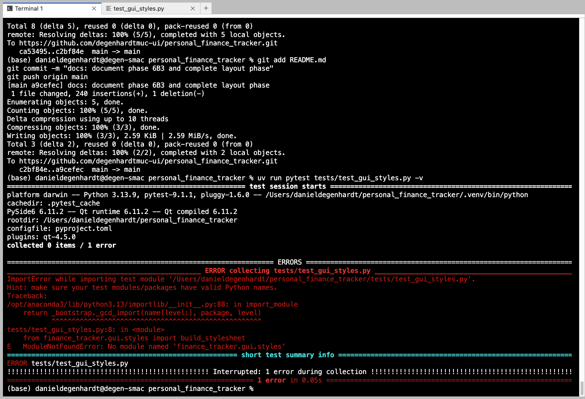

**GREEN - All 169 tests passed**

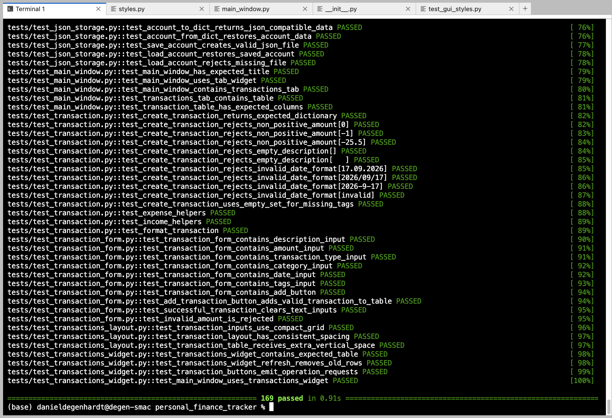

### Styled Interface

#### Transactions

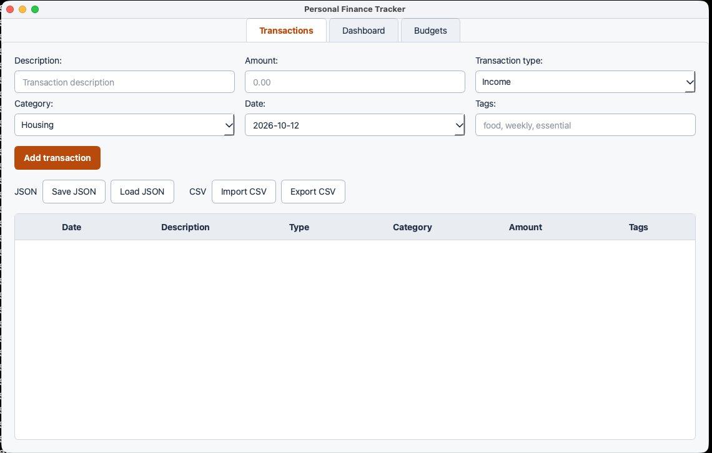

#### Dashboard

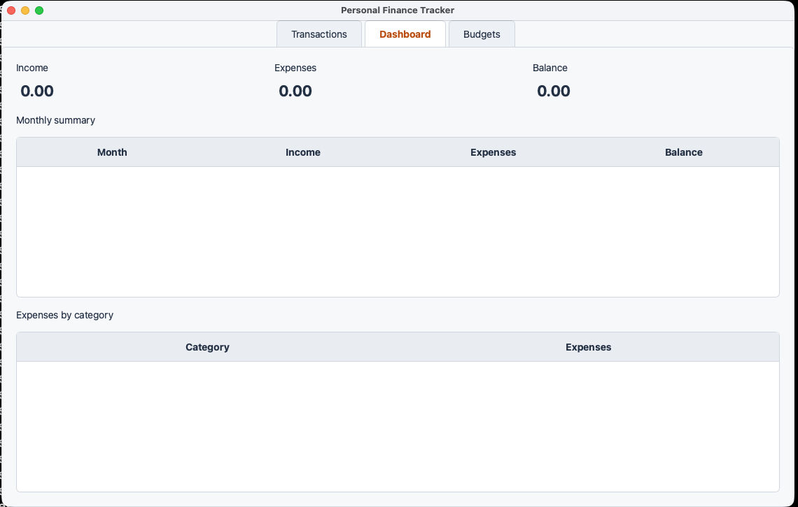

#### Budgets

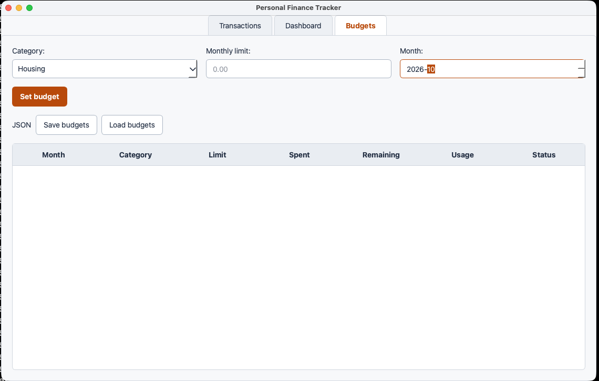

### Manual Verification

- Open all three tabs and check text readability.
- Confirm that Add transaction and Set budget are orange.
- Open selection lists and inspect their entries.
- Move through controls with the Tab key and inspect focus indicators.
- Select table rows and check that their text remains readable.
- Check that existing input and file operations still work.

### Verification Commands

Run the new style tests:

```bash
uv run pytest tests/test_gui_styles.py -v
```

Run the complete test suite:

```bash
uv run pytest -v
```

Start the application:

```bash
uv run python main.py
```

### Result

The application now uses a shared light theme with orange primary actions,
consistent input styling, clear table headers, and prominent dashboard totals.

Phase 6C2 will add consistent success and error status styling.
Phase 6D will add financial charts
## Phase 6C2 - Shared Success and Error Status Messages

### Goal

Provide consistent feedback for transaction, budget, and file operations.

Successful actions display a green status message.
Validation and handled storage errors display a red status message.

The message text continues to explain the result independently of colour.

### Changes

- Added shared status helpers in `status.py`.
- Added success and error selectors to the central stylesheet.
- Updated `MainWindow` to use the shared helpers for action results.
- Applied the same status appearance to Transactions and Budgets.
- Added tests for status transitions and real form submissions.

### Files

| File | Responsibility |
| --- | --- |
| `finance_tracker/gui/status.py` | Sets message text and status, then refreshes label styling |
| `finance_tracker/gui/styles.py` | Defines success and error appearance |
| `finance_tracker/gui/main_window.py` | Selects the appropriate status after each operation |
| `tests/test_status_messages.py` | Tests helper behaviour and GUI integration |

### Shared Helpers

```python
show_success(label, message)
show_error(label, message)
```

Both helpers accept:

- The `QLabel` that displays the result.
- The message text.

They delegate to the internal `_show_status` function with either
`"success"` or `"error"`.

The helpers affect presentation only.
They do not modify account data, budgets, or stored files.

### Message and Status Property

```python
label.setText(message)
label.setProperty("status", status)
```

`setText` updates the visible message.

`setProperty` stores a dynamic Qt property named `status`.
The stylesheet uses this property to select the appropriate appearance.

| Property value | Appearance |
| --- | --- |
| `success` | Green background, dark green text, and a green border |
| `error` | Light red background, dark red text, and a red border |

Labels without either property value do not match these status rules.

### Refreshing the Style

After changing the property, the helper reapplies the widget style:

```python
style = label.style()
style.unpolish(label)
style.polish(label)
```

This refreshes the appearance when a label changes
from success to error or from error to success.

```python
label.updateGeometry()
label.update()
```

`updateGeometry` notifies the layout that the size requirements may have changed.
`update` schedules repainting.

### Stylesheet Selectors

```css
QLabel[status="success"] {
    background-color: #eaf5ee;
    color: #205c35;
    border: 1px solid #a9cfb5;
    border-radius: 6px;
    padding: 7px 10px;
}

QLabel[status="error"] {
    background-color: #fff0ee;
    color: #982b23;
    border: 1px solid #e1b0aa;
    border-radius: 6px;
    padding: 7px 10px;
}
```

The square brackets select labels by their `status` property.

Both states use the same padding and border radius,
providing consistent presentation across the application.

### Transaction Status

The Transactions tab displays feedback for:

- Adding a transaction.
- Saving an account as JSON.
- Loading an account from JSON.
- Importing transactions from CSV.
- Exporting transactions to CSV.

A valid transaction is stored before its success message is displayed.

Invalid input produces an error message without storing
the invalid transaction.

### Budget Status

The Budgets tab displays feedback for:

- Setting a budget.
- Saving budgets.
- Loading budgets.

An invalid monthly limit displays an error.
After the input is corrected, a successful submission replaces
the error message and its status.

### CSV Import with Skipped Rows

The import summary continues to report both counts:

```text
Imported X transaction(s); skipped Y row(s).
```

- If no rows are skipped, the summary uses the success state.
- If rows are skipped, the summary uses the error state.

Valid rows remain imported even when the summary is red.
The red state draws attention to rejected rows.

This step defines success and error states only.
A separate warning state is not implemented.

### Cancelled File Dialogs

Cancelling a file dialog returns without performing the operation.

The existing status message remains unchanged.
Cancellation does not generate a new error message.

### TDD - RED → GREEN

1. **RED:** Added tests before the `status.py` module existed.
   Pytest reported `ModuleNotFoundError` during collection.
2. **GREEN:** Implemented the helpers, stylesheet rules,
   and handler integration.
3. **Verification:** All existing and new tests passed.

### New Status Tests

| Test | Coverage |
| --- | --- |
| `test_show_success_sets_text_and_state` | Checks success text and property |
| `test_show_error_replaces_previous_success` | Checks transition from success to error |
| `test_valid_transaction_sets_success_status` | Checks transaction storage and success feedback |
| `test_invalid_transaction_sets_error_status` | Checks error feedback without storing invalid data |
| `test_budget_status_changes_from_error_to_success` | Checks corrected input and status replacement |

The tests verify message text, status properties, and selected GUI actions.
Rendered colours and visual appearance are checked manually.

**Complete test result: 174 passed.**

### Test Evidence

**RED - Before implementation**

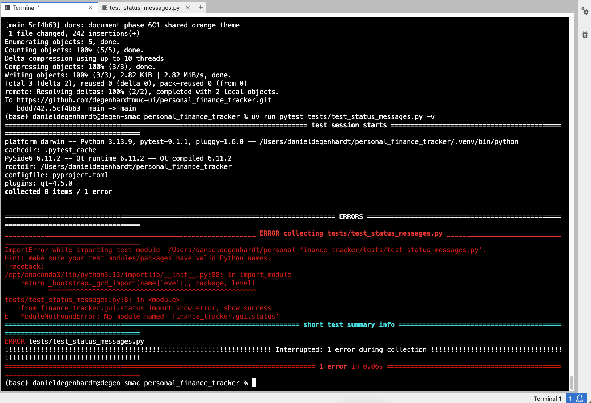

**GREEN - All 174 tests passed**

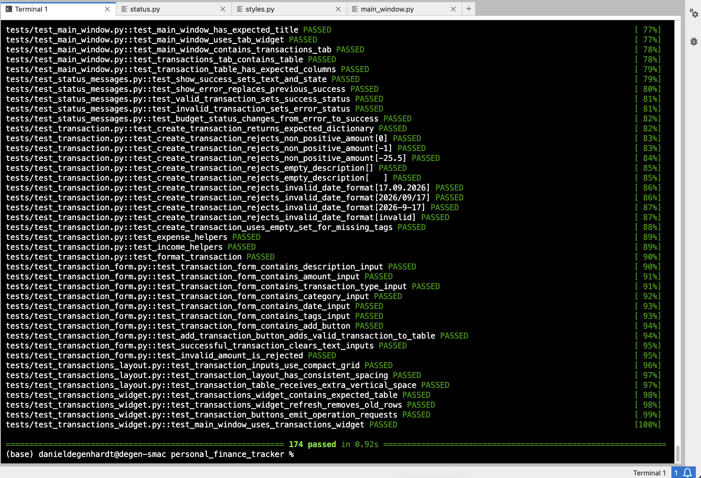

### Status Appearance

**Error message**

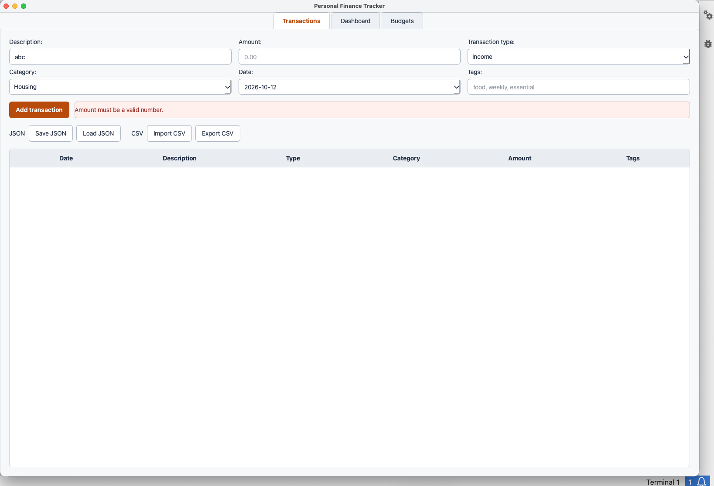

**Success message**

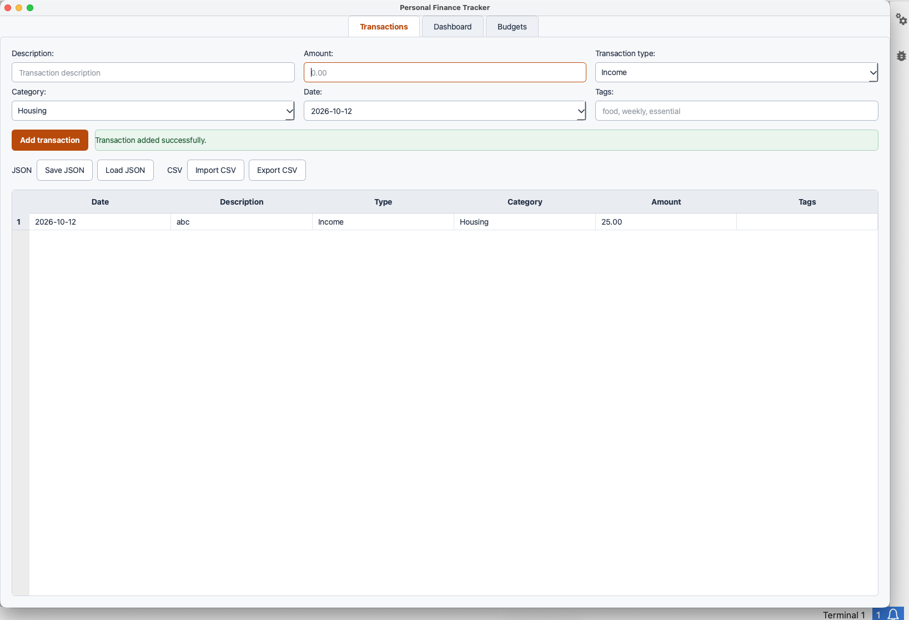

### Manual Verification

#### Transactions

1. Enter a description and `abc` as the amount.
2. Click Add transaction.
3. Confirm that the validation message appears in red.
4. Replace the amount with `25`.
5. Submit again.
6. Confirm that the successful submission appears in green.

#### Budgets

1. Enter `abc` in Monthly limit.
2. Click Set budget and inspect the red error message.
3. Replace the value with `100`.
4. Submit again and inspect the green success message.

The corrected action should replace both the previous text
and its status appearance.

### Verification Commands

Run the new status tests:

```bash
uv run pytest tests/test_status_messages.py -v
```

Run the complete test suite:

```bash
uv run pytest -v
```

Start the application:

```bash
uv run python main.py
```

### Phase 6C Result

| Step | Completed improvement |
| --- | --- |
| 6C1 | Shared light theme with orange primary actions |
| 6C2 | Consistent success and error status messages |

Phase 6C is complete with **174 passing tests**.

Phase 6D will add financial charts to complement the existing summaries.
## Phase 6D1 - Expense Category Chart

### Goal

Add a visual overview of expense totals by category.

The new Charts tab complements the existing dashboard tables
with a horizontal bar chart.

The chart uses the current account's expenses across all recorded months.
A month filter is not part of this step.

### Changes

- Added Matplotlib as a project dependency.
- Added a standalone `CategoryChartWidget`.
- Embedded the Matplotlib canvas in the PySide6 interface.
- Added a Charts tab to `MainWindow`.
- Displayed expense categories as horizontal orange bars.
- Sorted categories by expense total, largest first.
- Added amount labels and an empty-state message.
- Connected chart refresh to the existing account update flow.

### Files

| File | Responsibility |
| --- | --- |
| `finance_tracker/gui/category_chart.py` | Creates and refreshes the expense category chart |
| `finance_tracker/gui/main_window.py` | Embeds the chart and supplies the current account |
| `tests/test_category_chart.py` | Tests chart values, empty state, refresh, and integration |
| `pyproject.toml` | Declares the Matplotlib dependency |
| `uv.lock` | Records the resolved project dependencies |

### Dependency

Matplotlib was added with:

```bash
uv add matplotlib
```

The chart uses Matplotlib directly.
Seaborn is not required for this implementation.

### Chart Components

| Component | Purpose |
| --- | --- |
| `Figure` | Contains the complete diagram |
| `FigureCanvasQTAgg` | Embeds the figure as a Qt widget |
| `Axes` | Contains bars, axes, labels, and chart text |

```python
self.figure = Figure(
    figsize=(7, 4),
    layout="constrained",
    facecolor="#f7f8fa",
)
self.canvas = FigureCanvasQTAgg(self.figure)
self.axes = self.figure.add_subplot(111)
```

`layout="constrained"` helps arrange the chart and its decorations.

`add_subplot(111)` creates one plotting area:
one row, one column, and the first subplot.

The canvas is placed in the widget's layout and receives
additional available space.

### Data Source

```python
totals = category_breakdown(account)
```

The chart reuses the existing domain analysis function.

Expenses in the same category are summed.
Income transactions are excluded.

The widget does not own a separate account
and does not introduce another financial calculation model.

### Category Ordering

```python
sorted_totals = sorted(
    totals.items(),
    key=lambda item: (-item[1], item[0].value),
)
```

Categories are sorted by descending expense amount.

For equal amounts, the category value provides a stable
secondary ordering.

### Horizontal Bars

```python
bars = self.axes.barh(
    labels,
    amounts,
    color="#b84a0b",
    height=0.65,
)
self.axes.invert_yaxis()
```

`barh` draws horizontal bars.

`invert_yaxis` places the first and largest category at the top.

Horizontal bars provide room for category names
and make the expense totals easy to compare.

### Amount Labels and Appearance

Each bar receives an amount label formatted to two decimal places.

The chart uses:

- Orange bars matching the application accent.
- Dark labels on light surfaces.
- A horizontal amount axis starting at zero.
- Subtle grid lines for comparing bar lengths.
- Additional space beyond the largest bar for its value label.

The axis is labelled `Amount`.
This step does not define a separate currency setting.

Matplotlib colours are configured in the chart itself.
The Qt stylesheet does not style the plotted bars and axes.

### Empty State

When the account contains no expense totals:

- No bars are drawn.
- The chart displays `No expenses yet.`
- Axis ticks are hidden.

The message is positioned using axes-relative coordinates,
so it remains centred independently of the numeric axis range.

### Refresh Behaviour

```python
self.axes.clear()
```

Each refresh removes the previous chart before rebuilding it.

This prevents outdated bars or empty-state text from remaining
after the account changes.

```python
self.canvas.draw_idle()
```

The canvas schedules a redraw through the GUI event processing.

### Main Window Integration

`MainWindow` creates the chart before its initial refresh:

```python
self._create_charts_tab()
self._refresh_dashboard()
```

The chart receives the current account during the shared refresh:

```python
self.category_chart.refresh(self.account)
```

This refresh path is used after:

- Adding a transaction.
- Loading an account from JSON.
- Importing transactions from CSV.

Existing dashboard and budget updates remain available.

### TDD - RED → GREEN

1. **RED:** Added tests before the chart module existed.
   Pytest reported `ModuleNotFoundError` during collection.
2. **GREEN:** Implemented the chart and Charts tab.
3. **Integration correction:** Connected chart refresh to
   `MainWindow._refresh_dashboard`.
4. **Verification:** All existing and new tests passed.

The integration test detected that a chart could exist
without refreshing after a transaction.

Adding the shared refresh call resolved that failure.

RED and GREEN evidence are included together for this step.

### New Chart Tests

| Test | Coverage |
| --- | --- |
| `test_empty_chart_displays_no_expenses_message` | Checks the empty message and absence of bars |
| `test_chart_displays_expense_totals_by_category` | Checks category sums and exclusion of income |
| `test_chart_refresh_replaces_previous_expenses` | Checks removal of outdated bars |
| `test_main_window_refreshes_chart_after_transaction` | Checks Charts tab integration and automatic refresh |

The tests inspect chart labels and bar values.
The rendered appearance is additionally checked manually.

**Complete test result: 178 passed.**

### Test Evidence

**RED - Before implementation**

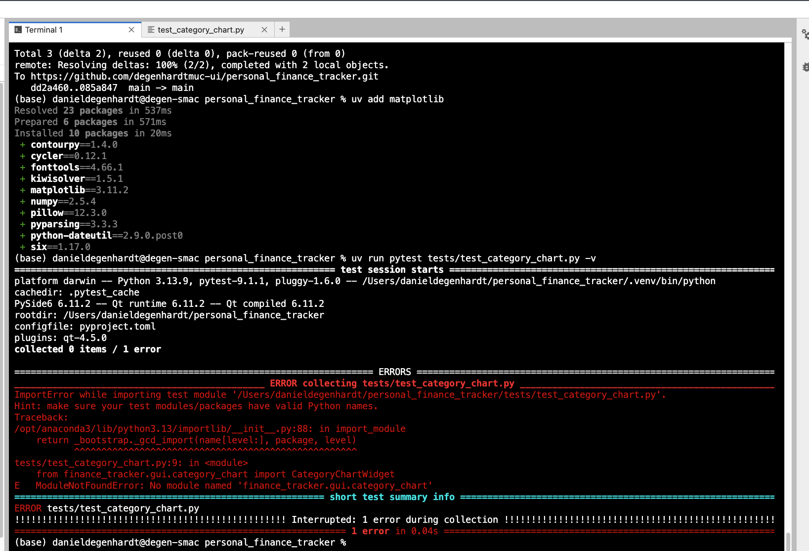

**GREEN - All 178 tests passed**

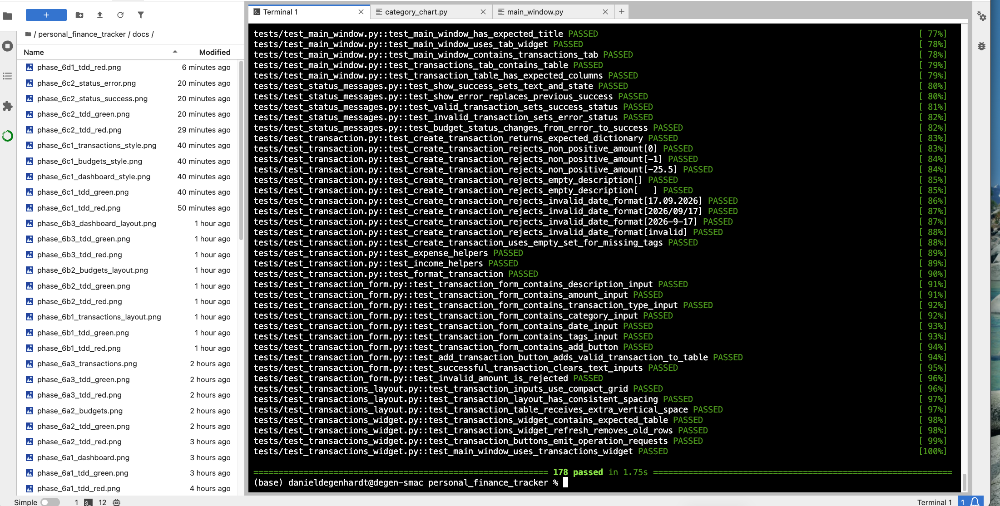

### Expense Category Chart

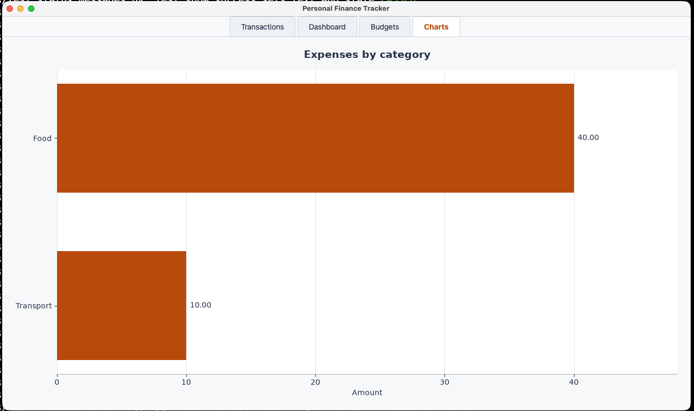

### Manual Verification

In a fresh session, add these transactions:

| Description | Amount | Type | Category |
| --- | ---: | --- | --- |
| Groceries | 25 | Expense | Food |
| Lunch | 15 | Expense | Food |
| Bus | 10 | Expense | Transport |

Expected chart totals:

| Category | Expenses |
| --- | ---: |
| Food | 40.00 |
| Transport | 10.00 |

Food should appear above Transport.

Adding an income transaction must not create an expense bar.

If the account already contains expenses,
include those values when checking the expected totals.

### Verification Commands

Run the chart tests:

```bash
uv run pytest tests/test_category_chart.py -v
```

Run the complete test suite:

```bash
uv run pytest -v
```

Start the application:

```bash
uv run python main.py
```

### Result

The Finance Tracker now displays expense totals by category
in an embedded Matplotlib chart.

The chart uses existing account analysis and refreshes
alongside the other financial views.

Phase 6D2 will add a monthly income and expense comparison.
## Phase 6D2 - Monthly Income and Expense Chart

### Goal

Compare income and expenses for each recorded month.

The Charts tab now contains two separate views:

- **Categories:** Expense totals by category.
- **Monthly:** Income and expenses by month.

### Changes

- Added a standalone `MonthlyChartWidget`.
- Reused the existing `monthly_summary` analysis function.
- Displayed income and expenses as grouped vertical bars.
- Sorted months chronologically.
- Added amount labels, axis labels, and a legend.
- Added an empty-state message.
- Introduced chart subtabs inside the Charts tab.
- Updated both charts through the shared account refresh flow.
- Adapted the existing category-chart integration test to the new tab structure.

### Files

| File | Responsibility |
| --- | --- |
| `finance_tracker/gui/monthly_chart.py` | Creates and refreshes the monthly comparison chart |
| `finance_tracker/gui/main_window.py` | Embeds both charts and supplies current account data |
| `tests/test_monthly_chart.py` | Tests monthly values, ordering, empty state, and integration |
| `tests/test_category_chart.py` | Retains category-chart integration coverage under the new subtabs |

The existing Matplotlib dependency is reused.

### Chart Navigation

The main Charts tab contains a `QTabWidget` named `chart_tabs`.

| Subtab | Widget |
| --- | --- |
| Categories | `CategoryChartWidget` |
| Monthly | `MonthlyChartWidget` |

Both charts remain available through direct attributes
on `MainWindow`.

### Data Source

```python
summary = monthly_summary(account)
```

The existing analysis function supplies the monthly totals.

The chart displays:

- `income`
- `expenses`

The monthly net balance remains available in the Dashboard table.

The chart does not own a separate account or duplicate
the financial calculation logic.

### Chronological Ordering

```python
months = sorted(summary)
```

Month keys use the format `YYYY-MM`.

Sorting these keys places recorded months in chronological order,
even when transactions were entered in a different order.

Months without transactions are not automatically inserted.

### Preparing the Values

```python
income = [
    summary[month]["income"]
    for month in months
]
expenses = [
    summary[month]["expenses"]
    for month in months
]
```

Both lists follow the same sorted month sequence,
keeping values and labels aligned.

### Grouped Bars

Each month receives a numeric position:

```python
positions = list(range(len(months)))
bar_width = 0.36
```

Income bars are shifted left of the month's centre:

```python
position - bar_width / 2
```

Expense bars are shifted right:

```python
position + bar_width / 2
```

This places the two bars beside each other.

| Series | Colour | Position |
| --- | --- | --- |
| Income | Green | Left |
| Expenses | Orange | Right |

The legend identifies both series.
Amount labels provide the exact displayed totals.

### Axes and Labels

- Horizontal axis: `Month`.
- Vertical axis: `Amount`.
- Month labels are rotated by 30 degrees.
- The amount axis starts at zero.
- Subtle horizontal grid lines support comparison.

The upper axis limit includes additional room for amount labels.

If the maximum total is zero, the chart uses a valid range
from zero to one.

A recorded month with only income still has an expense bar
with height zero, and vice versa.

### Empty State

Without transactions, the chart displays:

```text
No transactions yet.
```

No bars are drawn, and axis ticks are hidden.

Before every refresh, `axes.clear()` removes previous bars,
labels, legends, and empty-state text.

### Main Window Integration

Both charts are created before the initial shared refresh.

```python
self.chart_tabs.addTab(self.category_chart, "Categories")
self.chart_tabs.addTab(self.monthly_chart, "Monthly")
self.tab_widget.addTab(self.chart_tabs, "Charts")
```

The refresh flow updates both charts:

```python
self.category_chart.refresh(self.account)
self.monthly_chart.refresh(self.account)
```

This flow runs after:

- Adding a transaction.
- Loading an account from JSON.
- Importing transactions from CSV.

Dashboard and budget updates remain part of the same flow.

### TDD - RED → GREEN

1. **RED:** Added tests before `monthly_chart.py` existed.
   Pytest reported `ModuleNotFoundError` during collection.
2. **GREEN:** Implemented the monthly chart and chart subtabs.
3. **Regression update:** Adapted the category-chart test
   to locate its widget inside the new subtabs.
4. **Verification:** All existing and new tests passed.

RED and GREEN evidence are documented together for this step.

### New Chart Tests

| Test | Coverage |
| --- | --- |
| `test_empty_monthly_chart_displays_message` | Checks the empty-state message and absence of bars |
| `test_monthly_chart_displays_sorted_income_and_expenses` | Checks chronological order and monthly totals |
| `test_monthly_chart_refresh_removes_previous_bars` | Checks removal of outdated chart data |
| `test_main_window_refreshes_monthly_chart_after_transaction` | Checks subtab integration and automatic refresh |

The category-chart integration test continues to verify
its automatic refresh after a transaction.

**Complete test result: 182 passed.**

### Test Evidence

**RED - Before implementation**

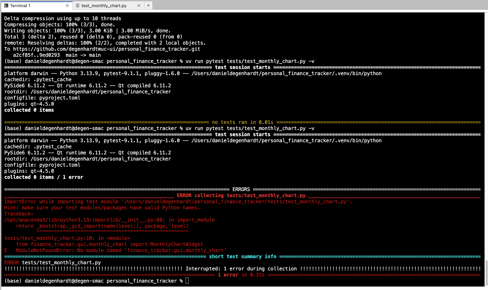

**GREEN - All 182 tests passed**

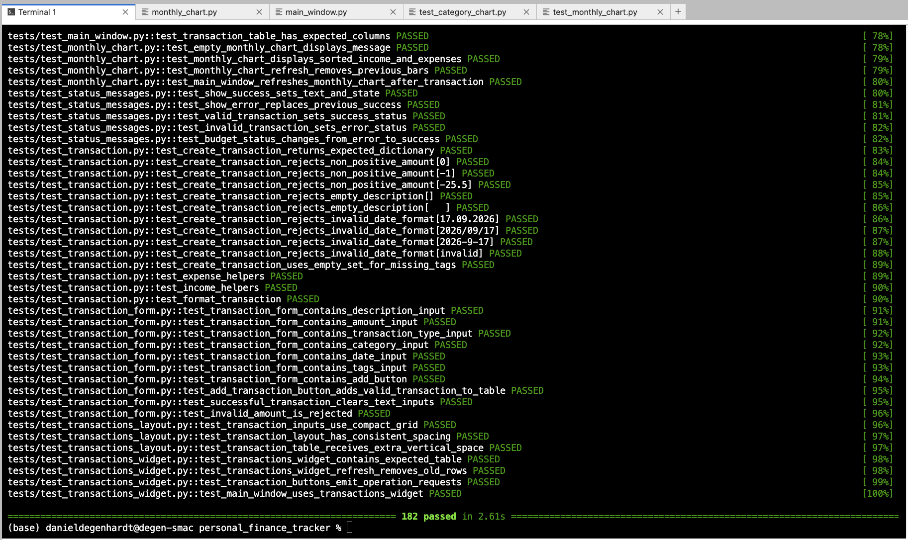

### Monthly Comparison Chart

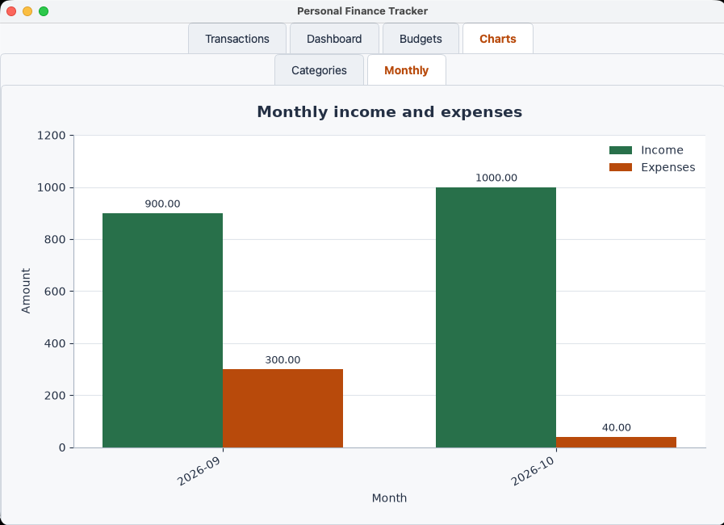

### Manual Verification

In a fresh session, enter:

| Description | Amount | Type | Category | Date |
| --- | ---: | --- | --- | --- |
| September salary | 900 | Income | Salary | 2026-09-01 |
| September rent | 300 | Expense | Housing | 2026-09-02 |
| October salary | 1000 | Income | Salary | 2026-10-01 |
| October groceries | 40 | Expense | Food | 2026-10-12 |

Open **Charts → Monthly**.

Expected totals:

| Month | Income | Expenses |
| --- | ---: | ---: |
| 2026-09 | 900.00 | 300.00 |
| 2026-10 | 1000.00 | 40.00 |

September should appear before October.

The automated test also includes a September Food expense of `25`,
so its expected September expense total is `325`.

Existing account transactions must be included
when checking the displayed totals.

Also open **Charts → Categories** and confirm that
the original category chart remains available.

### Verification Commands

Run both chart test files:

```bash
uv run pytest tests/test_category_chart.py tests/test_monthly_chart.py -v
```

Run the complete test suite:

```bash
uv run pytest -v
```

Start the application:

```bash
uv run python main.py
```

### Result

The Charts tab now provides category and monthly financial views.

The monthly chart compares income and expenses using existing analysis,
chronological ordering, and automatic account refresh.

Phase 6D3 will add a comparison of budget limits and actual spending.
## Phase 6D3 - Budget Limit and Spending Chart

### Goal

Compare each monthly budget limit with its actual matching expenses.

The Charts tab now contains three financial views:

- **Categories:** Expense totals by category.
- **Monthly:** Income and expenses by month.
- **Budgets:** Budget limits compared with actual spending.

### Changes

- Added a standalone `BudgetChartWidget`.
- Reused the existing `calculate_spent_amount` budget function.
- Displayed Limit and Spent as paired horizontal bars.
- Labelled each budget with its month and category.
- Sorted budgets chronologically and then by category.
- Added amount labels, a legend, and an empty-state message.
- Added the Budgets chart subtab.
- Connected chart updates to the existing budget refresh flow.

### Files

| File | Responsibility |
| --- | --- |
| `finance_tracker/gui/budget_chart.py` | Creates and refreshes the budget comparison chart |
| `finance_tracker/gui/main_window.py` | Embeds the chart and supplies current session data |
| `tests/test_budget_chart.py` | Tests limits, matching expenses, refresh, and integration |

The existing Matplotlib dependency is reused.

### Data Sources

The chart receives both current data structures:

```python
refresh(budget_tracker, account)
```

- The budget tracker supplies category, month, and monthly limit.
- The account supplies the transactions used to calculate spending.

The widget does not own a separate account or budget tracker.

### Matching Expenses

```python
calculate_spent_amount(budget, account)
```

The existing domain function calculates spending for the budget's:

- Category.
- Month.

Income transactions are excluded.
Expenses in other categories or months do not contribute to that budget.

The chart therefore uses the same spending calculation
as the budget overview table.

### Budget Ordering

```python
budgets = sorted(
    budget_tracker["budgets"],
    key=lambda budget: (
        budget["month"],
        budget["category"].value,
    ),
)
```

Budgets are sorted by month first and by category within each month.

Separate monthly budgets for the same category remain separate entries.

### Budget Labels

Each entry combines its month and category:

```text
2026-10 · Food
```

This distinguishes budgets for the same category
across different months.

### Paired Horizontal Bars

Each budget receives two bars:

| Series | Colour | Meaning |
| --- | --- | --- |
| Limit | Grey | Planned monthly expense limit |
| Spent | Orange | Actual matching expenses |

The bars are slightly offset vertically around
the same budget position.

```python
position - bar_height / 2
position + bar_height / 2
```

`barh` draws horizontal bars.
`invert_yaxis` places the first sorted budget at the top.

The legend identifies both series.
Amount labels show their exact displayed values.

### Axis Range and Overspending

```python
maximum = max(limits + spent)
```

The horizontal axis considers both limits and spending.

This allows spending above the budget limit
to remain fully visible.

The upper limit includes additional room for amount labels.
If all values are zero, the chart uses a valid range from zero to one.

The axis starts at zero and is labelled `Amount`.

### Interpretation

For a Food budget of `100`:

| Matching expenses | Chart comparison |
| ---: | --- |
| 0 | Spent is zero; Limit remains 100 |
| 25 | Spent is shorter than Limit |
| 100 | Spent equals Limit |
| 125 | Spent extends beyond Limit |

The chart displays absolute amounts rather than usage percentages.

Spent remains orange when the limit is exceeded.
Overspending is visible through the bar length and value labels.

The main Budgets table continues to display remaining amount,
usage percentage, and budget status.

### Empty State

Without budget entries, the chart displays:

```text
No budgets yet.
```

No bars are drawn, and axis ticks are hidden.

A budget without matching expenses still displays its limit
and a Spent bar with width zero.

### Refresh Behaviour

Before rebuilding the chart:

```python
self.axes.clear()
```

This removes old bars, labels, legends, and empty-state text.

```python
self.canvas.draw_idle()
```

The canvas schedules a redraw through GUI event processing.

### Main Window Integration

The chart is added to the existing chart subtabs:

```python
self.chart_tabs.addTab(
    self.budget_chart,
    "Budgets",
)
```

The budget refresh method updates both the table and diagram:

```python
self.budget_widget.refresh(
    self.budget_tracker,
    self.account,
)
self.budget_chart.refresh(
    self.budget_tracker,
    self.account,
)
```

This shared method is used after:

- Setting a budget.
- Loading budgets from JSON.
- Adding a transaction through the account refresh flow.
- Loading an account from JSON.
- Importing transactions from CSV.

A separate budget-chart call in `_refresh_dashboard`
is unnecessary because it already calls `_refresh_budget_table`.

All charts are created before the initial refresh.

### TDD - RED → GREEN

1. **RED:** Added tests before `budget_chart.py` existed.
   Pytest reported `ModuleNotFoundError` during collection.
2. **GREEN:** Implemented the chart, subtab, and refresh integration.
3. **Verification:** All existing and new tests passed.

RED and GREEN evidence are documented together for this step.

### New Chart Tests

| Test | Coverage |
| --- | --- |
| `test_empty_budget_chart_displays_message` | Checks the empty state and absence of bars |
| `test_budget_chart_displays_limits_and_matching_expenses` | Checks chronological ordering, limits, and spending matched by category and month |
| `test_budget_chart_refresh_removes_previous_bars` | Checks removal of outdated chart data |
| `test_main_window_refreshes_budget_chart_after_changes` | Checks updates after budget submission and transaction entry |

The spending test includes an exceeded budget,
an expense in another category, and an income transaction.

The tests inspect chart labels and bar values.
Rendered appearance is additionally checked manually.

**Complete test result: 186 passed.**

### Test Evidence

**RED - Before implementation**

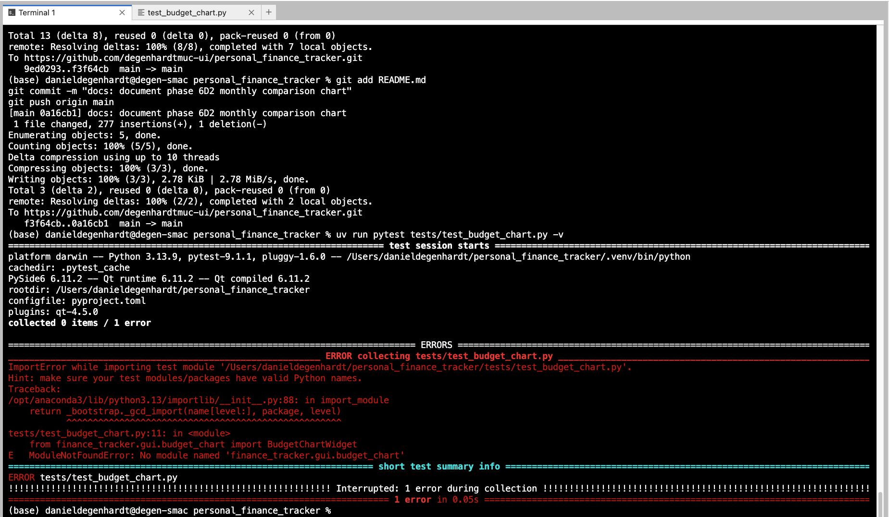

**GREEN - All 186 tests passed**

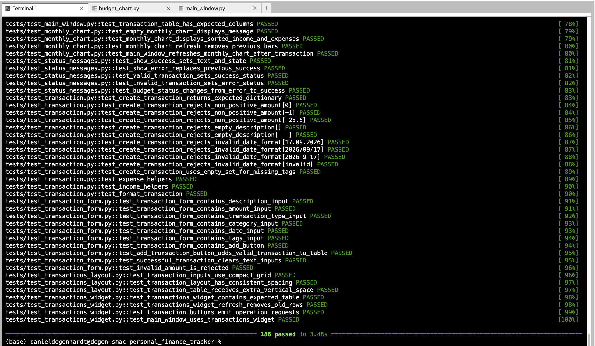

### Budget Comparison Chart

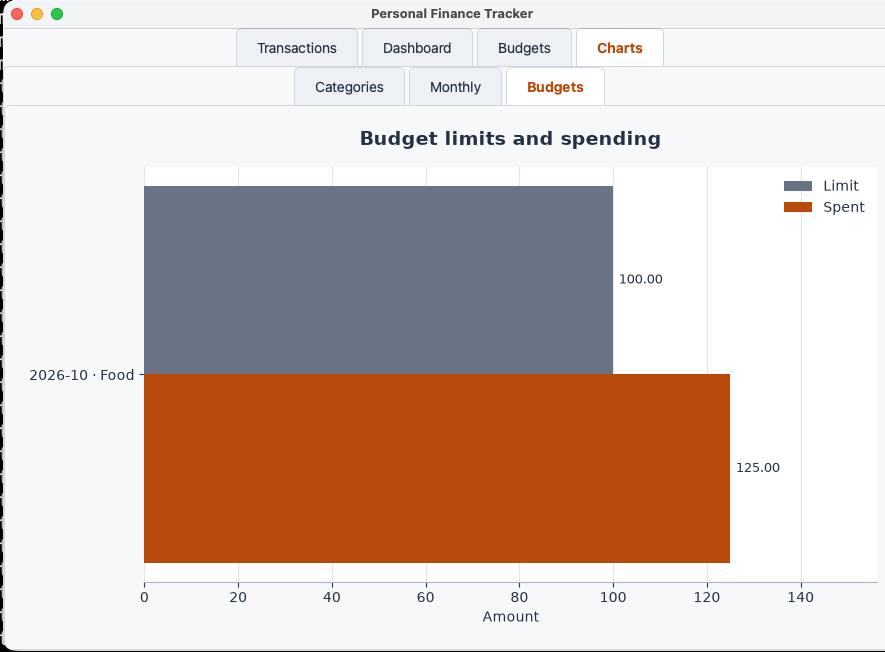

### Manual Verification

In a fresh session:

1. Open the main Budgets tab.
2. Select Food, enter a limit of `100`, and select `2026-10`.
3. Click Set budget.
4. Open **Charts → Budgets**.
5. Confirm Limit `100.00` and Spent `0.00`.
6. Add a Food expense of `25` dated in October 2026.
7. Confirm Spent `25.00`.
8. Add another matching expense of `100`.
9. Confirm Spent `125.00`, extending beyond the limit.

Expenses from other months or categories must not increase
this budget's spending.

Existing matching transactions must be included
when checking expected amounts.

### Verification Commands

Run the budget-chart tests:

```bash
uv run pytest tests/test_budget_chart.py -v
```

Run all chart test files:

```bash
uv run pytest tests/test_category_chart.py tests/test_monthly_chart.py tests/test_budget_chart.py -v
```

Run the complete test suite:

```bash
uv run pytest -v
```

Start the application:

```bash
uv run python main.py
```

### Phase 6D Result

| Step | Completed chart |
| --- | --- |
| 6D1 | Expenses by category |
| 6D2 | Monthly income and expenses |
| 6D3 | Budget limits and actual spending |

All charts reuse the existing financial calculations
and update from current session data.

Phase 6D is complete with **186 passing tests**.

### Phase 6 Completion

| Section | Result |
| --- | --- |
| 6A - Structure | Separate transaction, dashboard, and budget widgets |
| 6B - Layout | Compact forms, consistent spacing, and expanding tables |
| 6C - Styling | Shared orange theme and success/error status messages |
| 6D - Charts | Category, monthly, and budget comparison diagrams |

The planned Phase 6 implementation is complete.
## Phase 7A - Edit Existing Transactions

### Goal

Allow users to correct existing transactions through the transaction form.

Selecting a table row loads the stored transaction values.
Save changes replaces the selected transaction.
Cancel edit discards unsaved form changes.

### Changes

- Added Save changes and Cancel edit buttons.
- Connected table selection to transaction loading.
- Introduced an explicit editing state in `MainWindow`.
- Reused one validation method for adding and editing transactions.
- Refreshed all financial views after successful changes.
- Preserved original data when validation fails.
- Reset editing when rebuilding the transaction table.

### Files

| File | Responsibility |
| --- | --- |
| `finance_tracker/gui/transactions_widget.py` | Creates editing controls, loads form values, and switches button states |
| `finance_tracker/gui/main_window.py` | Tracks the selected transaction, validates changes, and updates data |
| `tests/test_transaction_editing.py` | Tests selection, editing, cancellation, and financial refresh |

### Selecting a Transaction

The table uses whole-row selection.

Clicking a saved transaction loads:

- Description.
- Amount.
- Transaction type.
- Category.
- Date.
- Tags.

The input fields do not need to be individually selected.
The highlighted table row identifies the transaction being edited.

```python
self.transaction_table.itemSelectionChanged.connect(
    self._handle_transaction_selection,
)
```

### Editing State

```python
self._editing_transaction_index: int | None = None
```

`None` means that no transaction is being edited.

An integer identifies the selected transaction's position
in the account's transaction list.

| Mode | Add transaction | Save changes | Cancel edit |
| --- | --- | --- | --- |
| Entry | Enabled | Disabled | Disabled |
| Editing | Disabled | Enabled | Enabled |

Disabling Add transaction during editing prevents
an accidental duplicate submission.

### Loading Stored Values

`TransactionsWidget.load_transaction(transaction)`
copies stored values into the existing form.

The amount uses its stored numeric representation rather than
the table's two-decimal display text.

Tags are displayed as sorted, comma-separated text.

The widget loads data for presentation.
It does not modify the stored transaction.

### Shared Validation

```python
transaction = self._read_transaction_form()
```

Both adding and editing use the same form-reading method.

It:

1. Reads the amount.
2. Converts it into a number and rejects non-finite values.
3. Converts type and category selections into enum values.
4. Reads the date and parses tags.
5. Calls `create_transaction` for domain validation.

Invalid input displays an error and returns `None`.

### Saving Changes

After successful validation:

```python
self.account["transactions"][index] = transaction
```

The selected entry is replaced.
A new transaction is not appended.

The transaction count therefore remains unchanged.

After saving:

- The table is rebuilt.
- Dashboard totals are refreshed.
- Budget usage is refreshed.
- All three charts are refreshed.
- Editing ends.
- Text fields are cleared.
- A success message is displayed.

Save changes updates the current session.
Use Save JSON to persist the updated account to a file.

### Invalid Changes

If validation fails:

- The original transaction remains unchanged.
- The existing table values remain unchanged.
- A red error message is displayed.
- Editing remains active so the input can be corrected.

### Cancel Editing

Cancel edit:

- Discards unsaved form input.
- Preserves the stored transaction.
- Clears the table selection.
- Clears Description, Amount, and Tags.
- Restores entry-mode button states.

Type, category, and date selections remain set.

Selecting another transaction loads its values
and replaces any unsaved form edits.
A confirmation dialog for this selection change is not implemented.

### Safe Table Refresh

```python
with QSignalBlocker(self.transaction_table):
    self.transactions_widget.refresh(self.account)
```

Programmatic table updates temporarily block table signals.

This prevents selection handlers from loading outdated data
while rows are being removed and rebuilt.

`QSignalBlocker` restores the previous signal state
after leaving the block.

### Row-to-Transaction Mapping

Sorting remains disabled.

The table displays transactions in account-list order,
so a row index corresponds to the transaction's list position.

Future filtering or sorting must preserve an explicit mapping
between displayed rows and stored transactions.

### File Operations during Editing

- Save JSON and Export CSV use stored account data,
  excluding unsaved form edits.
- Successful account loading or CSV import resets editing
  when rebuilding the table.
- Cancelled or failed file operations retain the current editing state.

### TDD - RED → GREEN

1. **RED:** Added editing tests before implementing the controls and handlers.
2. **GREEN:** Implemented selection, shared validation,
   replacement, cancellation, and financial refresh.
3. **Verification:** All existing and new tests passed.

### New Tests

| Test | Coverage |
| --- | --- |
| `test_edit_controls_start_disabled` | Checks initial button states |
| `test_selecting_transaction_loads_form` | Checks all stored values and editing controls |
| `test_save_changes_replaces_selected_transaction` | Checks replacement and every dependent financial view |
| `test_invalid_edit_preserves_original_transaction` | Checks data preservation and continued editing |
| `test_cancel_edit_preserves_data_and_resets_controls` | Checks cancellation, cleared selection, and entry mode |

**Complete test result: 191 passed.**

### Test Evidence

**RED**

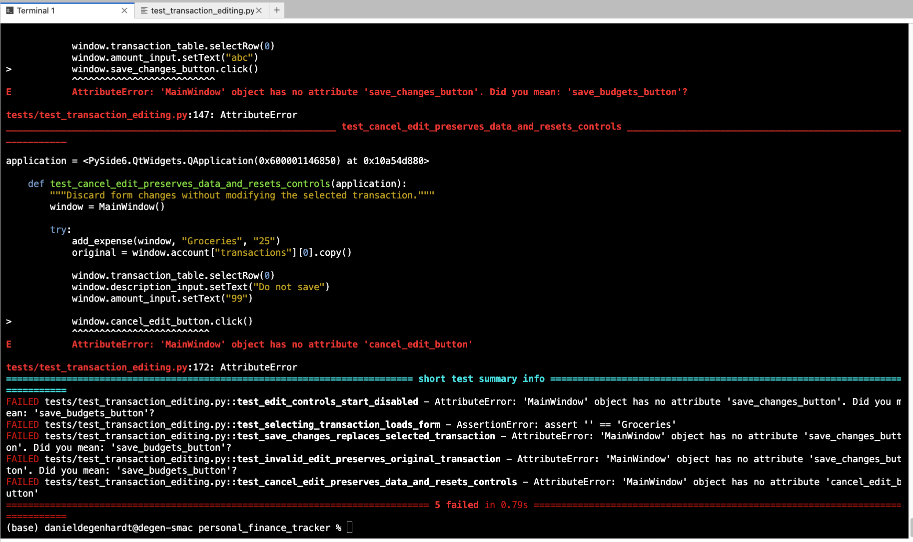

**GREEN**

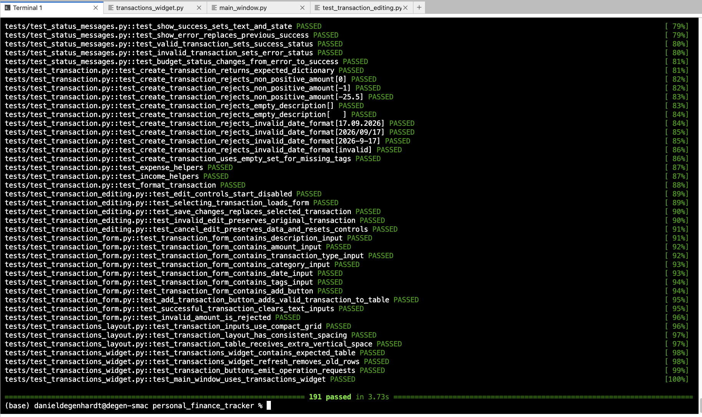

### Transaction Editing

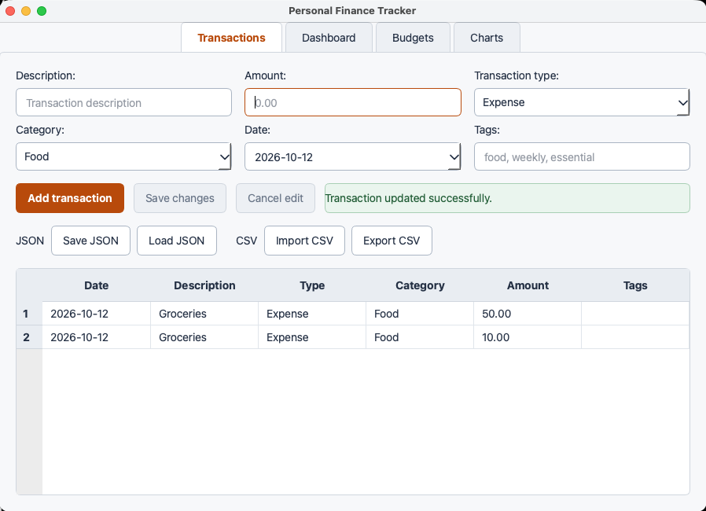

### Manual Verification

1. Add a Food expense named Groceries with an amount of `25`.
2. Click Groceries in the table.
3. Confirm that the whole row is selected and the form shows its values.
4. Change Amount to `40`.
5. Click Save changes.
6. Confirm that the same transaction now displays `40.00`.
7. Check the updated dashboard, budgets, and charts.
8. Select the row again and enter `abc` as the amount.
9. Confirm that saving reports an error and preserves the original.
10. Click Cancel edit and confirm that entry mode is restored.

### Verification Commands

```bash
uv run pytest tests/test_transaction_editing.py -v
uv run pytest -v
uv run python main.py
```

### Result

Existing transactions can now be corrected without creating duplicates.

Validation protects stored data, and successful changes update
all financial views.

Phase 7B will add deletion of selected transactions after confirmation.
## Phase 7B - Confirmed Transaction Deletion

### Goal

Allow users to delete a selected transaction after explicit confirmation.

The confirmation dialog shows the stored transaction values
and defaults to No.

### Changes

- Added a Delete transaction button.
- Enabled deletion only while a transaction is selected.
- Added a deletion request signal to `TransactionsWidget`.
- Connected the request to a handler in `MainWindow`.
- Added a confirmation dialog using `QMessageBox.question`.
- Refreshed all financial views after confirmed deletion.
- Added automated tests for confirmation, cancellation, and empty views.

### Files

| File | Responsibility |
| --- | --- |
| `finance_tracker/gui/transactions_widget.py` | Creates the delete button and emits the deletion request |
| `finance_tracker/gui/main_window.py` | Confirms deletion, removes the stored entry, and refreshes views |
| `tests/test_transaction_deletion.py` | Tests deletion behaviour and dependent financial updates |

### Button State

| Application state | Delete transaction |
| --- | --- |
| No selected transaction | Disabled |
| Transaction selected | Enabled |
| Successful deletion completed | Disabled |

The button follows the existing editing state.

```python
self.delete_transaction_button.setEnabled(editing)
```

### Request Signal

```python
delete_transaction_requested = Signal()
```

The widget emits this signal when the delete button is clicked.

`MainWindow` connects it to `_handle_delete_transaction`.

The widget presents the controls.
The main window coordinates changes to account data.

### Selected Transaction

The handler uses `_editing_transaction_index`
to identify the selected entry.

Without an index, it returns immediately.

A range check prevents deletion through an invalid list position.
The table remains unsorted so that row order matches account-list order.

### Confirmation Dialog

```python
answer = QMessageBox.question(
    self,
    "Delete transaction",
    message,
    QMessageBox.StandardButton.Yes
    | QMessageBox.StandardButton.No,
    QMessageBox.StandardButton.No,
)
```

The dialog displays the stored transaction's:

- Description.
- Amount.
- Transaction type.
- Category.
- Date.

It also explains that confirming deletion discards unsaved form changes.

The default button is No.

### Confirming or Cancelling

```python
if answer != QMessageBox.StandardButton.Yes:
    return
```

Only Yes proceeds with deletion.

No or closing the dialog preserves:

- The stored transaction.
- The selected row.
- The editing state.
- Unsaved form input.

### Removing the Entry

```python
del self.account["transactions"][index]
```

This removes exactly the selected entry from the current account list.

It does not remove any budget definitions.

### Financial Refresh

After deletion:

```python
self._refresh_transaction_table()
```

The existing refresh flow:

1. Ends editing.
2. Clears selection and text inputs.
3. Rebuilds transaction rows.
4. Updates dashboard totals and summary tables.
5. Recalculates budget usage.
6. Refreshes category, monthly, and budget charts.

A green success message is then displayed:

```text
Transaction deleted successfully.
```

### Deleting the Last Transaction

When the final transaction is removed:

- The transaction table becomes empty.
- Income, expenses, and balance return to zero.
- The category chart displays No expenses yet.
- The monthly chart displays No transactions yet.

Existing budgets remain available.
Their spending is recalculated from the remaining account data.

### Persistence

Deletion changes the current session.

Use Save JSON to persist the updated account.
CSV export also uses the updated stored transactions.

An undo feature is not implemented in this step.

### Automated Dialog Answers with Monkeypatch

The tests replace the real confirmation dialog temporarily:

```python
monkeypatch.setattr(
    QMessageBox,
    "question",
    lambda *args, **kwargs: QMessageBox.StandardButton.Yes,
)
```

This simulates confirmation without waiting for a user click.

The cancellation test returns No instead.

`*args` and `**kwargs` allow the replacement to accept
the dialog function's arguments.

Pytest restores the original function after each test.

### TDD - RED → GREEN

1. **RED:** Added deletion tests before implementing the button and handler.
2. **GREEN:** Implemented the request signal, confirmation,
   data removal, and refresh integration.
3. **Verification:** Checked the new tests and complete test suite.

Expected complete test count after the four new cases: **195**.

### New Tests

| Test | Coverage |
| --- | --- |
| `test_delete_button_starts_disabled` | Requires selection before deletion |
| `test_confirmed_deletion_updates_all_views` | Checks confirmation details, data removal, and financial updates |
| `test_cancelled_deletion_preserves_data_and_editing` | Checks that No preserves stored data and unsaved input |
| `test_deleting_last_transaction_restores_empty_charts` | Checks the empty account and chart states |

### Test Evidence

**RED**

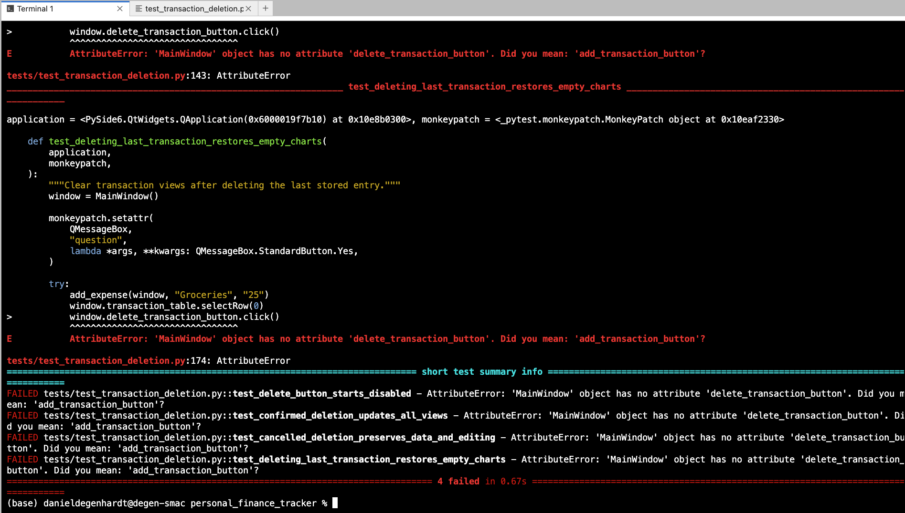

**GREEN**

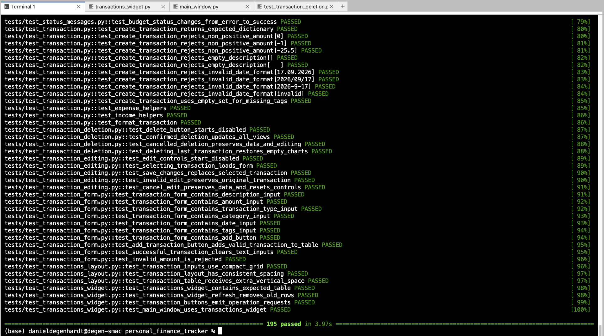

### Confirmation Dialog

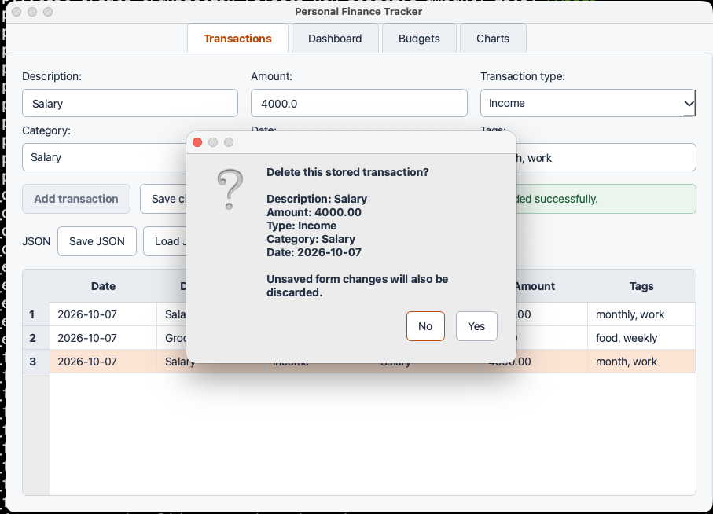

### Manual Verification

1. Add a test transaction.
2. Select its table row.
3. Click Delete transaction.
4. Choose No and confirm that the transaction remains.
5. Click Delete transaction again.
6. Choose Yes.
7. Confirm that the row disappears.
8. Check dashboard totals, budget usage, and all charts.
9. Confirm that entry mode is restored.

### Verification Commands

Run the deletion tests:

```bash
uv run pytest tests/test_transaction_deletion.py -v
```

Run the complete test suite:

```bash
uv run pytest -v
```

Start the application:

```bash
uv run python main.py
```

### Result

Selected transactions can now be deleted after confirmation.

Cancellation preserves the current data and editing state.
Confirmed deletion updates all dependent financial views.

Phase 7C will introduce transaction filtering and search.
## Phase 7C1 - Transaction Description Search

### Goal

Find transactions by description while preserving correct editing
and deletion behaviour in the filtered table.

### Changes

- Added a Search description field above the transaction table.
- Added live, case-insensitive substring matching.
- Ignored leading and trailing spaces in the query.
- Restored all rows when the search is cleared.
- Added explicit mapping between visible rows and stored transactions.
- Preserved full-account financial summaries and exports.

### Files

| File | Responsibility |
| --- | --- |
| `finance_tracker/gui/transactions_widget.py` | Creates the search field, filters rows, and stores their original indices |
| `finance_tracker/gui/main_window.py` | Handles query changes and resolves selected rows to stored transactions |
| `tests/test_transaction_search.py` | Tests search, clearing, editing, deletion, and edit-state reset |

### Search Behaviour

```python
query = self.search_input.text().strip().casefold()
```

`strip` removes outer whitespace.
`casefold` prepares text for case-insensitive comparison.

```python
if query and query not in description:
    continue
```

Only descriptions containing the query are displayed.

This is literal substring matching, not regular-expression search.

An empty query displays every transaction.
No matches produce an empty table without deleting account data.

### Live Updates

The search field emits its text changes through `search_changed`.

`MainWindow` rebuilds the visible rows when the query changes.
No separate Search button is required.

The field's clear button restores the complete table.

### Visible Row Mapping

Filtering changes the relationship between table rows
and account-list positions.

For example, visible row `0` may represent account entry `1`.

```python
self.visible_transaction_indices.append(index)
```

The widget stores each visible row's original account index.

```python
index = self.transactions_widget.account_index_for_row(row)
```

The selection handler resolves the displayed row before editing or deleting.

The mapping is rebuilt whenever the table is refreshed.
Sorting remains disabled.

### Editing and Deletion

Filtered rows can be edited and deleted through the existing controls.

Operations affect the mapped account entry rather than
the visible row number.

After editing, the current search is reapplied.
A description that no longer matches may disappear from the table.

After deletion, remaining row mappings are rebuilt.

### Search Changes during Editing

Changing the query ends an active editing session
and discards its unsaved form input.

Stored account data remains unchanged.

The selection is cleared and the entry-mode buttons are restored.

### Financial Views and Persistence

Search filters only the transaction table.

The following continue to use the complete account:

- Dashboard totals and summary tables.
- Budget calculations.
- All charts.
- JSON saving.
- CSV export.

Loading JSON or importing CSV reapplies the current search
to the updated account.

A newly added transaction may be hidden if it does not match
the active query.

### TDD - RED → GREEN

1. **RED:** Added tests before the search field and mapping existed.
2. **GREEN:** Implemented live search and original-index mapping.
3. **Verification:** Run the new tests and complete suite.

Expected complete test count after five new cases: **200**.

### New Tests

| Test | Coverage |
| --- | --- |
| `test_search_matches_description_case_insensitively` | Checks matching, whitespace handling, and unchanged account totals |
| `test_clearing_search_restores_all_rows` | Checks unmatched queries and restoring all rows |
| `test_editing_filtered_row_updates_correct_transaction` | Checks correct original-entry replacement |
| `test_deleting_filtered_row_removes_correct_transaction` | Checks correct original-entry deletion |
| `test_changing_search_ends_active_edit` | Checks discarded form edits and restored controls |

### Test Evidence

**RED**

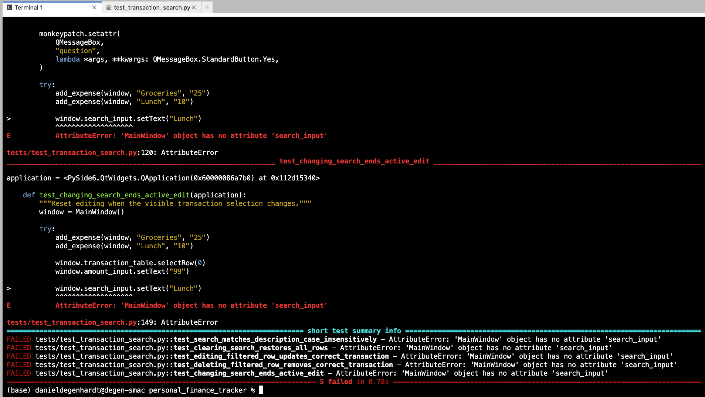

**GREEN**

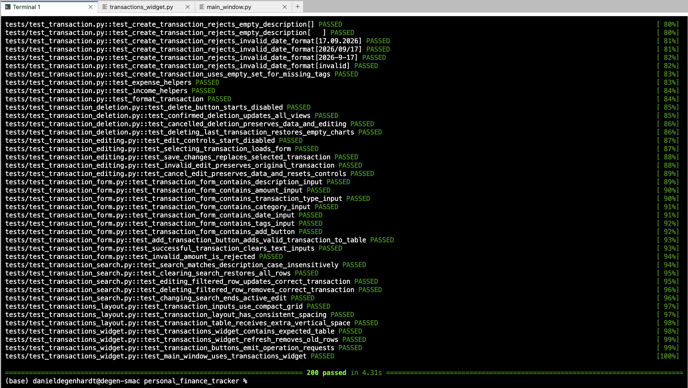

### Search Interface

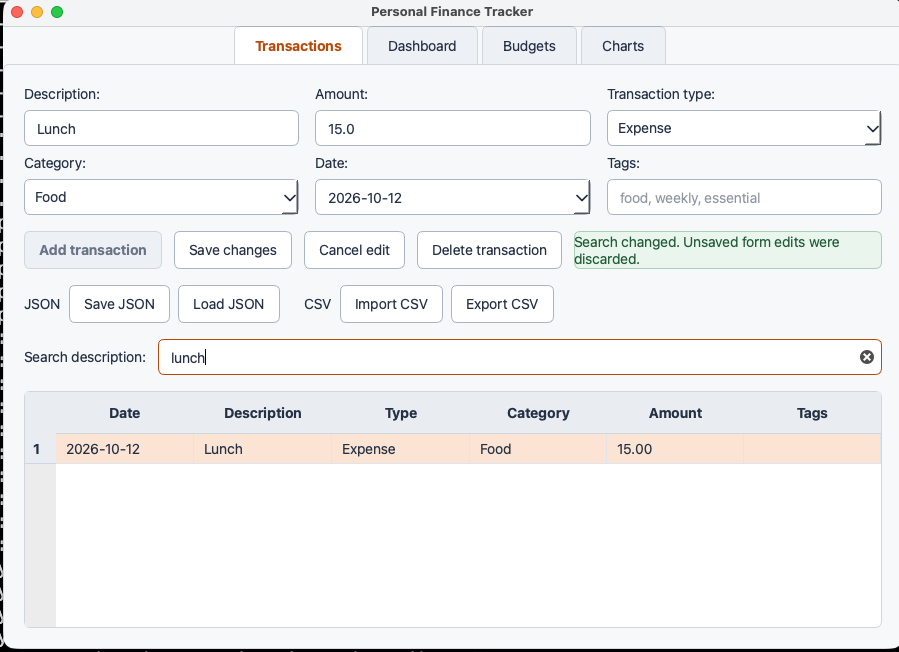

### Manual Verification

1. Add Groceries with amount `25` and Lunch with amount `10`.
2. Search for `lunch`.
3. Confirm that only Lunch is displayed.
4. Select Lunch and change its amount to `15`.
5. Clear the search.
6. Confirm Groceries remains `25` and Lunch is `15`.
7. Search for Lunch again and delete it.
8. Clear the search and confirm Groceries remains.

### Verification Commands

```bash
uv run pytest tests/test_transaction_search.py -v
uv run pytest -v
uv run python main.py
```

### Result

Users can search transaction descriptions without changing stored data.

Explicit row mapping preserves correct editing and deletion
in filtered views.

Phase 7C2 will add combined month and category filters.
## Phase 7C2 - Combined Month and Category Filters

### Goal

Filter transactions by month and category alongside the existing
description search.

A transaction must match every active criterion to appear in the table.

### Changes

- Added Month and Category dropdowns beside the search field.
- Added All months and All categories options.
- Populated the month dropdown from recorded transactions.
- Combined description, month, and category matching.
- Preserved original-index mapping for editing and deletion.
- Retained valid filter selections during account updates.

### Files

| File | Responsibility |
| --- | --- |
| `finance_tracker/gui/transactions_widget.py` | Creates filters, maintains month options, and displays matching rows |
| `finance_tracker/gui/main_window.py` | Exposes filter controls and handles refresh requests |
| `tests/test_transaction_filters.py` | Tests filter defaults, combinations, mapping, and edit-state reset |

### Filter Controls

| Control | Default | Behaviour |
| --- | --- | --- |
| Search description | Empty | Matches description substrings without case sensitivity |
| Month | All months | Selects one recorded month |
| Category | All categories | Selects one transaction category |

Changes apply immediately.
No separate Apply button is required.

### Display Text and Internal Values

```python
self.month_filter.addItem("All months", None)
self.category_filter.addItem(
    category.value.title(),
    category.value,
)
```

Each dropdown item can contain a visible label and an internal value.

`currentData()` reads the internal value used for filtering.

`None` represents an inactive filter.

### Month Options

```python
transaction["date"][:7]
```

The first seven characters of a validated `YYYY-MM-DD` date
provide the month in `YYYY-MM` format.

The widget:

1. Collects months from the complete account.
2. Removes duplicates with a set.
3. Sorts the months chronologically.
4. Adds them after All months.

The month list is independent of the active description
and category filters.

### Preserving the Month Selection

The month dropdown is rebuilt when the account view refreshes.

The previous selection is retained if that month still exists.

If the selected month is no longer present,
the dropdown falls back to All months.

Category options always contain the complete category enumeration.

### Preventing Recursive Refresh

```python
with QSignalBlocker(self.month_filter):
    ...
```

Rebuilding a dropdown changes its selection internally.

`QSignalBlocker` temporarily suppresses those signals
so that refreshing the month list does not trigger
another filter refresh.

The previous signal state is restored after the block.

### Combined Matching

Description, month, and category use AND matching.

For example:

| Criterion | Selection |
| --- | --- |
| Description | groceries |
| Month | 2026-10 |
| Category | Food |

Only Food transactions recorded in October 2026
whose descriptions contain groceries are displayed.

```python
if selected_month and transaction["date"][:7] != selected_month:
    continue
```

```python
if (
    selected_category
    and transaction["category"].value != selected_category
):
    continue
```

Non-matching transactions are skipped during table rendering.
They remain stored in the account.

### Shared Refresh Request

The existing `search_changed` signal also handles dropdown changes.

The main window asks the transaction widget to refresh.
The widget reads the current values of all three controls.

This keeps filtering in one rendering path.

### Editing and Deletion

The visible-row mapping introduced in Phase 7C1 remains in use.

```python
visible_transaction_indices
```

Each displayed row maps to its original account-list position.

Editing and deletion therefore affect the correct stored entry,
even when combined filters display only one transaction.

The mapping is rebuilt after account changes.
Table sorting remains disabled.

### Filter Changes during Editing

Changing search, month, or category ends an active edit.

Unsaved form changes are discarded.
Stored transaction data remains unchanged.

Selection is cleared and entry-mode controls are restored.

### Account Updates

The active filters are reapplied after:

- Adding a transaction.
- Saving transaction changes.
- Deleting a transaction.
- Loading an account from JSON.
- Importing transactions from CSV.

New recorded months become available automatically.

A new or edited transaction may be hidden if it does not
match the current filters.

### Financial Views and Export

Filters affect the transaction table only.

The complete account remains the source for:

- Dashboard totals and summary tables.
- Budget calculations.
- Category, monthly, and budget charts.
- JSON saving.
- CSV export.

An empty filtered table does not mean that the account is empty.

### TDD - RED → GREEN

1. **RED:** Added tests before the month and category controls existed.
2. **GREEN:** Implemented dropdowns, combined filtering,
   and month-selection maintenance.
3. **Verification:** Run the new filter tests, search tests,
   and complete test suite.

Expected complete test count after five new cases: **205**.

### New Tests

| Test | Coverage |
| --- | --- |
| `test_filter_controls_start_with_all_values` | Checks default selections |
| `test_month_filter_lists_recorded_months_and_filters_rows` | Checks sorted month options and month matching |
| `test_category_month_and_search_combine` | Checks category filtering and combined criteria |
| `test_editing_filtered_row_updates_original_entry` | Checks correct replacement behind combined filters |
| `test_filter_change_ends_edit_without_saving` | Checks stored data preservation and editing reset |

Existing search and deletion tests continue to cover
filtered-row mapping.

### Test Evidence

**RED**

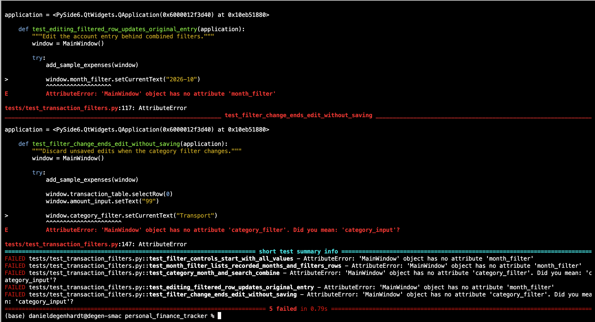

**GREEN**

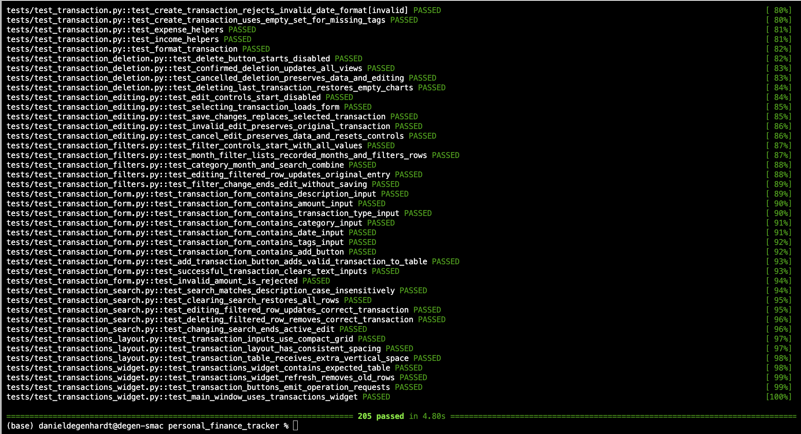

### Filter Interface

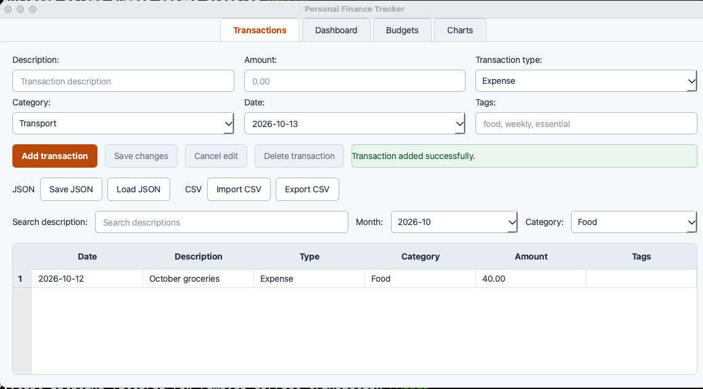

### Manual Verification

Create these expenses in a fresh session:

| Description | Amount | Category | Date |
| --- | ---: | --- | --- |
| September groceries | 25 | Food | 2026-09-12 |
| October groceries | 40 | Food | 2026-10-12 |
| October bus | 10 | Transport | 2026-10-13 |

Then:

1. Select Month 2026-10.
2. Select Category Food.
3. Confirm that only October groceries appears.
4. Enter GROCERIES in the search field.
5. Confirm that the same matching row remains.
6. Clear the search and restore both All options.
7. Confirm that all three rows appear.

The complete account expense total remains `75.00`
throughout filtering.

### Verification Commands

Run filter and search tests:

```bash
uv run pytest tests/test_transaction_filters.py tests/test_transaction_search.py -v
```

Run the complete test suite:

```bash
uv run pytest -v
```

Start the application:

```bash
uv run python main.py
```

### Result

Transactions can be narrowed by description, month, and category together.

Filtering preserves account data and correct editing/deletion mapping.
The financial views continue to represent the complete account.
## Phase 7D - Integrated Workflow Verification

### Goal

Verify that transaction editing, deletion, search, filters,
and JSON persistence work together correctly.

This step checks complete workflows across the features introduced
in Phase 7 rather than adding another interface feature.

### New Test File

| File | Responsibility |
| --- | --- |
| `tests/test_phase7_workflows.py` | Verifies combined filtering, editing, deletion, and account loading/saving |

### Integrated Workflows

#### Filtered editing and persistence

A transaction is edited while the table displays only one month.

Saving the account must preserve:

- The edited transaction.
- Transactions hidden by the filter.
- The complete account data.

The test loads the saved JSON file and checks both entries.

#### Deleting the final transaction of a selected month

After deleting the only entry in the selected month:

- The obsolete month option is removed.
- The month filter returns to All months.
- Remaining transactions are displayed.
- Selecting and editing a remaining row uses the correct account index.

#### Loading an account during editing

A replacement account is loaded while unsaved form edits exist.

The application must:

- Discard the unsaved form edit.
- End editing mode.
- Preserve the description query.
- Rebuild visible-row mapping for the loaded account.
- Allow correct editing of the newly loaded transaction.

### Test Tools

`tmp_path` provides temporary locations for JSON test files.

`monkeypatch` replaces file dialogs and confirmation dialogs
with automatic test answers.

The original functions are restored after each test.

### Verification Commands

Run the integrated workflow tests:

```bash
uv run pytest tests/test_phase7_workflows.py -v
```

Run the complete test suite:

```bash
uv run pytest -v
```

**Final Phase 7 result: 208 passed.**

### Test Evidence

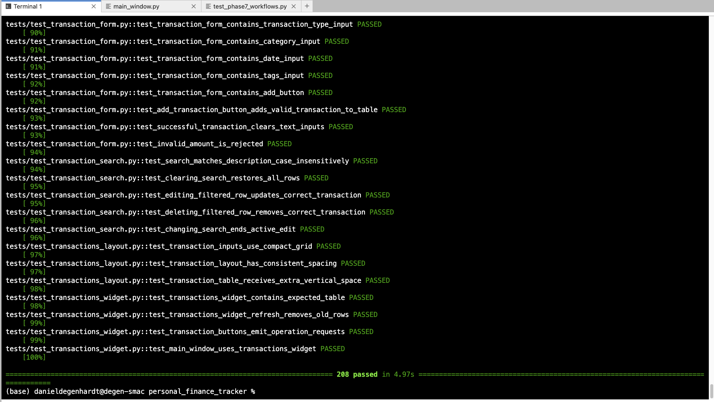

### Phase 7 Summary

| Step | Completed functionality |
| --- | --- |
| 7A | Edit existing transactions with shared validation |
| 7B | Delete selected transactions after confirmation |
| 7C1 | Search descriptions with safe original-entry mapping |
| 7C2 | Combine description, month, and category filters |
| 7D | Verify integrated editing, filtering, and persistence workflows |

### Data and Presentation

The account dictionary remains the source of truth.

Filters change the displayed transaction rows.
Dashboard totals, budget calculations, charts, and exports
continue to use the complete account.

Visible rows are mapped explicitly to original account entries.

### Persistence

Editing and deletion update the current session.

Save JSON persists the complete updated account.
CSV export also includes the complete stored transaction list.

Unsaved form edits are not included in either operation.

### Current Limitations

- Undo and redo are not implemented.
- Table sorting remains disabled.
- Changing filters or selecting another transaction can discard
  unsaved form edits.
- Account changes are not automatically saved to a file.

### Result

Phase 7 provides transaction correction, confirmed deletion,
description search, and combined filters.

The integrated tests cover interactions between these features
and JSON persistence.